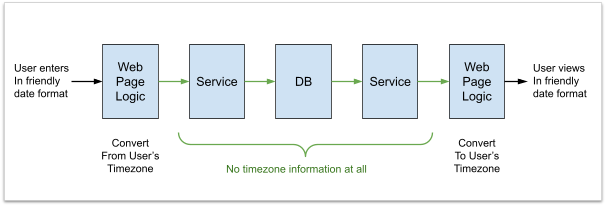

---
tags:
- design
- dates
---
# Date Value Types

Time is expressed as a linear dimension starting in the past and going into the future.  Any given moment is an instant alone that line. A date and/or time is a way of describing that point.  But the description of that point depends on the time zone within which you are communicating.  

## Five Main Quantities

There are five kinds of values that are important for handling dates and times.

**Timestamp** - this is a particular point in in time, an instant.  It is a particular time on a particular day.  There is no duration, it is an infinitely short instant of time.

**Date** - Surprisingly, this is not an instant in time, but a symbolic reference that represents a vague range of time values.  It is customary to associate things to a particular date, but the interpretation of that date depends on the context.  It is not a specific 24 hour period, but in fact times on that date can vary over a 48 hour period depending on where you are on earth.

**time** - here we mean time of day which is another symbolic reference and does not represent a particular instant in time.  An office that opens at 8:00 and closes at 5:00 will use these time values.  They must be interpreted in the context of a particular day and a particular time zone.

**duration** - this is a specific amount of time, from one instant to another instant.  

**period** - this is a symbolic reference used in a particular context to determine a particular follow on instant from a prior instant.  For exmaple, a monthly meeting might meet on January 5, and the following meeting will be February 5.  The period of one month differs from a duration because different months have differing numbers of days. 


## Epoch values are not in any timezone


The “epoch time value” represents a given point in time on a given day is just a point on the timeline.  There are points in time before that point, and points after that point.  This timeline is independent of any time zones.

The most common timeline (Unix) counts the number of seconds since Jan 1, 1970 UTC as an integer value.  Java and JavaScript count the number of milliseconds since Jan 1, 1970 UTC as a long integer value.   Let’s call this the “epoch” value.

Consider the following table:

| Epoch Value | Display Value | Location
| ----------  | ------------  | --------------
| 1667860895| Monday, November 7, 2022 10:41:35 PM| UTC
| 1667860895| Monday, November 7, 2022 02:41:35 PM| California
| 1667860895| Tuesday November 8, 2022 07:41:35 AM| Japan
| 1667860895| Tuesday November 8, 2022 04:11:35 AM| India

This is, of course, the same instant of time.  As you can see, the epoch value is the same in every case.   The display of date/time is of course different, because that is what a timezone is:  it is a way of localizing an epoch value to/from the way that locals in that timezone want to see it.  But no matter where you are, no matter what timezone you are in, the epoch value is the same all around the world.  

It is not correct to say that the epoch value is in UTC timezone.  It is a value that simply does not have a timezone.  It is just a point on the timeline, and there is one epoch value for the entire world.  (On the surface of the earth we don’t need to worry about relativistic time dilation.)

## Timezone is for Input/Display but not Storage

Timezone is only needed when presenting a date to a user, because different users are in different timezones.  Some users will see the current time as Nov 4, and others as Nov 3.  It is a mistake to think that timezone only affects the “hour” component, because date, month, and year, as well as minutes can be affected as well.

It is possible for a baby born in 2012 to be older than (born before) another baby born in 2011.

Calculations in time-zone dependent values get very complicated.  You can’t assume two times are on the same day, or month, or even year.   Sorting of time-zone dependent values is not a useful order at all.   However, for the epoch timeline values, the calculations are not complicated because they are simply integer arithmetic which is both fast and convenient.

It is a mistake to think that a timezone is a fixed offset from UTC.  That is not true for locations that shift between standard and daylight times twice a year.  New York for instance is on EST part of the year, and EDT the rest.  The specific date that different locations shift between summer and winter time is different.  Southern hemisphere countries do it the opposite way from the northern hemisphere.

Durations are even timezone specific.  You probably think all days are 24 hours long?  Think again.  Because of daylight shifts, there is one day a year that is 25 hours, and another that is only 23 hours.   And, there is one day where 1:30 in the morning occurs twice.

A service does not display date/time values to users.   A server only transfers, stores, and calculates based on time values.   That server should handle these values exactly the same no matter where it happens to be located in the world.
Pattern of Use

## Here is an idealized flow of a date/time value

All time values within the system should be expressed as epoch time values.  They are small and light, and can be used directly for calculation.  They can be transferred to web servers, and to client machines easily.  They are unambiguous, one value has one meaning.



A date/time value should be converted to a time zone ONLY in the user’s browser.  The browser knows the time zone that it is situated in, and the JavaScript within the browser can convert the epoch value to a string that can be displayed to the user.   Similarly, when a user enters a date/time value, they should do so according to their timezone, but it should be converted immediately to an epoch value for sending to the server.

There is no reason then that a server ever needs to handle a timezone.

Well, actually there is an exception and that is when the server needs to produce strings for human consumption:

* Printing time values into the text log files.  It is convenient to see the day/hour/minute/second will make it easier for them to compare with other events they see in the system.  Always use UTC time zone.
* Generating email to be sent.   Here, the best is to use the timezone of the user if you have it.  If not, you have to pick a timezone that the users learn to expect the time zone to be from.
* Generating a report.  The timezone should be clearly specified by the report.

Note: we can not and should not make any assumptions about the timezone that the server is in.  We can not guarantee how this will be set, and therefor must assume that it will vary across servers.
Details on ISO format

ISO 8601 format allows for different time zones.   So the values in the table at the top are:

```
2022-11-07T22:41:35.000Z
2022-11-07T14:41:35.000-0700
2022-11-07T07:41:35.000JST
2022-11-07T04:11:35.000IST
```

Notice that values in different timezones will not sort properly.  To assure consistency with internal communications, the UTC time should always be used.  The “Z” above is a shortcut for universal time, which is UTC.   While “-0000” is an offset that is equivalent to UTC, the “Z” notation should be preferred, and offset notation avoided.

Missing timezone:  2022-11-07T22:41:35.000

Be sure to include timezone in the ISO 8601 format!   Values without any timezone indicator should be avoided since the receiver might be parsing incorrectly and get an arbitrary timezone.

Theoretically, one can allow servers and clients to communicate using different time zones, because the timezone is there in the format.  However, if you are following the pattern of always converting time to universal time both input and output, then you will have no need to use any other timezone than UTC.

See discussion at https://github.com/google/gson/issues/281 and https://stackoverflow.com/questions/54015152/gson-deserialized-for-type-of-timestamp 

## Java / JavaScript / JSON support

java.util.Date - this object is a wrapper of the Java timeline value (the number of milliseconds since 1970).  It is an object on the heap, so it is slightly more expensive than using a long value, however there is an advantage that it clearly carries a type and thus automated handling is easier.  It has no timezone.

JavaScript Date - exactly like the Java object, this is simply a wrapper for the timeline value, the milliseconds since 1970.

Millisecond resolution is sufficient for nearly all purposes.   If higher resolution is needed in the server, there is a java.time.Instant class that carries a time zone free epoch timestamp that is accurate to the nanosecond.  Use judiciously only when timing very fast things.

JSON has no specific support for date/time values.  Sending epoch values as an integer has the advantage that integer conversion is very fast and efficient.  They are not human readable.  If you want your JSON to be human readable, then use ISO 8601 format.  This text format allows for the specification of a timezone, however like the server log files, this should always be in UTC timezone so that messages to/from servers are always the same.

Databases offer a timestamp value which is again an epoch value.   All date/time values should be stored in this integer format, because sorting by date, and searching for a date range, will work on values from all over the world equally well.  There is no reason to store a timezone setting with the date/time value because that would simply complicate searching and sorting.

Java offers some timezone specific classes, such as LocalDateTime, ZonedDateTime, LocalTime, LocalDate, and a bunch of new classes designed by people who don’t appear to have experience with a globally-scaled system before.  Time-zone specific classes should ONLY be used in a user interface, such as code that is generating a string for display to a specific person, or accept input from a specific person.  Most of the complexity of dealing with time zones is eliminated by always using epoch values, and then converting to the timezone of the user at the very last moment.  There is zero concern about timezone offsets between different users.  Each user sees the time in the way that makes sense to them.  And every server delivers a consistent value no matter where the server is located.

## Calculations on Date/Time

If you need to know the day or the week, day of the month, or hour of the day, etc.  then in Java use a Calendar object.  Or use the Moment package in JavaScript.  Remember, the length of the day depends on the day of the year, so there are no short cuts.  

To format a date for user viewing in the user interface code, use a DateFormat object in Java.  Or use the Moment package in JavaScript.  This should always be done in the user’s browser.

If you are sending email to a user, then you are formatting text to be seen by that user.  In this case, you must know the timezone that the user is in.   Or you must assume a timezone.  You unfortunately do not have any way to know.  Also, most email clients do not support execution of javascript, so you can’t calculate it in the user’s email client.  But again, this formatting to a timezone is done at the time you are generating the display for a particular user.

