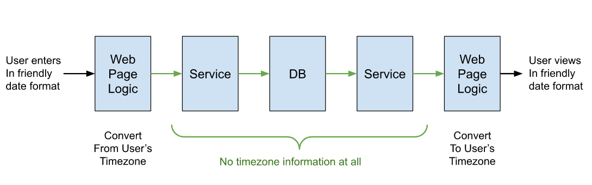

#  Handling Dates

In a globally distributed system, there are some key patterns for handling dates so that they work reliably, performantly, and are unlikely to be misused by developers.  Oddly, a number of new classes were added to Java which should be avoided.

## Quick Advice Summary

*   Use a java.util.Date class, or a long millisecond value, to handle a date/time value within all server side code.
*   Timestamps and date/time values must never have a time zone associated with them in a server.
*   Store date in a database as a long millisecond value often called a timestamp or a date column type.  Timezone setting should never be stored with a date in the DB.
*   All internal values within the system are “universal time”.
*   TimeZone enters the picture only when accepting a date/time from a user, or displaying a date/time to the user.
*   Learn to use the Calendar object in a particular time zone to get the pieces of a date out.
*   Learn to use a DateFormatter to create human readable date display values.

## What is a Date/Time?

A given point in time on a given day is just a point on the timeline.  There are points in time before that point, and points after that point.  This timeline is independent of any time zones.

The most common timeline (Unix) counts the number of seconds since Jan 1, 1970 UTC as an integer value.  Java counts the number of milliseconds since Jan 1, 1970 UTC as a long integer value.   Let’s call this the “epoch” value.

Consider the following table:


|Epoch Value|Display Value                       |Location  |
|-----------|------------------------------------|----------|
|1667860895 |Monday, November 7, 2022 10:41:35 PM|UTC       |
|1667860895 |Monday, November 7, 2022 02:41:35 PM|California|
|1667860895 |Tuesday November 8, 2022 07:41:35 AM|Japan     |
|1667860895 |Tuesday November 8, 2022 04:11:35 AM|India     |


Each row represents the same instant in time.  As you can see, the epoch value is the same in every case.  Think about that because so many people get confused by this: the epoch value is exactly the same in all time zones for a particular point in time.

The display of date-time is of course different, because that is what a timezone is:  it is a way of localizing an epoch value to/from the way that locals in that timezone want to see it.  But no matter where you are, no matter what timezone you are in, the epoch value is the same all around the world.

Don’t say that the epoch value is in UTC timezone!  As you can see, the epoch value is the same in all time zones.  It is just a point on the timeline.  There is one epoch value for the entire world, and it is not located in any time zone.

## Timezone is just a Localization of the Time

Timezone is only needed when presenting a date to a user, because different users are in different time zones. Consider scheduling a conference call.  The attendee on the east coast wants to see 2PM, and one on the west coast 11AM.  The presentation of the time depends on the **user** receiving it.  The meeting start time itself does not need a time zone, but instead you need time zones for each of the people being displayed to.  It never makes sense to package a timezone with the date-time value.

It is a mistake to think that timezone only affects the “hour” component.  For the example from the table above, some users will see the event happening on Nov 7, and others on Nov 8.   Timezone can affect year, month, day of month, hour, as well as minutes.

It is a mistake to think that a timezone is a fixed offset from UTC.  That is not true for locations that shift between standard and daylight times twice a year.  New York for instance is on EST part of the year, and EDT the rest.  The specific date that different locations shift between summer and winter time is different.  Southern hemisphere countries do it the opposite way from the northern hemisphere.

It is possible for a baby born in 2012 to be older than (born before) another baby born in 2011 because of the time zone they are born in.

Calculations in timezone dependent values get very complicated.  You can’t assume two times are on the same day, or month, or even year.   Sorting of timezone dependent values is not a useful order at all.   However, for the epoch timeline values, the calculations are not complicated because they are simply integer arithmetic which is both fast and convenient.

Durations are even timezone specific.  You probably think it is 24 hours from noon one day to noon the next, right?  Think again.  Because of daylight shifts, there is one day a year that is 25 hours, and another that is only 23 hours.   And, there is one day where 1:30 in the morning occurs twice — scheduling for 1:30 on that day is ambiguous without mentioning the time zone.

Generally services do not display date-time values to users.   Typically a service is accessed through an API by a program that can do the final localization of the time.   That server should handle these values exactly the same no matter where the service happens to be located.

## Pattern of Use

Here is an idealized flow of a date/time value



All time values within the system should be expressed as epoch time values.  They are small, light, unambiguous, and can be used directly for calculation.  They can be transferred between web servers and client machines easily.

A date-time value should be converted to a time zone ONLY in the user’s browser.  The browser knows the timezone that it is situated in, and the JavaScript within the browser can convert the epoch value to a string that can be displayed to the user.   Similarly, when a user enters a date-time value, they should do so according to their timezone, but it should be converted immediately to an epoch value for sending to the server.

_**There is no reason then that a server ever needs to handle a timezone.**_

Well, actually there are two reasons a server might need to convert a timestamp into a user-readable time:

1.  Printing time values into the text log files.  This should be done always in UTC time zone. Not the time zone of whatever user created the date. Not the time zone that the server happens to be running in.
2.  Generating an email message for a user.  Unfortunately, scripting does not work in email clients, so we can’t have the conversion happen there, and a human readable form must be created on the server.  If you do this, hopefully you have the right timezone for each user you are sending to.

Some protocol require sending or receiving dates in ISO-8061 format which is human readable and can include a time zone.  For example JSON formats often require this format.  In this case, all API interaction should use UTC time zone for consistency and to eliminate errors when an unusual timezone is used.  This is also known as the “Z” timezone.

## Java / JavaScript / JSON support

**Long** – In Java, the fastest, simplest format for holding a date-time value is a long integer with the epoch value in it.  Long integer value do not incur the overhead of an object.  Computations on long values are fast and efficient.  It is thread-safe.  JavaScript – and essentially all other languages — can handle these values equally well.

**java.util.Date** – The long value does not tell the programmer that the value is a date, and so some programmers would like a data type to make this obvious.  The Java Date class is a wrapper on the millisecond epoch value (the number of milliseconds since 1970).  It is an object on the heap, is a little more expensive than using a long value, but the clarity of the code might be worth the cost.  It has no timezone.  It has no conversions to local timezone field values like day of month or hour of day.

**java.time.Instant** – If you need nanosecond resolution, then the Instant object works like the Date object above, but includes time values to the nanosecond.  It does not include a time zone, but be careful which methods you use because “get” and “getLong” rely on the system default time zone which could be different on different servers.  Adding days to an instant value will not necessarily get you the same time on other days.

**JavaScript Date** – exactly like the Java object, this is simply a wrapper for the timeline value, the milliseconds since 1970.

**JSON** has no specific support for date/time values.  You have two options:

1.  Send the epoch values as an integer. Integer conversion is very fast and efficient.  Not human readable.
2.  If you want your JSON to be human readable, then use [ISO 8601 format](https://en.wikipedia.org/wiki/ISO_8601) and specify the timezone always as UTC (“Z” time).

**Databases** offer a number of formats for date and time.  Usually is one for a timestamp value which is again an integer epoch value without timezone.  Use that because it is fast and unambiguous.  A close second is a floating point number representing days, again without a timezone value.

Many DB Date formats are stored as a string of characters which can not be compared directly.  This means that to compare two dates, the DB must convert to a comparable timeline value, and the do the comparison.  You can see this has performance considerations.  It is fairly safe to say that when searching, one usually wants to find records in a particular range of timeline values: such as all the records from January 2020 (in a specified time zone).  More often you want to sort by chronological order.  In both cases, representing the date as an epoch values could be 10 to 20x faster than having to convert from a string.

Databases offer the opportunity to store the time zone with the date values, but it is hard for me to see what possible advantage this could have over always converting to UTC.  If your server is properly excluding all time zones, there is no reason to store this in the server.

## Calculations on Date/Time

**Learn to use the Calendar object.**  If you need to know the day or the week, day of the month, or hour of the day, etc.  construct a Calendar object for the particular user or context that you want these values.  Never just use the default timezone from the server.  The Calendar object is not totally intuitive, however if you construct on a particular time zone, and set the date value using an epoch value, it will produce correct time zone relevant values correctly.

**Learn to use DateFormat object.**  To format a date for user viewing in the user interface code.  Again, the format to display [depends on the user and on the context](https://agiletribe.purplehillsbooks.com/2012/07/25/configuring-date-format/).  The user might prefer not only a time zone, but also settings like Y-M-D or D-M-Y order as well as language for the month name.

Or use the Moment package in JavaScript.  This should always be done in the user’s browser if possible.

## Special Cases of Date-Like Things

All of this advice is useful for dates that are used in so many ways:

*   recording the moment that anything actually happened,
*   setting the time that something is scheduled to happen,
*   specifying the start/end time for a meeting,
*   setting when a rule or law is to go info effect.

Anything that happened or will happen at a specific point in time should be recorded this way.  But there are some date quantities that are not about a specific point in time:

**Birthdays, Anniversaries** – the date is important, but we simply don’t know the time of day and it does not matter.  Someone born in California on Nov 7 will have the birthday of Nov 7, even though it was Nov 8 in Japan, and even if applying for a Japanese driver’s license.  We don’t know the time of the birth and don’t care.  Birthdays should be stored as an ISO string value with year, month, and day: “1994-11-29.”

**Release year** – groupings of things into year-like categories, such as the vintage of a wine, should simply have the year value and should not attempt to point to a particular point in time that the vintage actually happened.  Example: Windows 2016.

**Repeating dates** – A group that meets every Tuesday night at 10am, or on the 10th day of every month, needs to have a designation that is not a date-time value.  It is not sufficient to have one date/time value, and then fixed offsets for repeat.  For example, for a meeting that occurs once a month on the 10th, you can’t simply take the date-time for one month, and add a duration of a month, because clearly different months are different lengths.  Instead, on needs to find

## Details on ISO format

[ISO 8061 format](https://en.wikipedia.org/wiki/ISO_8601) allows for different time zones.   So the values in the table at the top are:

```
2022-11-07T22:41:35.000Z
2022-11-07T14:41:35.000-0700
2022-11-07T07:41:35.000JST
2022-11-07T04:11:35.000IST
```


Remember, these are all the _same_ value.  To assure consistency with internal communications, the UTC time should always be used.  The “Z” above is a shortcut for UTC.  Theoretically, any timezone will work, but there is no need to use any other timezone than UTC.

## Definitely Avoid

Java offers some timezone specific classes, and a bunch of new classes obviously designed by people who have never implemented a globally-scaled system before.  These classes might be appropriate for applications written that run _completely in one time zone_, but certainly not a good idea for any system that can be accessed across time zones.  They combine the data of a date-time setting, with the utility of the Calendar/DateFormat objects.  This might seem convenient, but remember that the timezone should be part of the data, but instead applied at display time appropriate for the person you are displaying the date for.

To be honest, the new classes are well designed, but not with the idea of a distributed system in mind.  The problem with the old Date class is that there was no way to find Month, or day of week.   The new classes add this, but there is a cost.  There is also a danger that someone will attempt to access a value without setting the time zone properly, and get the wrong answer because they don’t think the time zone matters to get the Month or something like that.

**ZonedDateTime** – this is a class that represents the date-time as a string, and includes a timezone indicator in that.  It has performance issues because any calculation on the date/time requires conversion to an epoch value, and then back to a string after calculation.  Also, remember that if the value is for, say, the meeting start time, then the internal time zone needs to be modified to be appropriate for each user that you are displaying for.  In a distributed server system carrying the time zone identifier with the date/time is an unnecessary waste.  If you do use this, be absolutely sure to manually set the time zone as you need for the purpose, and don’t simply rely on the time zone of the server you are on.

**LocalDateTime** – this has most of the disadvantages of the ZonedDateTime but does not include the time zone.  This will normally use the time zone of the server, and that is a problem in a distributed system.

**LocalTime** – holds a time of day, like 10:30am.  Clearly this value depends on the time zone.  If you do use this, be absolutely sure to manually set the time zone as you need for the purpose before getting the Local Time, and don’t simply rely on the time zone of the server you are on.

**LocalDate** – holds a day, month, year, which is dependent on a time zone, but not specifying the timezone that this day is about. If you do use this, be absolutely sure to manually set the time zone as you need for the purpose before getting the Local Time, and don’t simply rely on the time zone of the server you are on.