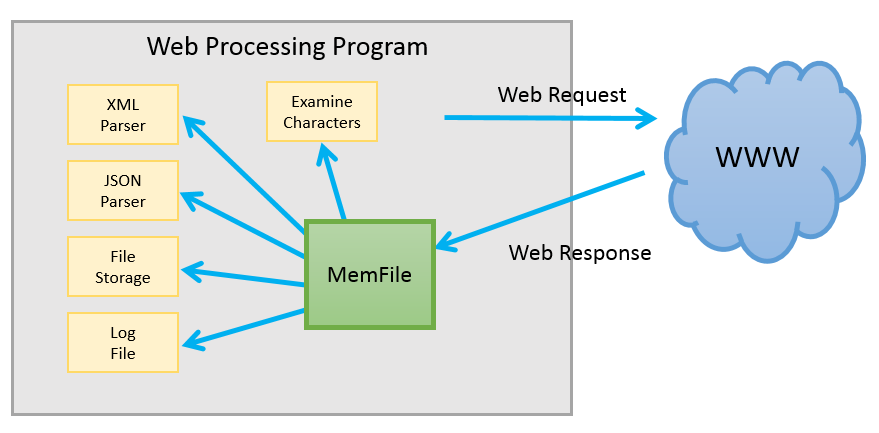
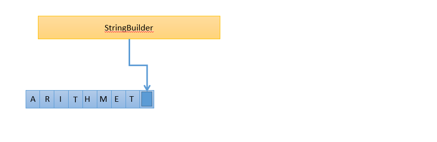
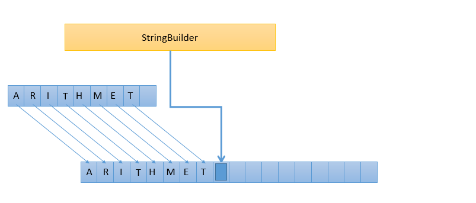
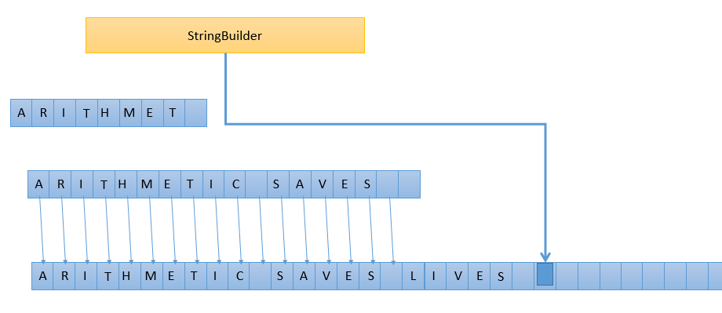
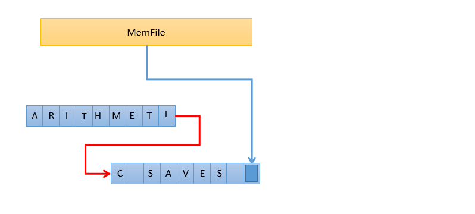
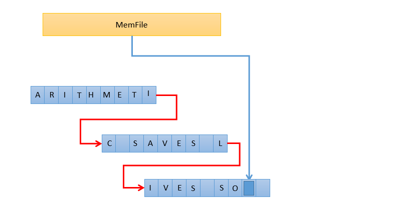

#  The Magic of MemFile

In the [Purple Utilities Library](http://purplehillsbooks.com/purpleDoc/) is a class called [MemFile](http://purplehillsbooks.com/purpleDoc/index.html?com/purplehillsbooks/streams/MemFile.html) which you can efficiently stream into and out of. Learn to use it properly can increase the efficiency of your programs when reading and writing data.

## Class Overview

MemFile is an object designed to give you an efficient buffer for streams. The most common use case is when you need to stream something to it, you can then stream out of it multiple time.  
It is far more efficient than using a byte array stream, or a string oriented stream object, because both byte arrays and strings need to keep the buffered information in a single contiguous block. That means that it preallocates a block of a particular size, but as you keep streaming, it has to allocate bigger blocks, and it has to copy everything from the old, smaller block, to the bigger block. This can mean while streaming, it might actually copy the contents 4 or 5 times to new, bigger blocks. That extra copying is wasteful. You can reduce the number of copies by starting with a bigger initial buffer, but then with a small amount of data that is wasteful.  
MemFile avoid this by storing the stream in a linked list of small blocks. As you stream, it allocates more blocks, but it never has to copy the data out of the original blocks. Streaming in never touches a character more than once, and streaming out touches each character once. There is no need to specify a size when constructing a MemFile, just construct it. All amounts of data are equally supported.

```java
MemFile mf = new MemFile();

```


MemFile is also very useful when converting between character-oriented streams to byte oriented streams. The only encoding offered by default is UFT-8. If you want to use other encodings of characters into bytes you have to do that yourself with the appropriate byte-to-character streams. But if you want to use UTF-8, then all the conversions are built in. You can stream in and out with any combination of bytes and characters.

## Use Case

When do you need to stash a stream some place?  Usually it is about conforming to a existing stream interface and translating to another.  There are cases where you have a stream, and then you want to send it to two or more places.  Or you need to receive a stream and you won’t know how to process it until after you receive it.  
Consider making a web service request, and you are not sure what the format of the response is going to be.  It might be XML, it might be JSON, or it might be URL formatted, but you won’t know until it is received.  Both XML and JSON have parsers, but for that to work, you need the parser to start at the beginning of the stream.  Generally you need to look at the first few characters, determine which it is likely to be, and then start the parser.   Having pulled the first few characters from the stream, it is complicated to then arrange for a regular parser to parse the whole thing.  
My solution is to receive the web request into a MemFile.  It is fast and efficient, and works fine when I am confident that the content being received will fit in memory.   Then, I look at the first few characters by reading from the MemFile.   One I have determined it is JSON or XML, I can get a new Reader, and give that to the parser to parse the entire thing.  
  
What can also happen is that the parsing fails because the first few characters looks like JSON, but actually there are syntax errors making it unparsable.  The parser throws an exception.  No problem, you still have the entire contents in the MemFile, so you can stream it again, for example into a different parser.   Or stream it into the log file.   It is a nice, convenient temporary buffer to save a steam contents while you figure out what to do with it.

## Why Not Use a String?

Some programmers do this by receiving the entire content into a string, which allows for the same inspection, but strings are far less efficient.  The reason is that the StringBuilder (or StringBuffer which works the same) attempts to keep all the characters in a single contiguous block.  To do this, it needs to allocate the block ahead of time.  
  
But what happens when you get to the end of the block, and need to write another character?    It need to allocate a new contiguous block, this time twice the size, and it needs to copy the previously received characters into it.   Something like this:  
  
And of course, when that is filled up, it will need to do the operation again, with an even bigger buffer.   This can happen many times, and each time the previous contents needs to be copied.  The copying, and the creation of many superfluous objects on the heap causes inefficiency.  
  
The MemFile class works differently.   It still needs to allocate a buffer to write into, but when that buffer is filled up, it creates a second buffer of equal size and just links it to the first.  
  
And the process continues as more is added.  
  
MemFile can do this because it does not require that all the characters be placed in a single contiguous block.   All it promises to do is to effectively and efficiently support streaming in and out of characters.  
There is a method that returns the total count of characters, so if you do actually need to make a string, then you can first find the total count, allocate the string to the exactly needed size, and then generate the string with a single allocation.   MemFile offers a method that does exactly that, so it can efficiently build a string, but my recommendation is: “don’t use it!”   Try to work completely with streams and avoid unnecessary copying of character data around in memory.

## Method Details

In order to do the streaming, standard [Reader](http://purplehillsbooks.com/purpleDoc/com/purplehillsbooks/streams/MemFile.html#getReader--), [Writer](http://purplehillsbooks.com/purpleDoc/com/purplehillsbooks/streams/MemFile.html#getWriter--), [InputStream](http://purplehillsbooks.com/purpleDoc/com/purplehillsbooks/streams/MemFile.html#getInputStream--) and [OutputStream](http://purplehillsbooks.com/purpleDoc/com/purplehillsbooks/streams/MemFile.html#getOutputStream--) objects can be retrieved.

```java
InputStream is = mfm.getInputStream();
OutputStream is = mfm.getOutputStream();
Reader is = mfm.getReader();
Writer is = mfm.getWriter();

```


There are also convenient operations for streaming the entire contents to either an OutputStream, a Writer, or a File.

```java
mf.outToOutputStream(OutputStream)
mf.outToWriter(Writer)
mf.outToFile(File)

```


As well as easy ways to read an InputStream or Reader until it ends.

```java
mf.fillWithInputStream(java.io.InputStream in)
mf.fillWithReader(java.io.Reader in)

```


## Summary

A MemFile is a buffer.   It is a buffer that you can write into, and read back later.  It conforms to all the Java standards about streams.   And it is far more efficient than StringWriter or ByteArrayOutputStream.  Learn to use streams to make your programs handle data without unnecessary copying multiple times.