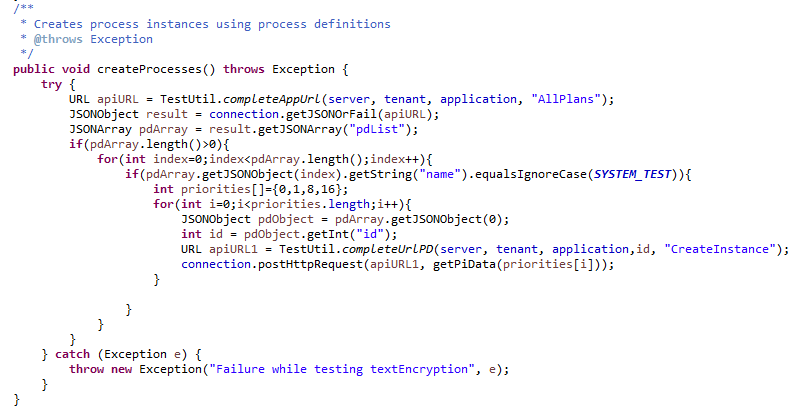

#  What is wrong with this code?

It is code review time, and I offer a sample of Java code for you to critique.   Can you find the problems?

## The example

  

For the purpose of this blog post, I have to pick one piece of code that is small enough to cover in a few points.  You will have to make some assumptions that the methods being called do what they appear to need to do.  The problems lie in the logic of this method directly. 

It is from an automated test suite, but the issues in this block are not specific to testing.  

read the code and make a list of problems before reading the next section

## Issues in the Code

(1) The first thing is, it is clear from the title and the comment that the very PURPOSE of this routine is to create process instance objects, so it should not leave the routine without any.   That is clear.  If it fails to create instances, it should throw an exception to show that it fails.

(1a) if pdArray is empty for some reason, the routine simple exits normally, without any exception.  It failed to create process objects, but did not let the caller know that.  

(1b) if no process definition is found with the name SYSTEM\_TEST then it just exits normally, without exception.  Again it failed to perform the purpose of the method, but did not let the caller know that. 

Both of these conditions must throw an exception so that testing does not continue without the process instances being created  

(2) the comment is inadequate.  What does someone reading the code need to know?  That it created 4 process instances at four different priorities.  Yes, you can figure this out from reading the code, but the comment should explain what the method does, and it should explain what makes this method special as opposed to any other method.  

(3) The exception that is thrown does NOT describe what this method does.  It says “Failure while testing textEncryption” however this method is creating process instances, and it should say “Failure to create process instances”.  
Did you get them all?  
Are there other problems that you caught?  
 

This entry was posted in [Coding](https://agiletribe.purplehillsbooks.com/category/coding/) and tagged [code style](https://agiletribe.purplehillsbooks.com/tag/code-style/), [errors](https://agiletribe.purplehillsbooks.com/tag/errors/), [exceptions](https://agiletribe.purplehillsbooks.com/tag/exceptions/), [programming](https://agiletribe.purplehillsbooks.com/tag/programming/). Bookmark the [permalink](https://agiletribe.purplehillsbooks.com/2019/11/14/what-is-wrong-with-this-code/ "Permalink to What is wrong with this code?").