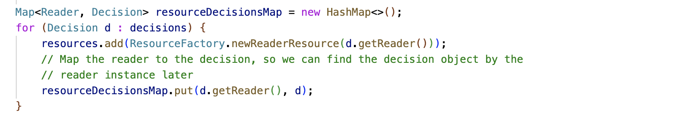

#  Lambda vs. Loop

There are two ways to walk through a list of values: one is the old-fashioned loop and the other is the new-fangled object streams which use a lambda to iterate through a list.  Which to use? Let’s explore the reasons for using one or the other.

## Avoiding Familiarity Bias

Understand that “**readability is in the eye of the beholder.**”  The personal preference of a given programmer will always depend on what they are used to. If you are used to lambda, your intuition is that that is easier to understand, but if you are used to the loops, then that will be more familiar and easier. To determine which approach is better, he need to set aside any preference based on intuition.  Avoiding that, we need to look carefully at rational reason to decide between the two, and to adopt the best pattern so it then becomes familiar.

The difference is small. We must also avoid the temptation to simply say it is so small it does not matter. Ultimately, we are setting a pattern, and we would like to choose which pattern is preferable for a good reason.  Once we have a good reason, no matter how small, use it so that everyone becomes more familiar with the better approach, and finds it ultimately more intuitive. So we care about small, rational differences.

Let consider a clear case.

## First Use Case

This is a real case from a real project.  There is a list of decision objects, each one has a reader object, and the goal is to construct a resource object for every decision object.  Both pieces of code below accomplish the same thing.  Both are formatted using the \`spotless\` code formatting and displayed the way that VS Code does syntax highlighting.  Obviously I avoided making any unnecessary changes between the two versions.

### Using Lambda:

### Using Loop:

## Analysis

One important guideline for software teams is ‘keep it simple’.  Don’t use ornate structures unless you need them and they provide an identifiable benefit.  We will naturally prefer the approach the accomplished the job with less elements.

**Size**: the lambda approach involves more lines and more elements. Not much more, but a little bit. More lines means more to maintain and that is bad. If the same thing can be said in a more terse form, it is generally easier to grasp and maintain.

**Reading Complexity**: largely the same. There is pretty much a one-to-one correspondence between the visible elements of the two blocks. The lambda approach is indented further implying more lexical levels that the reader needs to keep in mind.

**Code Cost**: The big difference is that the lambda approach causes the creation of a separate method. This creation is hidden from the user, but it is there and that makes the class a slight bit larger and more complex. That additional method is not reflected in the visible code. The extra hidden complexity is not good.

**Runtime Cost**: The loop will be very fast and efficient because it all runs in the same stack frame. Making a method call involves a bit more overhead for setting up the new stack frame for every iteration.  The loop approach does not need to do that. The extra processing needed is not good.

**Debug Cost**: When debugging, the extra stack frame becomes more apparent, you will see it in any stack trace: a method that does not appear in the code, and is nevertheless there in the stack with a funny name that it generated automatically. Debugging is enhanced when what you are running matches the visual code.  Magical creation of invisible methods is not impossible to understand in a debugging context, but certainly not make the debugging easier.

There are some other subtle differences between the approaches that we have not leveraged here.  For example, if the code block makes use of a return statement it will behave differently.  Break and continue statements operate differently.  The lambda support carefully makes other differences more hidden: for example the local variable resourceDecisionMap is made equally available in both cases.

We know that the loop will run slightly faster than the lambda, but speed is only one consideration.

**Conservative Programming**:  I suspect stylistically use of lambdas are more compelling to programmers because they are newer, and new elements would be invented if they were not good.  Shall I say it: lambdas are cooler.  It is very important to resist this temptation.  Even if all the other comparisons between the approaches were equals, we should prefer tried and true, well understood language construct over the new fashionable one.  Use the older construct unless there is a compelling reason to change, and in this case there are none.

## More Use Cases

For each case below, consider the metrics above: which one is less complex, has fewer levels, which one has variables declared in a more clear way. In all cases, the loop is coded with fewer line and clearer, more easy to understand code.  Case C is dramatically so.

Note, in each case the indenting is forced by the Google Spotless algorithm, and the indenting is directly related to the lexical levels in the code.  This is not an attempt to any code example look cumbersome in any way.  I tried to keep the variable names the same so that we can see exactly how the correspondence goes.

### Case B – Using Lambda

### Case B – Using Loop

### Case C – Using Lambda

### Case C – Using Loop

## Conclusion

Based on this analysis, we can recommend this guideline:

:::tip[Key Takeaway]

Avoid Using a Lambda when a Loop would do

:::

The straight loop is simpler, and faster, and easier to read ultimately. The loop approach comes out ahead in every way I could think to measure it.  I am always a fan of simpler approach in coding because reducing complexity increases reliability and maintainability.

My mind is open:  I am looking for a case where use of a lambda solves an important problem that the loop does not, however I have not found any yet.  Please let me know if you find a good case where the lambda is better.

Other languages might be different.  In JavaScript there is no good support for loops in this way, and so you are pretty much forced to use the lambda approach.  JavaScript support this kind of functional programming more natively, but it is really the last of loop support that tips the balance.

This also brings us back to the guideline that always stands:
:::tip[Key Takeaway]

Don’t use a complicated solution when a simple one would work better.

:::

