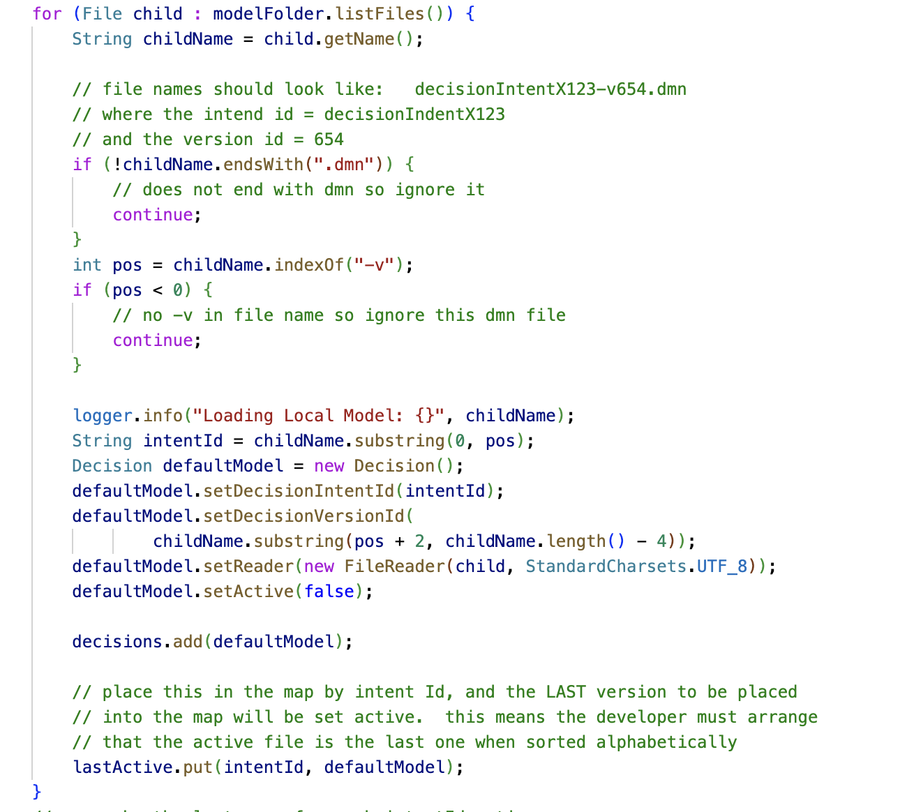
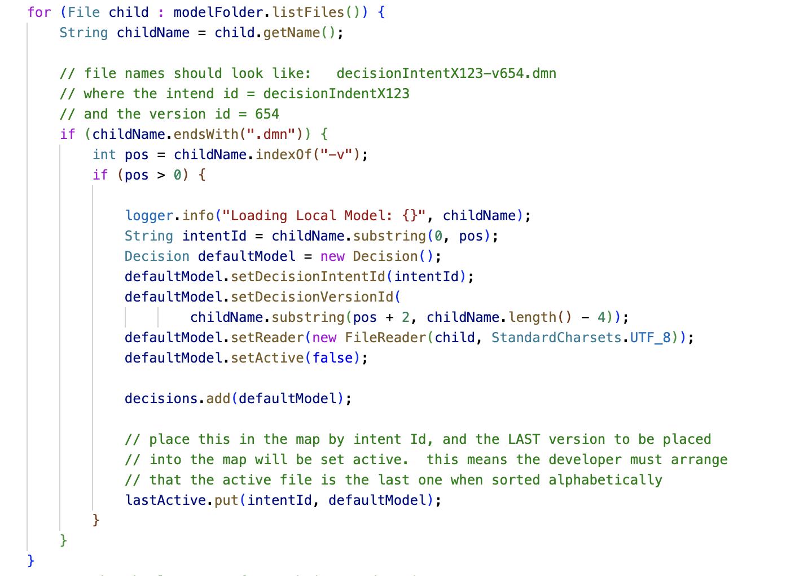

#  Avoid Deep Conditional Nesting

Simply put: try to make your conditions as flat as possible.  This makes them generally easier for the humans to parse and understand.
   
I ran across this example today:

```java
daysInMonth[1] = 28;
if (year % 4 == 0) {
    if (year % 100 == 0) {
        if (year % 400 == 0) {
            daysInMonth[1] = 29;
        }
    } else {
        daysInMonth[1] = 29;
    }
}

```


You might recognize that as the formula to calculate the number of days in February. Most of the time February has 28 days, but sometimes, on a leap year it has 29.  

The above conditional expression is correct. However, it is a bit tricky to read, particularly inside the century test level, to notice that there is a condition where nothing is set. (There is no ‘else’ on the year % 100 condition.)  

The same expression can be rewritten in this form:

```java
daysInMonth[1] = 28;
if (year % 4 != 0) {
    //do nothing this is a 28 day February
}
else if (year % 100 != 0) {
    daysInMonth[1] = 29;
}
else if (year % 400 != 0) {
    //do nothing this is a 28 day February
}
else
    daysInMonth[1] = 29;
}

```


Even though the logic is exactly the same — all we have done is transform according to DeMorgan’s laws into another form and rearranged — this form is easier to decode. You can handle one thing at a time. Each steps gets one step more refined. As you eliminate the earlier conditions, there is less complexity you have to hold in your head to remember what all the remaining possibilities are.  

More important, it is easy to see that there are really only four cases: two with February at 28 days, and two with February at 29 days. That is much harder to see in the original formulation.  

When looking for a bug in the logic, the ability to identify all the relevant cases, and the ability to work through the logic is critical. Both expressions above are correct in the logical sense. But if there was a bug in them, the second would make it much easier to find the bug.  

So if possible, flatten your boolean logic expressions to be step-like or list-like.

## Use "Continue" statements to reduce cognitive load


Below are two code scenarios, one with continue statements, and one without structured as a deeply nested if statement.   This example has only two, but the problem gets more significant the more conditions you have.  The continue statement approach de-clutters the logic by using an approach of elimination:  The code uses each if statement to eliminate non-conforming cases, and the rest of the logic proceeds with the conforming cases.  Any block or loop that is searching for specific conditions for processing can benefit from this approach.

Example with continue statements



Here is the version with the if blocks extended to the end of the loop:



To understand the IF statement, you have to see to the end of the block.  This is a relatively small if block, so you can see to the end.  If it goes off the page, that is a different matter.


Extending the if statements to the end of the loop is not easier to read or understand.   The IF statement increases cognitive load while reading the contents of it.  An IF statement that does a `continue` allows you to ignore that condition.  The IF eliminates a set of possible inputs, in this case files that are named incorrectly so you can ignore them.  The `continue` formulation allows you to ignore those ignored cases.   The big IF block does not allow you to ignore them:  everything is indented in and you need to consider the condition for the entire block.

