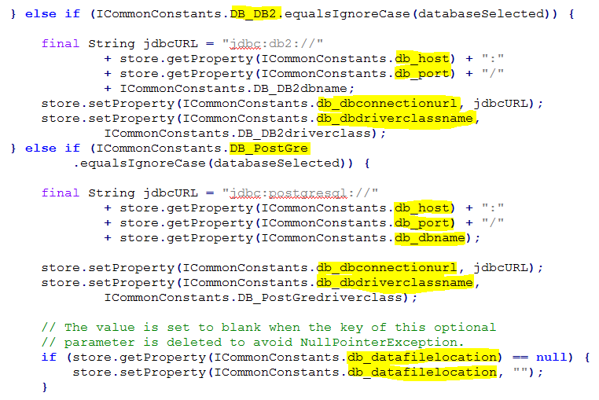
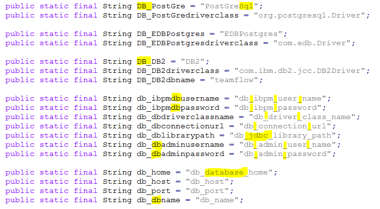
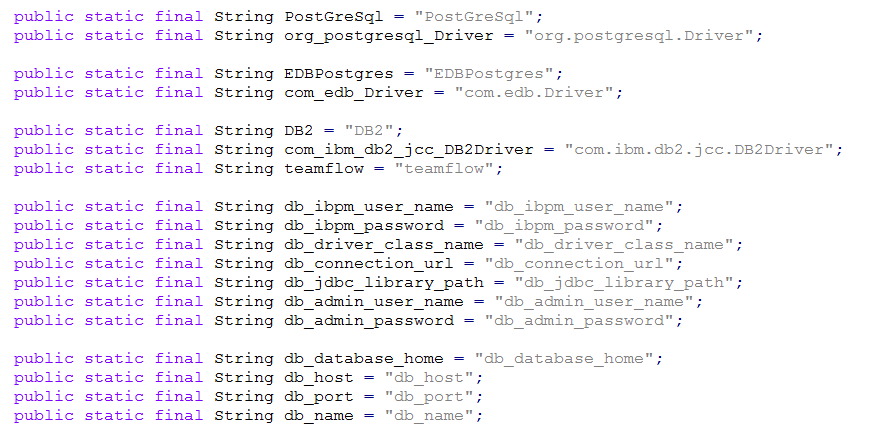
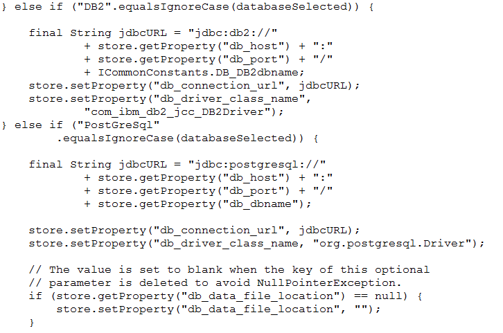

#  Constant Abuse 2

Some programmers believe that constants are the source of all goodness, because it means in the future that everything will be malliable.  Particularly programmers paid by the hour.  This is a mistake.  Readibility suffers if constants are abused.  I am reading some code today which exemplifies this.

## The Situation

Here is some code that reads and interprets a “config file” -- that is a file that contains a lot of name value pairs.  Something like this:

```java
db_type=PostGreSql
db_ibpm_user_name=GuaranteeInc
db_ibpm_password=*********
db_driver_class_name=com.foo.project.MainThing
db_connection_url=http://server:9550/foo
db_jdbc_library_path=x/yyy/z
db_admin_user_name=frank_underwood
db_admin_password=xerxes
```


The program has some code that looks like this:  
  
This then involves a separate class file called ICommonConstants which contains this Java code where I have highlighted some of the differences between the constant name and the constant value:  



## Readability

To read the source code, you understand that it is reading values from a properties.  The source is reading a property “DB\_PostGre” so you might expect to look in the file and find an entry for “DB\_PostGre” but that is not the case.   First you have to go look inthe constants file.   “DB\_PostGre” actually stands for “PostGreSql”.   So look in the property file for “PostGreSql”.  

This difference may seem slight, but it adds a lot of complexity in reading and understanding the code.  It is not the case that “DB\_PostGre” is any more explanatory than “PostGreSql”.  They are both equally obscure.  So why have two versions of the value?   And why force the reader to translate between them?

## Arbitrary Differences

There was some attempt to make the constants similar to the values they represent, but there are many arbitrary differences that I highlighted.  
For instance in the code you read “db\_dbadminpassord”  but the config file will have “db\_admin\_password”.   A small difference, but that difference means you can’t search for it without going to the constants file and mapping the identifier to the value.  

Another example is the constant “db\_home” which translated to “db\_database\_home”.  Remember, in the Java code, you can change the name of constants any time you want.   Why wasn’t the constant (and all 3 to 4 places it is used) changed to be called “db\_database\_home”.   If it had been, then the Java code readibility would be greatly improved.  

Imagine instead the situation where constants are named EXACTLY after the value they represent.  Like this:  

  

If you do this, then in the code when you see “PostGreSql” you know that the value in the config file will be “PostGreSql”   That would be a huge improvement in readability.

## They Can Never Be Changed

Some believe that constants are created so that you can change the value, but in this case once you have shipped a version of this product, you will have config files all through the customer base.  The property name in the file is “db\_database\_home” and it will have to be that name in all future version of the product (except if you do expensive schema migration which is unlikely to be worthwhile for a config file!)

The property names can never be changed, but the Java constant identifier can be changed, so there is really no excuse for not using identifiers that match the value.   But still, since the property can never be changed, why not simply use the string literal in the code.   For example, you might end up with code like this: 

  

Look at that!  Compare to the code at the top.  The code contains the EXACT string that you will look for in the configuration file!  This is easy to read.  It is clear what the code is doing.  And you can read and understand it faster without involved an arbitrary look up in between.  

Some programmers recoil:  what if you have to change them.  First of all, you can’t change them because of all the config files that already are deployed, however it is trivial to do a search and replace for “db\_driver\_class\_name” with any other value.

## Encapsulation

One final problem with the implementation:  all of the constants were defined in a completely different package.   The class “DeploymentManager” was in a package called “silent.core” while the constants where in a completely different place in the source tree, in a package called “constants” which apparently contains only constants.  
The opposite of encapsulation is called spaghetti-code.  Anything that a class needs, that no other class need, should be encapsulated in that class.  If ti must be shared, then ideally it will be defined in the same package.  But this code actually has the critical maps necessary to understand the class, in a completely different package.

## Conclusion

Every step that slows down the ability to understand and read the code, increases the cost of maintaining the code.  Creating constants with names that different slightly from their value, that are defined in a separate package, that can never be changed add a cost to maintaining the code which can not be justified.  Using string literals would be superior from a cost of maintenance point of view.  I can’t think of any advantage of using the constants because they never can be changed.  
See an earlier post on a similar topic:  [Constant Abuse 1](https://agiletribe.purplehillsbooks.com/2016/03/09/constant-abuse/)

This entry was posted in [Coding](https://agiletribe.purplehillsbooks.com/category/coding/) and tagged [constants](https://agiletribe.purplehillsbooks.com/tag/constants/), [Java](https://agiletribe.purplehillsbooks.com/tag/java/), [maintenance](https://agiletribe.purplehillsbooks.com/tag/maintenance/), [programming](https://agiletribe.purplehillsbooks.com/tag/programming/). Bookmark the [permalink](https://agiletribe.purplehillsbooks.com/2018/11/14/constant-abuse-2/ "Permalink to Constant Abuse 2").