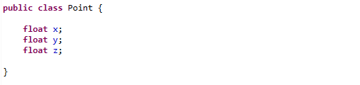
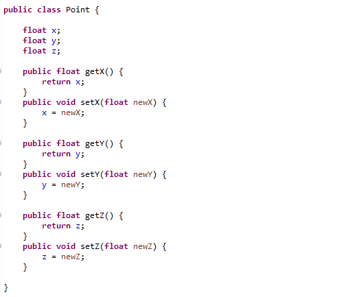
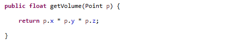
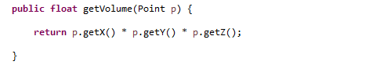
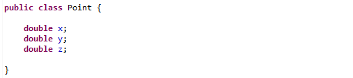
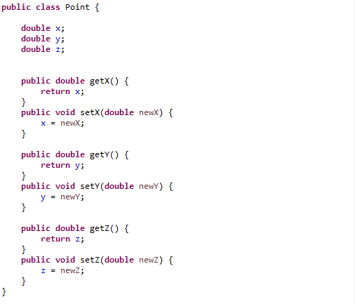
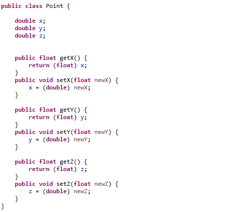
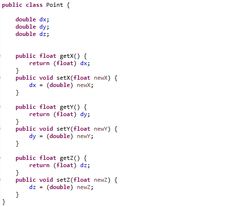

#  When Getters and Setters are not Needed

Getter and setters (also called accessors and mutators) are small pieces of code that run to provide a value stored in the object instead of accessing it directly.  Sometimes they are good, sometimes bad, this post explores which is which.

Some people find this topic so close to a religious one that I am right now fearing the blowback.  How can I consider the heresy of not implementing getters and setters?  Well, sometimes you don't need them, and you should never implement what you don't need.

## Need for Change

Why do we have getters and setters? The common answer is: in case you want to change the implementation in the future you will have that ability to.  Also used to prevent update to values that should be read-only, although here we focus on the 'change' reason.

Pay close attention to this:  there is a _**potential**_ that we might need to change in the future, so we are going to _**pay now**_ some amount, so that the potential future change is less expensive.  If you never end up changing things, then your payment now is completely a waste.

The agile principle of YAGNI suggest this can be a waste.   In a recent post “[Code only what you Need](https://agiletribe.purplehillsbooks.com/2023/04/10/code-only-what-you-need/)“, I argue that implementing today what you might need in the future is always a waste.

1.  It is a waste if you never get around to needing to make a change.
2.  It adds cost to maintaining the current code whether you need it or not.
3.  If you don't anticipate the exact change you need, you will have to redo it.

## Historical Origin

There was a time when getters and setters were a very good idea in general, but our programming languages have changed, and most benefits no longer apply.

The idea of getters and setters goes back to the very first object oriented languages.  C++ is arguably the first successful OO language based on C.  Understand that C would calculate the actual machine address of a global variable in memory, and then put that address into the code directly.   Not the actual global address, but an actual number of bytes from a reference point like the heap or the top of the stack.  Code compiled to use a record structure would have the intimate details of the exact memory positions fixed directly into the machine code.  The code also explicitly assumed the data type to be found at that location in memory.

dd a data member in the middle of the record, and all code everywhere that uses that must be recompiled a relinked into the whole system – a process sometime taking hours or days.  Any code that missed recompilation would be reading and writing the wrong values to that piece of memory, quite possibly creating data corruption that would cause other parts of the code to behave unpredictably.

With modern languages, it is hard to imagine exactly how ossifying that was.  Because of the incredibly high cost of making a change, sometimes preparations where worth it.  Add an extra method now to read and write that little piece of data, and you get the freedom to change your internal representation. From the very first course on C++, the lesson to always create getters and setters was drummed into students, and it was important.

## What is the Benefit Today?

None of the modern languages work this way. Java, Python, JavaScript all use a symbolic reference to look up object member values.  Compiled code to look up “point.x” will do the right thing even if the internal representation of the object changes.  Add a data member before or rearrange them, and no problem: the compiled code does not have the byte offset for x.

Runtime type checking is used far more often to assure that the right thing gets done.  Change the type of “x” from a float to a double, and most of the calling expressions will not have to be changed: the runtime system will simply use the right version for the new data type.  Even if conversion is not automatic, the runtime system can usually tell when the data being accessed is the wrong type and not what the code is expecting, assuring that recompilation happens when needed.

Modern languages compile tremendously faster than the old one, and even very large systems can be built in a few minutes.  So you can make a change in a class structure which required recompilation, and in many cases the recompilation takes care of any possible code problem quickly and easily.

Modern IDEs automate the kinds of changes that you might need to make, finding and fixing all the points that are accessing the changed class. If they can't automate the change, they can easily list them all for you, and global search/replace can make a lot of changes really easy.  Once you know exactly what the change is, you can then make the change exactly, and end up with code that works exactly as you need it to.

## Not Really Needed in Many Cases

Adding a getter and setter doesn't actually solve anything.   Consider for example changing the internal implementation of a Point class from _float_ to _double_.

If your getter is declared as a float, then you probably want to change the getter to be a double. This exposes your class to all the incompatibility

changing the internal representation to a double buys you nothing.  If you want to use the additional precision, you have to change the getter.  Of course, you could define a new getter that returns a double, but then you still have to change your code everywhere to call the new getter, and you have the old one left around as technical debt to be maintained. if the change effect the external contract, then the getter/setter has not in fact saved you anything.

Fifth, entirely hidden internal changes are extremely rare.  If the internal change has literally no effect on the external contract, then why are you changing them?  Adding and removing other members does not break direct references to a member.  Changing the data type of a member almost always requires a change to the getter/setter.

## What is the Cost?

First cost is that you have many of lines of code for no real benefit.  This is extra lines that maintainers will have to read and understand, but which adds absolutely no value to the running of the code if the internal implementation is never changed.

Consider this Point class using only data members:

Here is the same with getters and setters:

A modern IDE will create these lines easily and automatically, so it is not strictly a coding problem, however when you go to read it, and to maintain it, you have at some point check and see that each of the method is doing what it is supposed to do.

Second cost is readability at the call site.  Let say you want to calculate the volume of the  rectangular space from the origin to the point.  Here is the example without getters and setters:

Here is the same thing with getter and setters:

There is no question that the first one is clearer and easier to read.  Obviously you can get used to either one, but all things equal, the first of these is easier to read.  It is not a big change, but you have to admit that it is longer and requires more effort to grasp.  When dealing with code readability, we need to be concerned about small changes like this.  There is an advantage in using the members directly when readability is considered.

Another cost is runtime overhead: a method has to be called after looking up the method, a stack frame needs to be put on the stack, the code runs, and finally the return value is popped off the stack.  To be clear, this is not a lot of overhead, but it is clearly overhead.

## Just Make the Change

The whole point of getters and setters is to make change easy, so let's consider a change.

Let's consider two cases: a change where the getters and setters are changed, and a case where they are not.  Consider that you want more resolution on the Point class, and you decide to change from float to double.   The modified simple class would look like this:

With modern programming languages, that is pretty much all you have to do.  the fact that doubles are bigger in memory, and the object have moved around does not matter: the values will be accessed by name, and the memory address of the value is not coded into memory.  Truth be told, this solves a majority of the problems that getters and setters were designed for in the first place.

If this change would cause a compatibility problem, it would be found by the compiler.  the IDE is likely to have mechanisms to find and sometimes even fix the incompatibilities that this change makes.  There is a strong argument that you should “bite the bullet” make the change to what you need, let the IDE and compiler sort of the consequences of the change, and then get on to correct code that has the advantage of higher resolution points.

Don't protect callers from change, just make the change and deal with it.  In many many cases it is easy or automatic.  Plus the implementation is more transparent and correct without the class pretending to be something it is not.

## Failure to Protect from Change

Consider the same change with getters and setters, and make the corresponding changes to the getters and setters.  this is one of two options:

The problem with this is that you have broken the contract with the caller in exactly the same way that changing the basic object does.   If the double type is incompatible with any calculation being done, it will be just as incompatible with the getter as well!   The internals are not hidden, they are simply expressed again with the overhead of a method call.

Opponents to always creating getters point out that this actually still exposes the internal implementation of the class.  The goal of completely encapsulating the internal representation has been violated by making a getter and setter matching the internal implementation. This shows how automatically defining getters and setters to exactly match the internal structure does nothing of benefit, but still incurs costs above using the members directly.

## Preserving the Contract

To allow the object to participate precisely with earlier uses of the class, you might decide to leave the getters and setters defined exactly the same.  Like this:

This of course preserves the contract with the callers, accepting float values and returning float values.  Sit back and admire how pointless this change would be in this case.  Although the point class defines higher resolution objects in the interior, it can't use them, because all the values coming in and out are reduced to the resolution of a float.

To get high resolution advantages, without breaking the low resolution usage, you might provide BOTH the double accessors and the float accessors so that old code uses the float, and new code uses the double and benefits.  This is an important legitimate use of accessors which I will mention below.

Quite often changes need to be more than this which are less likely to be automatically accommodated by the compiler.   Consider a document class that provides HTML output, and the programmer decides to change from HTML internal representation to Markdown internal representation.  There might be legacy accessors to provide HTML and automatically convert.  Legitimate cases are discussed below

## Where are getters/setters Justified?

**Do use getters/setters when:**

*   Interfaces for separately compiled libraries.  When designing an API for a library that will be used by completely different projects under control of a different organization, when it is still wise to stick to getter and setters so that upward/downward compatibility is less of a problem.
*   The class has a quantity that can be read but not set.  Provide a method to get the value, but keep the data member private.
*   There are side effect to a value.  For example a class that represent a fetched web page might have a web address of that page, but direct setting of that address should not be allowed.  Instead a method to fetch the web page should be used.
*   Methods that you know will be specialized in derived classes.  If the meaning of the method changes across different subclasses then of course use a method. For example a writer object may have a byte stream embedded in it, but a specialized version of Writer might embed a StringBuilder instead.  Different sub-classes have different implementations and so exposing these details would be a problem.
*   The class wants to control the range of values that can be set on a member, and so will validate set values (must within a range or whatever) and thrown an exception if an invalid value is set.

Most classes don't fit in this category. The real thing is to not simply assume that all members need getters and setters.  If you have a clear need, implement them, but if not, the expressions using the data members directly are more convenient.

**Don't use getters/setters when:**

*   They simply reflect the exact same values or types as on the basic object and those members are unlikely to change.
*   Class is mainly just a data storage without a lot of complex interactions, like the data members in the Point class above.
*   Data members are likely to be useful directly and meanings of the member are obvious, such as x, y, and z above.
*   The class is so well defined or common, such as a Point in three-d space, that it is not likely to change in any significant way.
*   It is a class that is just used internally, and the number of places that access it are limited.  It is better to update all the call sites than to maintain a translation to the old object.

For most classes in routine programming, if you need to change the internals of a class, it would be better to simply find and fix all the corresponding calls to that code.  When done with this change, the final implemented code is both efficient as well as being easy to understand.

## You Can Add Them When You Need Them

There is a principle in agile development known as YAGNI (You Aren't Gonna Need It).  This principle is to avoid adding things to code that might be used in the future, because you can add them in the future if the need arises.  On average, the effort you save by not defining things you don't need pays for the effort of adding them later when you do.

For this Point class, imagine you implement the simple, directly accessed members.  This case:

You find you need to change from float to double, and you are worried that there is code that depends strongly on getting exactly a float value.  You can **_at that time_** implement the accessors that convert to/from float values, and you rename the internal member to prevent any code from accidentally doing the wrong thing.  Like this:

The compiler will find all the places that are erroneously trying to access “x” directly, and you either automatically or manually change this either to “dx” or to “getX()”.   This is work, but it is surprisingly easy, and when you are done, you have a properly defined class, and have reduced technical debt.

The point here is that you can get all the benefits of accessors when you need it, and it is a waste to define them before you need them.

## Not Always Worth It

Given a project with hundreds of classes involving thousands of getter/setter, what is the chance that you will need to change them?  What is the chance that you will need to make an internal change to the object that you need to hide from the other classes?

I am not against getters and setters:  they are certainly needed sometimes.

I am against the automatic generation of getters and setters for ALL data members of all classes.  There are clearly cases where addressing the data member is valuable and useful.  in many cases the class will never change.  For internal classes, you can easily change them when needed anyway without the overhead of getters/setters.  We should not consider that all classes should always have them.  Instead, it is pretty simple:

> use getters and setters when they are needed, and not when they are not needed.

## References

*   [Getters/Setters.  Evil. Period.](https://www.javacodegeeks.com/2014/09/getterssetters-evil-period.html) – Yegor Bugayenko argues the extreme position that no getter and setter should ever be used, not ever because getters and setters don't actually mimic behavior of real objects.
*   “[Why getter and setter methods are evil – Make your code more maintainable by avoiding accessors](https://www.infoworld.com/article/2073723/why-getter-and-setter-methods-are-evil.html)” – 2003 article by Allen Holub from JavaWorld in InfoWorld argues that getter/setters don't actually hide the implementation of the object because “.x” and “.getX()” expose the exact same amount of internal details.
*   “[Are Getters And Setters an Anti-Pattern?](https://levelup.gitconnected.com/are-getters-and-setters-an-anti-pattern-c8cb5625ca8c)” – More discussion of Yegor Bugayenko scandalous suggestion that all getter/setters should be eliminated.