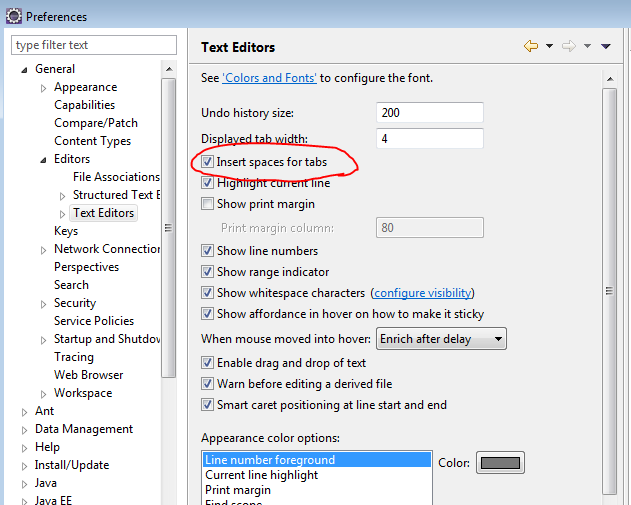
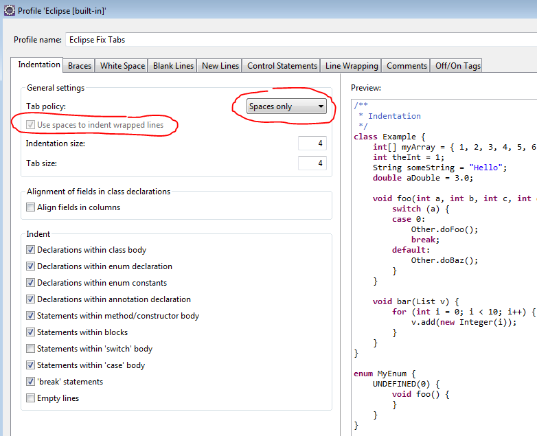
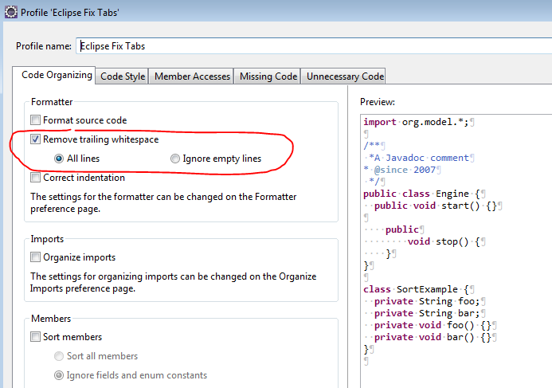

#  #18 Don't use TAB Characters

An age-old debate that should not exist.  Tabs are evil.  It is an attractive idea, but poorly implemented, non standardized, unpredictable handling, and so this post enumerates the ways that their cost far outweighs their benefits.

## Tab Characters

The ASCII character #9 is designated a tab character, and the idea was that the occurrence of one of these in a piece of text would advance the horizontal position to the next tab position, harkening back to the time when manual typewriters would have would have little metal pieces that could be inserted into positions along the line, and would physically stop the advancement of the carriage holding the paper.

The problem with tabs is that there is no standard way to encode the tab stop positions into the text file.  Traditionally many systems have assumed that tab stops are positioned every 8 characters, and so advance to the next integer multiple of 8.  This makes it easy to line up columns of things that are smaller than 8 characters wide. But the 8 character assumption was never standard, and different environments used differing values for how many characters equals a tab stop.  

It is worth mentioning, but I assume obvious to every reader here, that if you were to use proportionally spaced fonts, that the tab offset would not be measured in character widths (which all vary) but instead in real world units like inches or centimeters.  Tabs play an important role in wordprocessing, but this discussion is about text files, source files, which do not have (and do not need) tab stop positions in anything other than fixed-width character spaces.  I would welcome tab characters in a system that uses proportional fonts and has a standard mechanism to indicate the tab positions, but in plain text files, tabs are just plain evil.

## Indentation is Important

All current programming languages (that I know of) allow the programmer to indent lines in order to clarify the structure of the code.  This indention, if used properly, is important, for readability and maintainability of the code.  If the programmer indents the code one way, and then it is displayed a different way, the code is not only less readable, it may mislead someone into misinterpreting the meaning of the code.  It is reasonable to say that the indention is PART of the program, and distorting the indentation is equivalent to distorting the source itself.  

Some programmers saw an opportunity to use tabs as a mechanism to make it easy to indent code.  One level deep would be one tab, two levels two tabs, and so on.  But 8 characters was too deep, so then smart editors offered variable amounts.  Many systems use 4 characters as the indent depth (and therefor the tab width) but I have seen 2 and 3 character indents in use as well.  The tab width was a setting on the editor, and often associated with the filename extension (“.java”, “.htm”, or “.txt”).  The biggest problem with this is that there is no way for the editor to communicate to other tools what the settings were.  

Sun specifies in their Java coding conventions that this a tab should be interpreted as 8 character, and from that we can assume that they are still providing tools that use this assumption of the meaning of a tab character. When source that has been formatted for 4-character-tabs is displayed in a tool that expects 8-character-tabs, the indent is displayed incorrectly. It is not just that it is indented too deeply, but since both tabs and spaces are white space, there is usually a mix of tabs and spaces at the beginning of the line. One line might have 4 space then two tabs, and another 8 spaces and one tab. In the text editor they appear the same, but a tool that expects 8-character-tabs will display them as having different offsets, making the code hard to read. Readability and proper indentation is important to avoid reading errors and programming errors.  

There is no problem with “pressing a tab key” on the keyboard in order to line up text, but instead of putting tab characters in the file, it should instead add the appropriate number of space characters.  This avoids this whole problem by interpreting the meaning of the tab key when it is pressed, and not putting any tab characters into the source that need to be interpreted later. Since there is no ambiguity, the source is always displayed the same way, regardless of your assumptions about tab characters in the source.  Another way to say this, is that any assumption on how tab is supposed to work is completely encoded into the spaces that are entered in the file.

## Tools

Some will claim that everything can be configured to allow tabs to be interpreted as 4 characters, but this is not true.  Below are tools which display source incorrectly if that source contains tabs that are supposed to be 4 characters wide.  

**WinDiff** – can check an entire source tree against another source tree, listing the files that are different, and provides a way to navigate to the files that have changed,and show the differences. It displays tabs as being 8 characters wide, and is not configurable. While WinDiff does not have the best display of the differences, the powerful capability to recurse a source tree and find all files that have changed is unique. You can tell it to ignore files that have names that fit certain patterns, which is nice for exclusion. If you do not use tabs, and use only space characters, then the indentation is always correct.  

**CVS diff** – display of differences between files one your disk and in the repository. Output is to the command line. The command line assumes that tabs are 8 characters and is not configurable. Output can be redirected to a text file, and opened in an appropriate text editor, but here there is a curious problem: In lines that have been added it puts a “> ” at the beginning, and lines removed it puts “< ” in front. Adding two characters always messes up the indentation because some lines will be shifted 2 characters, and some will be left alone. It is even possible for some lines to be shifted over a complete tabstop. If you do not use tabs, and use only space characters, then the lines always shifted over 2 spaces, and all the relative indentation is correct.  

**ClearCase** – has a similar diff tool. Tabs are 8 spaces, and can not be configured. I know we have moved off of clear case, but my point is that you do not always get a choice in the tools that you use. If the source is in ClearCase, then it is most convenient to use the clear case diff tool. Tabs that assume 4 character offsets will be displayed incorrectly. If you do not use tabs, and use only space characters, then the indentation is always correct.  

**GREP, SORT, SED, Any command line tool**  – Any specialized tool that searches to find particular patterns or whatever and displays the results by output to standard out will result in incorrect display, because the command line assumes that tabs are 8 characters. If you do not use tabs, and use only space characters, then the indentation is always correct.  

**Microsoft Word**  – While programmers are not always involved in documentation activities, it is not unusual to take snippets of code, and paste them into the word document. Word, and other word processing programs, treat tabs in an entirely different way: a tab advances to the next tab stop. Assuming that a fixed-space font has been selected so that each character has the same width. Furthermore we assume that you have not done anything special, tab stops are on the 1/2 inch or 1cm offsets. In this case the tab stop is neither at 4 spaces or 8 spaces, but often a completely different physical offset, and the code looks entirely wrong. If you do not use tabs, and use only space characters, then the indentation is always correct.

**MS Notepad** – displays tabs as 8 characters, and can not be configured. Who would use notepad? I hate notepad, and would never use it by choice, but there are some cases where the OS brings up notepad even when you have specified something else as your text editor. For example: “view source” from IE always uses notepad (except if you hack the registry which is not recommended for a couple of reasons…) Therefor it is unavoidable that notepad will appear at time to time. If you do not use tabs, and use only space characters, then the indentation is always correct.  

**Tinderbox, other web based tools** – If you use any thin client web based tools for source management which displays the source using the \<pre\> tags will be displayed incorrectly because Internet Explorer has the built in assumption that tabs are 8 characters, and you can not configure this. There are many specialized searching, sorting, and batch manipulation tools that display source within a web page. If you do not use tabs, and use only space characters, then the indentation is always correct.  

**Uncontrolled Environments** – I can often get my personal workstation configured correctly using Eclipse or other tools that I am used to — this is my “controlled” environment. But the real problem is that debugging and testing of the product is not done in my controlled environment. If we experience a problem on HP-UX, we have to go to the HP UX machine and work on the problem there. Often, there is no time to reconfigure the environment to be comfortable; we have to use whatever environment is there. By default, most unix environments have standardized on the tab being 8 characters. If I am forced to use VI or EMACS (I would never choose this, but there are times when it is necessary) then the source will be displayed incorrectly if it has tabs in it. While Eclipse is cross platform and freely available, you do not always get the time to install and configure eclipse. If the problem is at a customer site, they may not allow you to install anything. But, if you avoid tabs, and use only space characters, there is no indentation problems. 

**Customers** – We are not the master of all domains: some of our source is delivered to customers. We can decide internally that a tab is 4 characters, but our customers may have chosen a different standard. The source will appear poorly indented to them. If you do not use tabs, and use only space characters, then the indentation is always correct.

### The Flip Side

The above goes into detail on how the tab character can be evil, let examine the reasons that programmers usually give for using tabs, in an environment where tab is set to 4 spaces, and source indentation is 4 spaces. The assumption is that the programmer in the controlled environment is using a “professional” text editor that represents a tab as 4 spaces. Those professional text editors have (in all cases I have seen) an option to insert spaces when you press the tab key: enough to move the selected character to the next tabstop. Thus in either case, the line you are working on can be easily indented simply by pressing the tab key. The comparison is then between running this text editor where it inserts a tab character when the tab key is pressed, and where it inserts spaces when the tab key is pressed.  

**indentation is more correct with tabs** – of course it is only correct if you put the right number of tabs in, and you do not have any extra space characters after the tab and before the line of source. This requires that when you insert the tab, you have the cursor at the right place to insert the tab, and press the tab key. But when using spaces, if you position the cursor at the right place, and press the tab key, it inserts precisely the right number of spaces to indent. So the indent is equally correct.  

**Moving blocks of text left and right is easier with tabs** – All professional text editors have a batch reindent mode: usually the action is to select a number of lines, and press tab to move all the lines a tabstop to the right, or shift-tab to move them one tabstop to the left. This batch indent mode works the same regardless of whether you are using tabs or using spaces. This batch mode works for single lines as well. So if a block of source is indented too far, or not far enough, the action required to change the level of indent is precisely the same regardless of whether you are using tabs or using spaces.  

**If I over-indent, and can get back with a single backspace key press** – Imagine you press the tab key one too many times. When a tab character is stored in the text, then pressing the backspace deletes the tab before the cursor and moves the cursor to the previous tab stop. When using spaces, you must press the backspace key 4 times to get back to the previous tabstop. This is a very emotional issue with some programmers who insist that ease of deleting the tab character is important. It is very much what you are used to.  If you need this, get an editor that converts TO tabs when reading, and converts back to space when saving.

## Summary

In the end, your viewpoint depends upon whether you think programmers are making the source for themselves, or whether they are making the source for someone else. As a programmer, I have never felt that the source is there for my convenience, but rather that it belongs to my employer. The source has a life beyond the initial programmer, and there are many tools that are used outside the eidting of the source that are important. As a development manager, I find myself using those “other” tools more often, and usually I have little choice over the tools that I use. It is not sufficient to simply say that there exists a DIFF tool that can handle tabs-as-four-characters, but often the choice of tool is not allowed. As a conclusion, if we can make the source work in ALL tools, then we have at our disposal ALL tools at any time. Using tab characters in the source limits the number of tools that can be used. Using space characters for indenting allows the source to be used in ALL situations, with ALL tools, without exception.  

The conclusion is clear: make then the decision to always indent with spaces, and avoid all the problems with tabs.

### Resources

*   [EMACS: TabsAreEvil](http://www.emacswiki.org/emacs/TabsAreEvil) "Tabs are evil whenever they require you to know the tab size in advance."
*   [Daniel Lemire’s blog](http://lemire.me/blog/archives/2005/11/24/tabs-are-evil/)  "Tabs are evil in text files. Why? Because the tab character (\\t) has vaguely defined semantics. It means “insert x spaces” where x depends on the text editor and the preferences of the user.  The solution? Tell your text editor to dynamically replace tabs by spaces."
*   [Reddit discussion on the topic](http://www.reddit.com/r/programming/comments/cm7p1/so_whats_up_this_notion_that_tabs_are_evil_do_you/)  "When I write code I want someone else to read, I want it to look good when they try to read it. That does matter. This discussion contains good advice about how to achieve that. "
*   [Why no tabs](http://adamspiers.org/computing/why_no_tabs.html) "It's less portable", "It makes context/unified diffs far harder to read, because of the way they use the first column to indication the manner in which the line has changed.", "It makes re-indenting sections more difficult", "The `tabs are good because then you can choose your own tab width' argument doesn't work"
*   [Jamie Zawinski: Tabs versus Spaces](http://www.jwz.org/doc/tabs-vs-spaces.html) – "My opinion is that the best way to solve the technical issues is to mandate that the ASCII #9 TAB character never appear in disk files . . ."
*   [C++ coding style - broken link](http://www.chris-lott.org/resources/cstyle/CppCodingStandard.html#indent)
*   [JSPWiki: Why Tabs Are Evil - broken link](http://www.jspwiki.org/wiki/WhyTabsAreEvil)
*   [Pluralsight: Tabs are Evil - broken link](http://www.pluralsight-training.net/community/blogs/craig/archive/2004/12/08/3775.aspx)

## Nuggets

:::tip[Key Takeaway]

Tab characters should never appear in source text files.  Set your editor to write spaces instead of tabs.  Only in this way can you guarantee that indentation will be correct and meaningful in all situations.

:::

## Editor Settings

Searching through through the setting in Eclipse can be daunting to find the right place. Each editor seems to place it in a different place.  
For ECLIPSE you find it in:  Preferences > General > Editors > Text Editors  
  
And also, if you use the text formatting, find the setting in Preferences > Java > Code Style > Formatter > Indentation and make a new formatter with these settings:  
  
These are likely to change with future versions of Eclipse.  If you find TAB characters in source files, I have not found any way to clean this up in Eclipse except by reformatting the entire source (which is not always desired).   Do this in NotePad++ or TextPad.  
The following is how you strip white space from the end of lines which you might need as well.  Go to Java > Code Style > Clean Up and make a new “profile” for this and choose the “remove training blanks from lines”:  
