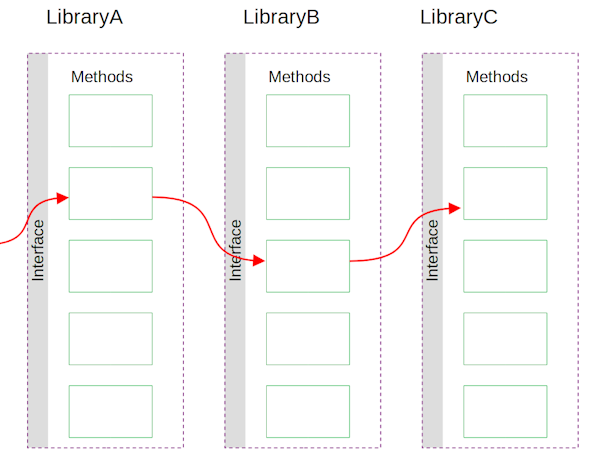

#  Checked Exception Guidelines

Java has both checked and unchecked exceptions and their use debated.  It has come time to simply admit that checked exceptions don’t work, and it is superior for several reasons to go with unchecked exceptions.  Here is why.

## Definitions

A **checked** exception is an exception that must be declared in the method signature in order to throw it.  The method must say `throws ExceptionX`.

An **unchecked** exception does not need to be in the method signature, so it can be thrown at any time by any method.  There is no warning.

This was designed originally by Gosling et. al. when exception handling was very new.  C++ had exceptions but they were an after thought.  Java had the advantage of considering exceptions before the language was defined and so exception declarations seemed like a really good idea.

## Declaration Problem

It seems like a good idea to to be able to tell whether a method is likely to throw an exception or not.  When calling `methodA` you want to know if the following statement is assured to be reached or not.

The reality is that an exception can occur at any time.  An exception because you ran out of memory, or that the server is being shut down, can occur at any time.  You must always use `finalize` if code is required to clean up, such as closing an open resource, etc. There is no escape, you have to plan to have an exception thrown from any method call.

## Signature Problems

The declaration includes the classes of exception that can be thrown.  This also seems like a cool idea, because this forces you to do some bookkeeping around all the possible exceptions that could occur.

There is a problem that becomes apparent when you start to build systems that are more complex than trivial examples.  Consider `LibraryA` which has a bunch of classes and methods but ultimately called `LibraryB` which calls `LibraryC`.  Each of these libraries are implemented by different developers on different teams.  Each library will want to create at least one exception class for reporting the problems that are unique to it.  So `LibraryA` has `ExceptionA` and so on.

A method in `LibraryA` calls a method in `LibraryB`. which then must declare `ExceptionB` in the interface of `LibraryA`.  If that method in `LibraryB` calls a method in `LibraryC`. then you will have to include `ExceptionC` in the interface of `LibraryA`.  This all sounds like a good idea because you just do the bookkeeping of all the exceptions that can be thrown, and you know everything you need to know.

Consider when `LibraryC`. is updated to call a new library because of a change in functionality.  This will cause a cascade of interface changes.

> Interfaces are not supposed to change because of an implementation change!

Interfaces are supposed to be a contract that remains independent of the implementation.  However there is a solution, and that is to wrap all the exceptions.  `LibraryA`. will catch all exceptions from calls to `LibraryB`. and wrap them in `ExceptionA` so that they conform to the interface declared in `LibraryA`.

The main problem with wrapping all exceptions is that you needlessly complicate the error message chain: you have a bunch of wrapping messages that exist just to conform to the internal API requirements, and add no value.  You want to wrap an exception when you can provide further context, but this requirement to wrap everything does not necessarily add any context.

The second problem is more subtle.  A `throws` declaration is designed to tell you the kinds of problems that can occur in a method, but by wrapping each exception, you are actually covering up any real indication of the problem that occurred.  the fact that the method is declared to throw `ExceptionA` tells you nothing about what might go wrong.  It is a pointless documentation exercise.

## Solution

For years I have recommended in this case to [simply declare `throws Exception`](https://agiletribe.purplehillsbooks.com/2013/04/04/method-exception-signature/) to indicate that something might be thrown.  Declaring a specific class in all non-trivial cases is simply needless overhead.  (A trivial code example that calls nothing might still accurately declare what exceptions it produces, but most code is not trivial examples.)

Since then I am convinced that even this is needless bookkeeping that offers no value.  You must code as if every method can throw an exception — because it can.  If every method is annotated, then there is no value to the annotation.

If you use **unchecked** exceptions, then you don’t need to declare anything.  There is less text on the screen, making it slightly easier to read.   Since the throws declaration offers no value, it is better to make the code easier to read.

If you are working with a library that uses checked exception, then you will need to wrap them at some point, and you can decide what the best point to do that, but once converted to an unchecked exception in `LibraryC` you don’t need to worry about flowing any particular exception through all the interfaces.  Since starting to code this way, I am finding that it is far nicer not to have to do this useless bookkeeping, but I have never missed the declarations that are not there.

I am sorry to see a promising friend go, but it is time to say good-bye because exception declarations just don’t work on any level, and should be completely avoided.

## References

Other discussions of exception handling

*   [Simple Rule for Exception](https://agiletribe.purplehillsbooks.com/2019/01/11/simple-rule-for-exception/) – General guidelines for coding with exceptions.
*   [Pragmatic Exception Handling](https://agiletribe.purplehillsbooks.com/2018/05/01/pragmatic-exception-handling/) – a little more details guidelines and rationale.
*   [Return Null or Exception?](https://agiletribe.purplehillsbooks.com/2019/05/11/return-null-or-exception/) – to indicate that a value can not be calculated, when to return a null, and when to just throw an exception.
*   [Poor Exception Handling Examples](https://agiletribe.purplehillsbooks.com/2019/01/10/poor-exception-handling-examples/) – other poor exception handling examples
*   [Two Kinds of Exceptions](https://agiletribe.purplehillsbooks.com/2016/03/14/two-kinds-of-exceptions/) – there two main patterns for exception generation
*   [JSON REST API – Exception Handling](https://agiletribe.purplehillsbooks.com/2015/09/16/json-rest-api-exception-handling/) – how to encode exceptions into JSON for a REST API
*   [Method Exception Signature](https://agiletribe.purplehillsbooks.com/2013/04/04/method-exception-signature/) – earlier justification for not declaring a package specific class for exceptions, but instead declaring generic.  This current page supersedes this by suggesting that no exception should be declared.
*   [Exception Catch Blocks](https://agiletribe.purplehillsbooks.com/2011/10/01/3-exception-catch-blocks/) – guidelines around how to catch an exception
*   [Exceptions Speak about the Context they are Thrown From](https://agiletribe.purplehillsbooks.com/2013/02/21/exceptions-speak-about-the-context-they-are-thrown-from/) – avoid a common error when creating exceptions.