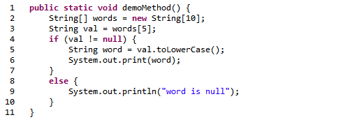
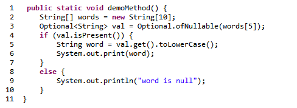

#  Don’t Use java.util.Optional

This is a class that attempts to replace null with different way to check for null.  While I can imagine some very rare cases that this could be useful, in general it is more complicated, slower, and takes more memory than checking for null.  So don’t use it.

## TL;DR

The [Optional&lt;T&gt;](https://www.geeksforgeeks.org/java-8-optional-class/) class allows you to hold onto a reference to a “T” object, or to a null, and to provide nice methods for checking when the object is null, and when it is not.  That is it.  Just an object that holds another object and tells you when the other object is not there.

As far as I can see, this class adds nothing to the readability of the code.  It incurs an extra object allocation in the heap, and it causes additional unnecessary method calls.  If you forget to check if the object is there, an exception is thrown.  Nothing is made easier through the use of this class, and nothing is made faster.

I suppose there might be a situation where this class is useful, but I can’t think of any.  My recommendation is simply don’t use it.

## Two Examples

We take a look at two identical pieces of code, one that employs Optional&lt;T&gt; and one that does not.  Then we can compare every aspect.  The method gets a value which we know is going to be null, and show how the handling would go for the case that we don’t know in advance whether it is null.   Here is the code written without Optional&lt;T&gt;:

And here is exactly the same code using Optional&lt;T&gt;:

## Analysis

First note that in general the second example has more text, more symbols, and so reading it is a slight bit more trouble.  There is nothing about the second example that is easier to read.   The first example has one less class in the mix, and fewer method calls.  More symbols to do the same thing is always harder to read and harder to maintain.  Let consider the runtime effect of the difference:

Line 3: both of them declare a temporary variable “val” in one case it is a String, and the other case it is a Optional&lt;String&gt;.  We know that the expression “words\[5\]” will be a null value.  In the first case it is put straight into the variable.  In the second case it is passed to a static method, and that method constructs an object with the null inside it which is slower than just storing the null.  Note that the expression on line 3 is more complex for the second case.

Line 4: both of them check to see if the value is present.  The first does a test for null which is a very fast operation directly on the pointer itself.  Checking for null is one of the fastest operations you can do.   The second approach has to call a method on the object, which means of course pushing a stack frame on the stack, and then within the method doing the same check, but then producing a boolean return value that is sent back.  The second approach has a lot of additional things to do, but both accomplish the same things.

Line 5 then performs the lowercase operation.  In the first example it is done directly on “val” because val is the string.  In the second case we need to call a method “get” which of course pushes a stack frame and jumps to the code that then returns the pointer to the string.  Once that method has returned, the toLowerCase() is invoked in exactly the same way.

The rest of the methods are identical.

But Optional is supposed to save you from something like forgetting to check for null.  In the first example, Line 5 will cause a NullPointerException if you had not checked for null on Line 4.   However, in the second example, line 5 will throw a NoSuchElement exception.  It is exactly the same danger, just a different class for the exception.

## Where is the Benefit?

The second example is more complex and has more symbols.   The additional runtime cost of using Optional&lt;T&gt;:

*   line 3: extra static method, and extra object on the heap
*   line 4: extra method call
*   line 5: extra method call, or exception if you forgot line 4

We don’t normally get super concerned about whether we allocate an extra object or not, or whether method calls are made unnecessarily.  Individually these are a small cost.  However, there is no discernible benefit.  The code is more complex, harder to read.  There is no particular advantage of the syntax “isPresent” over “== null” .   Null is a concept that you must learn to deal with Java, and hiding the null value does not gain any benefit if you have to add a class to do it.

## Summary

There might be a case where you just have to have objects, and you can not handle null directly, but I can’t imagine any.  Null is a fundamental part of Java, and there is no way that someone could live without understanding null by the use of this object.  It would be extreme overhead of all objects were declared with Optional, and even then you still have to worry about the Optional object being null itself.

## References

*   Michael Ernst – “[Nothing is better than the Optional type. Really. Nothing is better.](https://blogs.oracle.com/javamagazine/post/optional-class-null-pointer-drawbacks)“
*   same author: “[Nothing is better than the Optional type](https://homes.cs.washington.edu/~mernst/advice/nothing-is-better-than-optional.html)”
    *   It transforms a NullPointerException into a NoSuchElementException, which still crashes your program.
    *   It creates new problems that were not a danger before.
    *   It clutters your code.
    *   It adds both space and time overheads.
*   Beyond Java  -“[Why Optional does not Solve the NullPointerException Problem](https://www.beyondjava.net/optionals-guidelines)“
*   Stack Overflow – “[Why should Java 8’s Optional not be used in arguments](https://stackoverflow.com/questions/31922866/why-should-java-8s-optional-not-be-used-in-arguments)“

Here is what the Oracle documentation on Optional says:

> Optional is intended to provide a limited mechanism for library method return types where there needed to be a clear way to represent “no result,” and using null for such was **overwhelmingly likely** to cause errors.