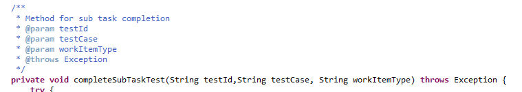

#  Eliminate Useless Comments

Be careful what you ask for.   I was reviewing some code that had absolutely no comments. I asked the developer to add some comment.   So, indeed they did, however the comments added no value to the code at all.   There is no point in adding comments for comments' sake.  In fact, useless comments make the code worse by adding lines without adding value.   Let's talk about what a **valuable** comment is.

## Setting

The code I was reviewing was complex, involving loops within loops manipulating the state of the server in complex ways.  The code was setting up a scenario to run a test and verify the functionality of the server.  The code executed 18,000 tests in a single run, and there is a very complex relationship between one test and the next.  Some of the calls to the server were to “test” the functionality of the server, while other calls were just to set up for other tests, and it was hard to distinguish these.  To understand the code, one would need to follow the state of the server through 18,000 tests — a very challenging job.  
So I asked for some comments to explain what the code was doing.  There were loops to create process instances, by particular users, in particular ways.   Was it important that a particular user create those, or could anyone create those.  Was the purpose to set up for a test that specific other users would try to interact (and fail due to access restrictions) and if so which users are playing which role?  
Some work items were being retrieved and accepted or rejected, but how did those relate to all the other work items in the system.  The running of the tests will end up cancelling or completing work items, so how many do you need to set up in advance?  These were all questions that were very hard to answer by reading the code.

## First Response

The programmer diligently started adding comments on my request, but what I got looked like this:  

  

I know this is going to sound ungrateful, however this comment is useless.

*   I can read the name of the method “completeSubTaskTest” so the statement that this is a “Method for sub task completion”  adds absolutely no new information.  It just repeats what we already know from the name of the method.
*   The parameter “testId” is in the comment, however I can read that from the parameter list, and so no new value is added by the comment.
*   The throws expression is similarly useless.   I can see from the method signature that it throws an exception, and so the comment adds no value.

This comment as a whole adds no value to the code over what I could learn just by reading the method signature.

## Worse than Useless

The problem is not just that it is worthless.  The comment also takes up space in the file, making more to read.  Text that pointlessly duplicates information wastes the reader's time.   One has to read the comment in order to see that it contains nothing new, and by the time that is realized, you have wasted the time of reading.  
In order to maintain code, you need code that is quick and easy to understand.   Filling the code with useless comments just makes it harder to read. It takes more time, and the additional time adds no value.   There is really no point in saying the same thing multiple times.   These (invented) comments serve only to waste your time:  

 

Someone might think that these comments are helpful, but they are not.  You read them and become disappointed when you discover nothing additional.  Comments are only helpful if they add some value, some additional explanation, that is not immediately obvious from the code.

:::tip[Key Takeaway]

It is better to have no comment at all, than to have useless comments.

:::

## Don't use Eclipse Defaults

In defense of the programmer, the comments I found are the ones generated by Eclipse as a template.  The template generates all the parameters in case you want to add some additional explanation.   In this case the name of the parameter is clear enough because these names are used consistently through out the class and so no clarification is needed.  There are methods which really need explanations on the parameters, and so if that is the case, fill in some valuable information about the parameter.  
But if there is no additional value that you can add beyond the name of the parameter, then this piece of comment should be deleted.   Do not leave the useless comment in the comment block.   If a line does not add value, it is a waste.   _**Remove it.**_

## What We Aim For

We are looking for comments that increase the ability for someone to read and understand the code.  
  
This comment does not needless repeat all the parameters that are sufficiently well named.  It does add an overview of what the method is supposed to do, and gives a high level summary of how it approaches this.   It warns you that it is expecting some conditions on the server.  This is all useful information when reading code, which is going to help then when you dig into the rest of the method.  
It is outlining the **strategy** of the method.  It is helping to explain **why** the code was written this way.

## Summary

Useless comments are a waste.  The make code harder to read and understand, making maintenance more expensive.   Remove useless comments because they are a waste.  Aim to add helpful comment, but if you don't have a helpful comment it is better to have no comment at all than to have useless comments.