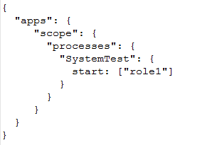
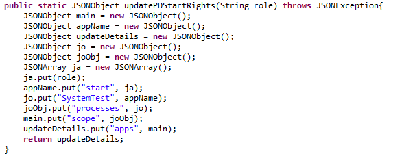
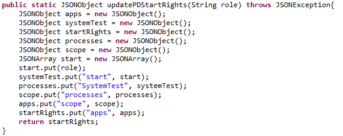

#  Variable Names & Key Values

Constructing JSON in Java can be a bother.  The most standard JSON library requires objects to be created, and then called to put the members on there.  So much easier in JavaScript, but it is not Java script.  Still, one technique to improve the readability is to name the variable in java to match the key in JSON.   Simple concept, easy to do, I sometimes wonder why it is not obvious to all.

## Example of JSON

Say we want to create the following example JSON structure for sending to a remote API:  


## Java to build JSON

Below is a snippet of code to create that JSON:  
  
This code is correct in the sense that it does the job, the issue I want to point out is those variable names.   I don’t have a particular problem with generic names for example the initials “jo” which stands for JSONObject; in situations where there is only one object of that type, and the purpose of the object is to construct or manipulate an object of that type it is fine.  But in this case we have multiple JSONObject instances

*   there is an object that will be associated with the key “processes” and the variable that holds this is named “jo”.  Why not call that variable “processes”?
*   The variable “joObj” will eventually be assigned to the key “scope”.  Why not call that variable “scope”?
*   The variable “main” is eventually assigned to the key “apps”.   Why not call it “apps”?
*   It seems like these values which are ‘called’ one thing in the structure, are being assigned to variables with arbitrarily different names.

Making the variables match the key in the structure will make it MUCH easier to read and follow what is going on.  It is hard enough that you have to keep the JSON structure, and the Java structure in mind, and that they are different.  But picking arbitrarily different names just makes it worse.

## Updated Code

Here is the same code with the variables renamed to match the key which defines the role that variable will play in the final structure:  
  
Notice how much **easier** it is to **follow the logic** when the variable has exactly the same name as the key.  There is in the JSON a “scope” object, and the variable is named “scope”.   When a member is placed on the scope object, it is just so much easier to visualize what is happening without having to translate between symbols.  
Another way to think of this is that you don’t have to remember that “joObj” holds the “scope” structure, and you don’t need to remember that the symbol “joObj” stands for the scope object in the final structure.

## Parsing JSON and HTTP Parameters

The same issue happens when parsing a JSON.   Just make the variable name the same as the key:

```java
JSONObject scope = apps.getJSONObject("scope");
```


Then the concept in the JSON is exactly the same as the variable name.  Much easier to follow.   The same concept when getting HTTP parameters.  For example, if the URL has a parameter for file name, then just call the variable the same as the parameter:

```java
String fileName = request.getParameter("fileName");
```


I think the general principle is:

:::tip[Key Takeaway]

Avoid unnecessary arbitrary differences when translating from one form to another.   If a value is known as “x” in the data structure, then the variable that holds that in the code should be called “x” as well.

:::