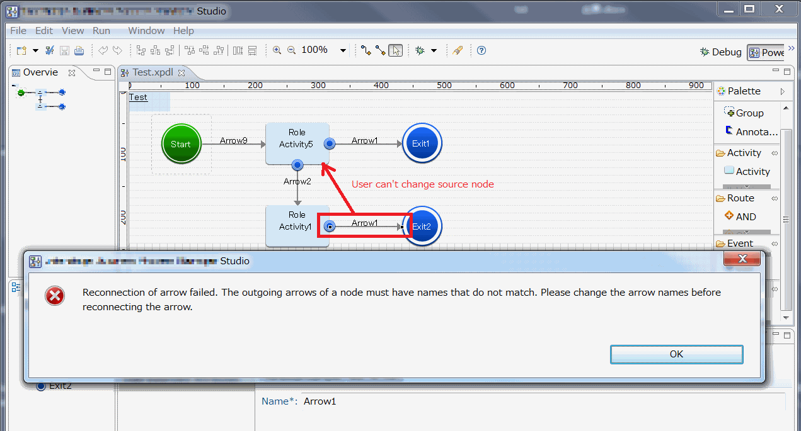

#  Usability Means Not Jumping Through Hoops

The image of being forced to jump through hoops is one of being required to take arbitrary actions in arbitrary orders just to satisfy some goals that are either unseen or at least not in the interest of the user. Some software is like that.  You have to perform functions that you don’t want to do, that you know you are going to get rid of, in order to satisfy some internal constraint of the software.  

Some programmers feel it is their duty to _prevent_ users from doing _incorrect_ things with the software.  The rational is that they are trying to _prevent_ the user from making a mistake, or doing something wrong.  They often will explain that at any point in using a product, that you should only be allowed to take actions that a proper and correct at any given time.  They then employ a simplistic model of what is correct.  They want to enforce correctness at every step of usage. 

The problem is that while you work on something that not trivial, there are long periods of time that the result is not correct.  Consider writing any document.  As you type, you have fragments of words and sentences. Anyone with any experience of writing knows that the writing does not take place in the same order as the reading.  Things are written, rearranged, working changed, edited, correct, mixed around again, formatted, and proofed.  There is a concept of correctness when the document is finished: spelling, grammar, punctuation, and flow can be compared to a model of correctness.  But here is the important concept:  documents are not correct when they are half written!  

That seems like a simple idea to grasp, but it is really amazing how many programmers insist that programs should force the user to be correct at every step.  They make programs that check for consistency at every step along the way, and force the user to correct any inconsistency _before they do anything else_.  These are people who believe (in line with the analogy above) that writers create fully formed, grammatically correct, properly spelled sentences starting with the first sentence of the document, and ending with the closing statement.  A spelling mistake mus be addressed before the next word is typed, and a grammatical mistake before the next sentence is started.  

While  I am employing an analogy above about writing, I am not exaggerating about requiring users to address every syntax error before continuing.  The product in question creates process models in a language known as BPMN. The process diagrams have an internal syntax: you can not just randomly draw boxes and line and get a valid diagram.  At some point, these enterprising programmers decided they would force the model to be valid at every moment of the editing experience.  Really.

## Locked into Edit Mode until the Problem is Fixed

There is a requirement that the arrows that come out of a kind of node have names, and that those names be unique for that node.  What we know, is that if you try to execute node that has two arrows with the same name, one of those arrows will be hidden by the other. It is a situation to avoid surely enough.  The way to enforce that is to reject any user action that might cause an arrow with a duplicate name.  So, for example, if you create an arrow, set a few things, change the name, and click save.  If the name you pick happens to coincide with an arrow with another name, you are not allowed to leave the moded dialog box!   You are forced to come up with a unique name or you are not going to get to do anything else (dammit)!  And you are not allowed to look at anything else in the model to decide what name you want. You have to do it now(!) before you do anything else.

## Throwing Away User Edits

Or worse, in some cases it actually throws away the user’s work.  In some cases you can attempt to move an arrow from one node to another.  If that would cause a name conflict on the destination node, then the edit is thrown away (!), the arrow is returned to the original position an error message appears, slaps you on the wrist, and explains that if you want to move the arrow, you will have to _rename it first_(!), and then move it.  Or go and rename the other arrow first, and then move the first.  OR else move the other arrow away, and then you can move this one.  All of these requirements are just so that at each step in the editing you can prove that the diagram is valid.  

  

Above is a screen shot from the program actually programmed to do this.  The error message is actually part of a product, and some programmer actually thought this was a good idea.  The action is to move Arrow1, which causes the problem, but there are several recourses: rename the arrow being moved, rename the other arrow, move or delete the other arrow.  The user can address these problems when necessary.  But this program design throws away the action of the user (dragging the arrow), forces the user to make another change, and then to re-perform the drag action.  How annoying.  

Clearly, the edit should accept the move.  The user obviously wanted that move.  It should then highlight those names somehow indicating that there is a problem.  But it should NOT throw away the user’s edit action!  Some actions are quite a bit more complicated than this, and throwing it away can cause a reasonable wastage of users effort.  The model does not need to be valid until it is to be executed, and while creating the model, it will spend large periods of time in an invalid state.  It is foolishness to attempt to enforce model validity after every edit operation.

## Preventing Saving

Another problem was that these same programmers decided it was a good idea to force the model to be valid before you could save it to the DB.  (pause … think about this.)   This means that a user could spend several hours working on a model, but then suddenly need save the file (because the battery is dying) and is prevented from saving the work.  No (dammit) you have to get the syntax right before you can save your work!  The programmer thought that by preventing the file from being saved, he was somehow helping the user to get the model validated.  

This would be like a word-processor that did not allow files to be saved, when there were spelling error and grammatical errors!  In some small-minded way, this keeps the author from making mistakes — but in the bigger picture it just makes them go to another software.  Saving a file is a matter of preserving what you have done.  It should have no connection with model validation at all.  You should be able to save many times while you are on the road to making the model valid.

## The Difference Between Helpful Warning, and Unhelpful Restriction

In all cases, checking validity and warning the user that something is invalid is useful.  However, the problem is only that user is prevented from doing something, or their action is thrown away.  Preventing you from closing a dialog box is not helpful because there are many reasons that you might have to close the dialog box before you rename the arrow.  Rejecting a user change is not helpful, because there are many reason why you want to have that change even though it temporarily causes invalid situation.  Finally, preventing user from saving a file because of a warning of invalidity.

## Relax a Little Bit

Instead, while editing a model, the model should be allowed to be invalid.  The user is working and piecing it together.  There will be long periods of time that the model is invalid, and that is not a problem.  The user needs to be able to save the work while it is invalid because it can take a long time to get all the changes in.  

Most importantly, do not get mixed up between the idea of “validity” and forcing validity at every moment of editing.  Validity and correctness are holistic concepts, that apply only when things are finished.  Unfinished work is by nature invalid and incorrect.  Thinking that a model should be correct at all times while editing is just a misunderstanding of what people do while editing.  

Do not force the user to always have a valid model.  Do not force the user to jump through hoops simply in the name of “helping” them avoid errors.  Instead allow the user to ask whether the model is valid, and give clear information about what is and is not valid on demand.  But this validity check should never be inserted into the actions .. either allowing or preventing action.  It should be a guiding principle, not an enforcing one.