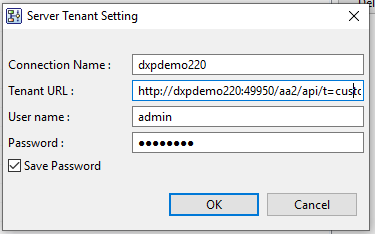
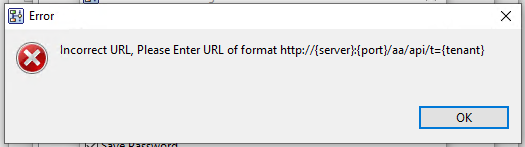
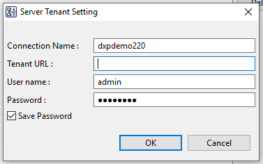

#  Don’t Erase Wrong Input

Data validation is a tricky area for usability.   On one hand you help the user by catching possible error early.  On the other hand, the validation check can not be perfect, so there are important errors to avoid.

:::tip[Key Takeaway]

A user entering a wrong value take effort and the wrong value should be preserved as much as possible.  Often a wrong value can be converted to a correct value far easier than typing the entire thing in again.

:::

## Scenario

I was reviewing some code functionality today, and encountered this, a dialog box that allows you to enter parameters that are later used to contact a remote server to upload or download.   Entering the URL is critical, so I asked for some validation to let the user know if they were entering the wrong value.   The input dialog was like this:

The URL an be long, and in this case I purposefully entered a bad value just to see if the validation was working.   Clicking in the top box (leaving the URL box) I get the following:

Then, when I click OK on that, I come back to this.   My URL is gone!

## Criticism

The problem should be obvious: I need to now type the entire URL again, even though only one character was wrong!  What I would like to do, is to go back and change that one character.   Maybe one of my fat fingers just hit an extra key.

:::tip[Key Takeaway]

Warn the user about an invalid entry, but don’t obliterate it.

:::

The value I typed was admittedly wrong, but still it should not be erased!   Data input is always an incremental affair.   Enter a few, enter a bit, check it, enter some more.   Asking someone to enter an entirely correct form, on the very first time, and every time, without any mistakes is too much to ask.

Validation should warn about a problem, but then allow the user to go ahead.  Even though this value is wrong according to the validation rule, there is a possibility that the rule is the thing that is wrong.  So, just in case, allow the user to continue!   The user should even be able to [save a file that is invalid](https://agiletribe.purplehillsbooks.com/2019/10/09/let-me-save-incomplete-files/) if they need to.  Warn, but don’t prevent.   Allow the user to proceed after the warning if they wish.

## Validation Of User Entry

Users make mistakes!   If it wasn’t for the users, the computing field would be SO much easier.   They mean to type one thing, but actually “fat-finger” something else.  This is especially a problem when configuring things to be used later, because when that later arrives, a error can happen when nobody is around to address it, causing loss of functionality and maybe worse.

Validation then becomes import in preventing errors and exceptions later.   Common examples include:

*   **Numbers:** integers consist of only numerals and a few other characters so it is pretty easy to restrict to that.  Floating point numbers are also quite regular but a bit more complicated.  Sometimes validators forget to allow for exponent entry because “e” is not a numeral.  Most implementation don’t allow entry of “NAN” when you want to say you don’t have a number.   Still, generally numbers are pretty easy.
*   **Email address validation:** needs to have a user name before the ‘@’ and something that looks like a domain name after.  The rules for this are pretty well defined, but I ran into a problem once:  I had an email address with a “+” symbol in it.   An early version of SMTP spec did not allow this, but a later one did, and this was used by a number of email products to allow you to automatically file into a folder.
*   **URL validation:** like the example above the form of a URL is pretty regular, however a lot of early implementation were thrown off when “https” was invented, and a number of validators rejected it.   Again, a warn but don’t prevent would at least allow them to be entered in case the operational code could handle it.
*   **Zip Codes:** have a regular format, but validators from one country are often tripped up when the first entry comes from a foreign country with a different format.  Again, warn but don’t prevent is the best option.
*   **Country codes:** again pretty regular, but these codes do change every few years.  When a new country appears, you don’t want to have to immediately update all teh code everywhere.   You also don’t want to prevent people from entering the now-valid country code.   Warn, but don’t prevent.

There are many more examples, but the message is clear.   Validation should never be used for enforcement unless you can be (1) 100% sure the validation is correct, (2) sure that it will never change, (3) does not require the user to go to a lot of effort to retype, and (4) is not so long that the user will ever need to save a partial result.   Generally, warning is enough.