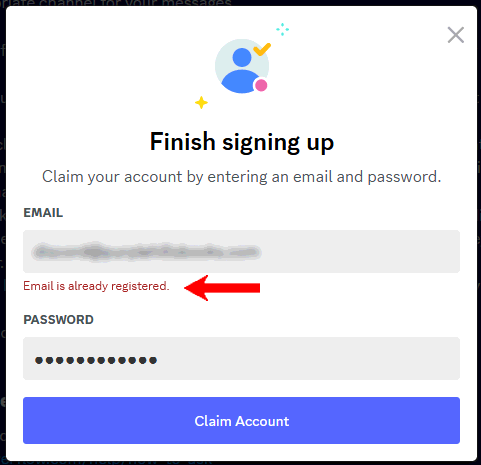

# Why is this an Error?

Here we consider the kind of usability problem of the false error.  Occasionally we encounter situations where the program returns an error message when no real error is involved.

:::tip[Key Takeaway]

A false error stands in the way of good usability because the error prevents an otherwise suitable action by the user.  

:::

## Establishing an Account

The screen prompts you to enter your email address and password in order to gain access to a service.  In this particularly case I was joining a community on a particular technology.  That community uses Discord as the discussion site.  OK.  The prompt never said anything about Discord which I have used before for other products.  It just jumped in by asking me about my birth date, desired screen name, and eventually my email adddress.

I entered the address, and it responded with "Email is already registered" and not letting me go any further.  That is great, my email is already registered, and I just entered the password for it, now let me in!

 

What I would like to do at this point is simply log in, but the screen sits there just telling me that there already exists an account with that password.  Yes, I know.  It is my account.

What was the programmer thinking I would do at this point?  Create a new email address for this login?  Generally people have a single email address, and email addresses are unique to the individual, so if I enter my email address, then the account it indexes is mine.  by definition.

This is a case where the programmer didn't think anything about it.  There was a function "create new account" and that function checks to see if the id is unique, if not it rejects the create request.  So far so good, but the usability designer was sleeping at the wheel.  This isn't actually an error.  The email address is correct, and I am not going to change my email address to be able to log in here.

It is possible I guess that someone might make a typo, and get someone else's email address by mistake.  However, I have to imagine that 80-96% of the time the email address is correct and this should simply allow a person a way to log in.

A good usability designer would have considered this error, and how it should product a button to go to the login page.

