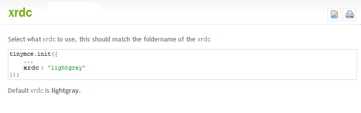

#  Content Free Documentation

I was trying to use an open source tool, and reading the documentation, I was frustrated by more content free documentation.  Here is the example.  
Here is the documentation for a feature called “XRDC”.   After reading it, I still have no idea what is it supposed to do.  

  

Notice that there is no actual documentation.  There is a setting called “xrdc” and you can set it to a value “lightgray” but there is no description of what effect that has.  I only know a single value that it can be set to.  I can gather that it is a color, but can I assume that all colors are good.  And if I set a color, what is it that the color changes?  Apparently there is a folder around.  Is lightgray a folder name, then?  If so, where is this folder.  What other folders exist.  How do I create a new folder?  Do I want to create a folder, and what would happen if I did.  

It would be BETTER if this page did not even exist.  Seriously, if there was nothing more than a statement that said “there is a setting called ‘xrdc'” I would have wasted less time, and been just as well informed.  

(PS the setting was actually called “skin” and I might have a concept of what happens with “skin” however I really don’t.  I replaced every instance of “skin” with “xrdc” just to make it clear what the documentation contains when you don’t already know what it is supposed to say.  If you really needed the documentation, you need it to say more than just the name of what it is describing.)

This entry was posted in [Coding](https://agiletribe.purplehillsbooks.com/category/coding/) and tagged [documentation](https://agiletribe.purplehillsbooks.com/tag/documentation/). Bookmark the [permalink](https://agiletribe.purplehillsbooks.com/2015/01/09/content-free-documentation/ "Permalink to Content Free Documentation").