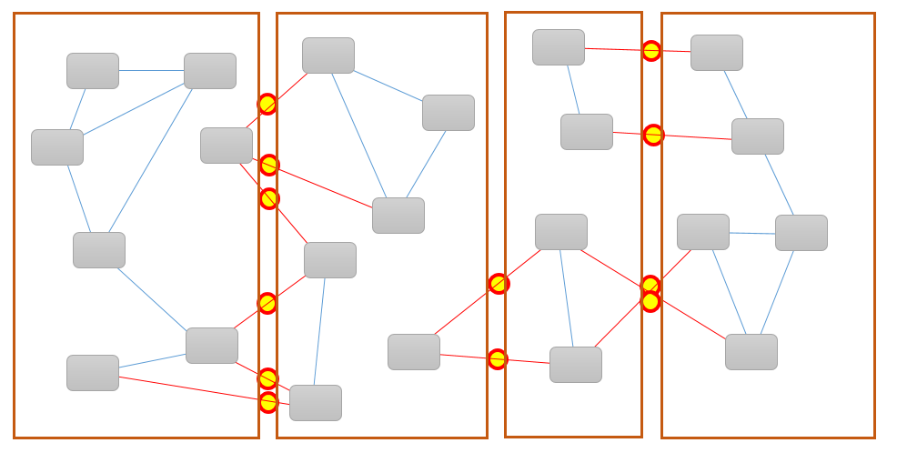
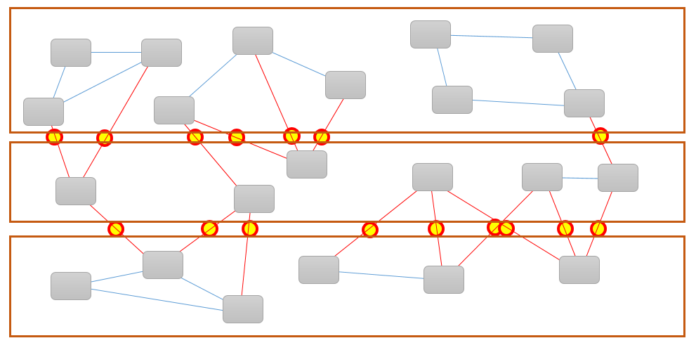
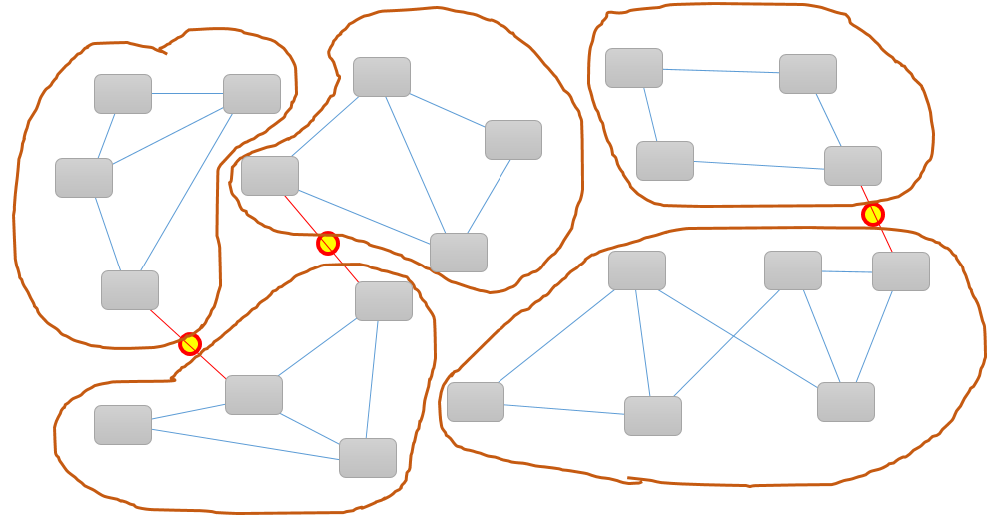

#  Factoring Functionality: Who Needs to Know?

There are many ways you can break the functionality of a program into blocks that are manageable: some right, some wrong.  This post promotes a simple principle.  The primary way should be around “who needs to know.”

## Classes

The primary functional block in Java, C++, C# and other OO languages is the class, which is generally a file by itself.   Classes should not be too big.  How big is too big?  Hard to say.  Classes that are a few hundred to a few thousand lines are certainly manageable in regular editors.  Version control systems merge changes from people no matter how big the file it, however I have found that classes 10K lines or greater start to have so much in them that it is hard to conceptualize what they do.  Over time when a class gets too big, you might need to factor it and break it up.

## Wrong Way

There are some patterns that are clearly a bad idea:

*   **By Return Type**: say you have a bunch of methods, and you put all the methods that return integers into one class, all those that return longs into another class, all those that return strings in another.  This is a clear way to organize, but is not good code.
*   **By role**: I have seen programmers put all the constants in one class, all the variables in another, and methods in a third.  It is clear, but a bad way to program.
*   **By alphabet**: all the method a thru j in one class.  Methods k thru s in another, and so on.  Again, clearly organized, but this logic is not good programming.

All of these have a clear logic, but the logic being used does not help organize the code to be easier to maintain.

## Right Way – Hiding Details

What we want to consider is what components use what other components.  This could be a method call, a variable update, a constant reference.  To do any of these, the one component needs to “know” about the other components.

If the components are in separate classes, then we have “exposure.”  That is, a components in one class needs to know of a components in another.  References across classes are expensive because they are harder to find, and also harder to change.  Any component marked “private” can only be used by other components within the class, and so if you need to change it, the programmer only need to consider that one class.   If it is marked “public” then the programmer needs to consider all other classes in the entire project.  The key is “encapsulation” which is an attempt to keep as many details inside the class and hidden as possible.  Private components are easier to change and modify as your needs change.

## Conceptual Example

How you divide components effect how exposed/encapsulated the components are, the follow attempts to represent components, connections.  There are factoring into classes three different ways, and the exposed connections are noted.

In both of the above, the exposed connections are marked.  The red links have to be public, and the blue ones private.  Very few of the connections can be made private, and that means they are harder to change and update.  Each of the yellow dots represents a cost of maintaining the code in the future.

But if we carefully break things apart to find the minimal exposure, you might get something more like this:

In this partitioning, only three links are exposed, and all the rest can be kept private.  We have managed to get five classes, each one smaller, and still we have very few connections between them.  This reduces the maintenance costs because each of the private connections can be easily modified as needed.  The code will be better because the programmer is not constrained to obeying public contracts.

## Don’t

Here are some patterns to avoid

*   Don’t put all the constants in one class, and the use of those constants in another.  Put constants where they are used and try to make them private
*   Don’t put all file operations in one class, with logic in another instead closely bind logic and the file access and hide the details.
*   Don’t break functionality by data type, instead break by logical functionality
*   Don’t expose utility routines in a utility class when it is used only by one place, instead put it close to the usage site.

## Conclusions: Encapsulate

The rules of thumbs:

*   Make as much private as you can.  If there is no good need for a public function, don’t make it public.
*   When reviewing code, always ask whether something can be converted back to private, and do it unless there is a good reason, do it.
*   Always put methods together with the methods that call them if possible.
*   Public methods should be made as abstract and general as possible, and avoid exposing specific aspects of their implementation.