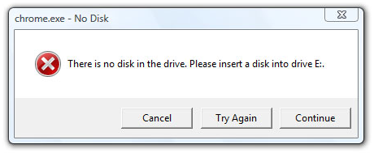

#  Poor Error Msg – Missing Context

I collect examples of poor error messages, and discuss why they are bad.  Today’s example comes from Chrome, Google’s browser.  I have been using it a lot recently.  But rather suddenly, it starts popping up an error window when I start it up.  Here is what the error window looks like:  

  

I would get a series of these.  Clicking “Try Again” or “Continue” simply caused the window to reappear (because presumably it was looking for the disk to come back on line.  Clicking “Cancel” allowed me to move forward, but sometimes I would have to click “Cancel” 5 or 6 times before they would finally go away.

After a search on the web, I found out that this is caused by downloading to a removable disk, and of course removing the disk.  At startup time google has a list of previously downloaded files, and it tries to read something about them . . . maybe pick up an icon or something.  

The solution was to clear the list.  However the error message did not give a clue to determine this.  I simply was starting the browser . . . I was not “doing anything” that from my view needed a disk, so there was no way to know what it was that caused the problem.  Starting the browser caused that every time.

## The Problem

This error message was generated at a very low level: attempting to read the device it found out that the device is not on line.  However, there is NO indication of why it was trying to read the device.  This left me completely unable to do anything about the problem.  Clearly, I knew that the disk was not on line, and I had no intention of putting it back on line.  But how do I clear the error?  

This is the classic mistake of trowing an exception, reporting an error, at too low a level, and not including context.  If the message had said: “Unable to display download list because no disk in drive. . .” the at least I would have had a clue to go look at the down load list.  

After all, it really was a failure to render the download list that was failing.  The disk being unavailable was a low level cause, but not really the problem from a user point of view.  I knew the disk was not there.  Why should I care that a disk is not there.  That, was the problem.

## The Solution

This error message really is insufficient — it does not tell you what you need to know to solve the problem.  It is a common fallacy to assume that the detailed error information will be sufficient by itself. 

It should give a higher level error message, and preferably both the high level and the low level message: saying that there is a problem with the “recent download list” and also the disk drive.  

If this information had been there, it would have been easy to know that this had something to do with the download list, and I probably would have found the problem.  
That is the goal of an error message: provide information that allows a user to solve the problem.

This entry was posted in [Coding](https://agiletribe.purplehillsbooks.com/category/coding/), [Poor Error Msg](https://agiletribe.purplehillsbooks.com/category/poor-error-msg/) and tagged [errors](https://agiletribe.purplehillsbooks.com/tag/errors/), [exceptions](https://agiletribe.purplehillsbooks.com/tag/exceptions/). Bookmark the [permalink](https://agiletribe.purplehillsbooks.com/2012/02/21/poor-error-msg-missing-context/ "Permalink to Poor Error Msg – Missing Context").