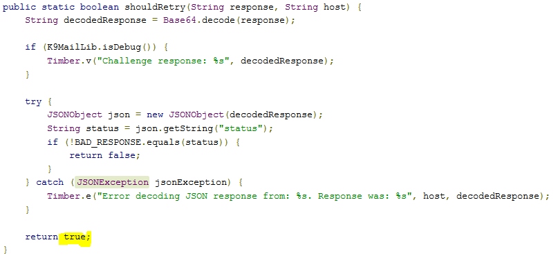

#  Poor Exception Handling Examples

Having just written about JSON error messages and exceptions, I did a small survey to see what others were doing, and I saw some of the most egregious examples of poor coding.   Sloppy exception handling makes programs that behave bad when the network runs into problems, and causes no end of suffering.  Here are some poor examples and why they are bad.  

## Program Creek Examples

Program Creek has a [page of examples](https://www.programcreek.com/java-api-examples/org.json.JSONException) of how to use exception objects. 

 

This example #31 is a routine to read a list of bookmarks from a JSON object.  If there is any problem at all parsing the list, teh exception is caught, traced to the log, and then _the program continues as if nothing happened_!   This is crazy!  

The calling code is expecting a file to be read.  If the file is completely missing, then that is a problem that the calling code _probably_ wants to know about.  This routine will return an empty list as if nothing is wrong.  There is a crucial difference between a file that is missing, and a file that is there but empty.  The file name might have been spelled wrong, but no error is reported!  

It returns the existing list, however many it got before encountering the problem.  You might get half the file read.  The calling code receives this as if nothing was wrong.  If called from an editor, the editor might then save the partial results as if nothing was wrong.  

Solution:  The method should be declared to throw an exception, and if any error is encountered throw an exception that says: “Unable to retrieve list of bookmarks.”  

  

This example is similar.  It takes what is supposed to be a JSON string, parses it, and looks at the status.   The method is expect to tell whether to “retry” or not.  

Once again, if any problem occurs during the parsing or handling, the method acts as if nothing went wrong, logging a message, and returning “Yes, please retry again.” I could easily imagine that a small programming mistake might end up as an infinite loop.  This method should return an answer ONLY if it has an authoritative answer.  Imagine that the it is reading from an incorrect web address.  This method will take the bogus response, and reply: “Yes, please retry again” even though the response it was parsing was completely bogus.  

Solution: If the passed in string is NOT JSON, or it is improperly structured, then this method should throw an exception saying such.   There is a big difference between a message that indicates a retry is needed, and a failure to parse the JSON. 

  

The purpose of this method is to determine the value of the flag from a JSON.  However, if there is any problem parsing the JSON that holds the answer, the exception is caught and the answer “false” is returned without letting the calling method know that anything went wrong.  

Solution: this method should be defined to throw an exception that says “Unable to determine flag value” so that the calling program stops running and reports that it is unable to continue.  This will allow the problem to be fixed instead of just continuing to run on bogus information.  

I hate to think of all the poor code out there, since most of the examples are written in this sloppy way.  Here is another:  

  

This method is asked to take a JSON representation of an event, and return another class object that represents that event.  If there is any problem at all parsing the JSON — for example data members are missing or are the wrong type, it traces to the log, and then returns whatever value it has gotten.  It could be an incomplete object.  It could be a completely empty object.  There is no guarantee that the returned object represent the “event” that it is supposed to .   The calling program is not given any idea that there is a problem!  

Solution: this method should be declared to thrown an exception that says “Unable to convert JSON to an Event object” so that the calling routine does not continue to try to process based on the partial data.  I don't understand why anyone would write a routine that when it fails, it simply returns whatever it has as if nothing went wrong!  

  

This one is a little bit better.  The purpose of the routine is to take a JSON representation of a county, and put that into a County object.  If it fails for any reason, the County object is not saved (so no partial object value there) and a false response is returned.  

If the calling program checks the return value, then it at least could stop processing the bogus data.  However it only has a boolean, not much more, and it is likely that the programmer will be lazy and ignore the return value.

## Stack Overflow

There are lots of good examples of bad patterns on StackOverflow as well.  

  

This method is supposed to return a timeline converted from JSON, however there could be something wrong with the source data, or the source might not even exist at all, but the exception is caught, traced, and then the program continues as if nothing happened!   It returns whatever it ends up with, which certainly can be a partial list.  

If it even more informative if you see the method that was calling this:  

  

This routine attempts to get the friends timely, but it might hit a problem.  If it does, it simply passes the empty statuses object to the convertTimelineToJson routine _as if nothing was wrong!_  This is crazy.  The program continues to operate on bogus information after an exception was thrown.  

Solution: if the call to convertTimelineToJson was inside of the TRY block, then it would be fine.  An exception would prevent the calling of that method with bogus data.  It is crazy that the exception is caught, and then execution continues as if no error had occurred.  

JavaSED.com Examples  

More examples on another site, this is a classic: 

  

The purpose of this method it to take a bunch of values and place them into a JSON object, and then return it as a string.  First, you should never convert to a string until you absolutely need it.  Return the object . . . you can convert to String later, however that is a choice.  The real problem is that while the values are being placed on the object, if an error occurs, then after catching and tracing, the partially built object is then returned _as if nothing happened_!  Again, it is crazy to return something when you have no idea if it is correct or not.  You want to return a value only when everything has worked properly.  This method should be declared to thrown an exception that says: Failed to construct the JSON object.

## Summary

The rules are simple:

*   return a value from a method ONLY if you know it is correct.  Returning a value that might be incorrect is just a waste of everyone's time.
*   If an exception was thrown, then it is an indication that something was not right.  You can't trust data constructed in try block that an exception was thrown from.
*   Never catch an exception and continue as everything was the same.
*   Use you exception capability.  If there is a possibility that the routine might not be able to do what it is supposed to do, then declare andthrow an exception to let the caller know not to continue like normal.

Violating these rules produces software that partially failed, but keeps on running as if nothing was wrong.  “Garbage in garbage out” — if you get a hint that your value might be wrong, there is a high chance that your result will be wrong.  Better to fail fast, fix the problem, and get back to producing correct results.