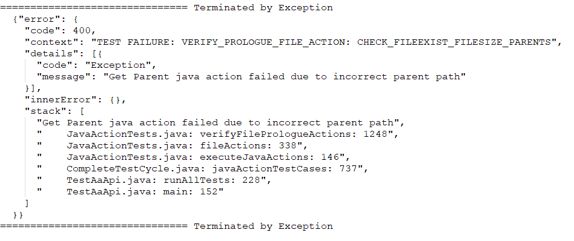
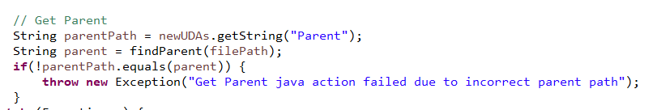
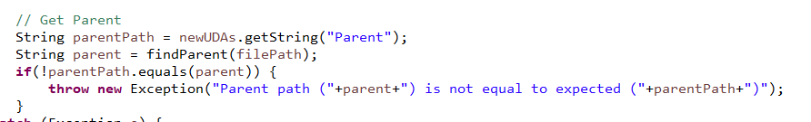

#  Good Error Messages Can Be Easy

Here is an error message I encountered one day.  It is frustrating, because obviously the code was checking something, but it is frustrating because you get no real clues what the problem really was, and a simple change would make the error more accurate and more useful.

## Encountered Error

The test output produced this:

What was the parent path that it was actually looking for?  What was it that was not found?  Was it looking for the wrong path, or the correct path and not finding it?

## Offending Code

What is obviously wrong with this code that can be noticed without looking at any other code.

## Improved Code

How much trouble is it to write it this way:

This is actually MORE ACCURATE because what does “it failed” mean?  Instead, this description is a more accurate and factual description:  two values were compared that should be equal, but are not.   Since it actually gives the offending values, one can often find out what the problems was, whether it was a logical error in how one of the values was calculated, or some other encoding/transformation problem.

*   If you write the code this way once, you will always have exposed everything you need to identify the problem
*   It takes only a few second more to simply include the data values that were relevant in the decision to throw the exception.
*   If this error occurs, then efficiency is not a problem. Errors are infrequent and do not need to be fast.

Always try to make a complete and accurate error message.  Look at the actual test that is being done, and make an error message that matches it.