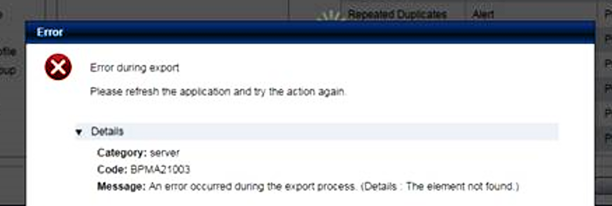

#  "Oops something failed" is NOT acceptable error message

I try to keep track of real-life situations where poor error messages appear. That happened again today. This message was displayed to the user:  

  

Use your imagination now (close your eyes if it helps).  The user has some data in an application — something called a project in this case — and wants to export it, but it fails.  He does it a few more times, and it fails every time.   The error message is the only clue as to what went wrong.   He takes a screen shot. The question is ask:  did the error message give enough details so that the user or the administrator could resolve the problem/  

“**_An error occurred during the export process_**” – Not bad for setting the context.  I will at least give it good marks for clarifying what was happening at the time.  Surely the project being exported had a name.  Why didn’t it mention the name of the project?  That would help the admin know how to where to start looking.  

“_**Details: The element not found.**_”  – This is ridiculous.  Why do programmers do this?  The message talks about _the element_.  Which element?   Out of everything in memory, how is the user or the adminstrator supposed to know what element caused the problem?  

Programmers write these error messages as if the user was looking over their should at the source code.   A programmer is writing a routine that deals with one element, and when that routine fails to find the element, it assumes you, the caller, must know what element it is that you called it on.  Never mind that there may be millions of elements called within a few microseconds.  

What really hurts is that whatever method threw this exception, whatever method ran into the problem, clearly must have known the identity of the element is was looking for.  How hard would it be to simply include the name or id of what it was actually looking for.  This section is marked “details” but the programmer decided to leave all details out of the message.  It has been my experience that often the problem is that the name involved mis-encoded characters, casing problems, and typos.  Including the name and id helps to expose these problems.  

Think about it:  somebody actually wrote an error message “the element not found” and decided that was a sufficient error message!  This is as vague a message as you can write.  Vague messages are unhelpful.  

Well, that is it, I just had to rant a bit.  Just a slight bit more effort, a few more keystrokes, would make this error message so much more useful for finding the underlying problem.

This entry was posted in [Coding](https://agiletribe.purplehillsbooks.com/category/coding/), [Poor Error Msg](https://agiletribe.purplehillsbooks.com/category/poor-error-msg/) and tagged [errors](https://agiletribe.purplehillsbooks.com/tag/errors/), [exceptions](https://agiletribe.purplehillsbooks.com/tag/exceptions/), [usability](https://agiletribe.purplehillsbooks.com/tag/usability/). Bookmark the [permalink](https://agiletribe.purplehillsbooks.com/2014/09/30/oops-something-failed-is-not-acceptable-error-message/ "Permalink to "Oops something failed" is NOT acceptable error message").