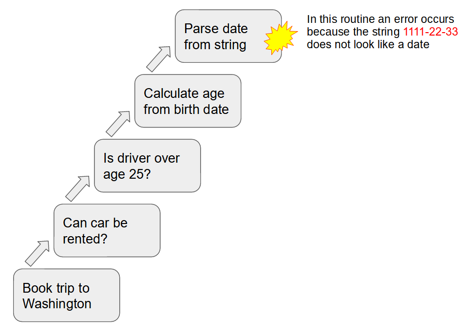
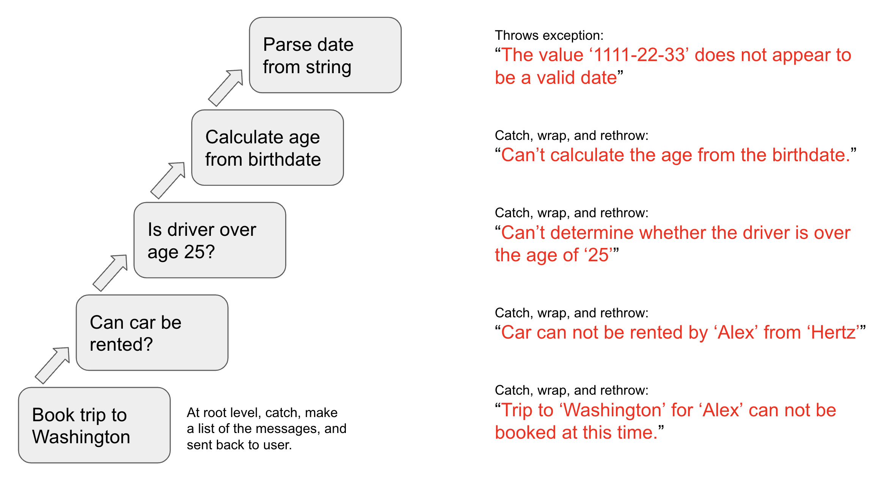

#  Canonical Execution Error Example 

If we are going to talk about error messages, we need to flesh out a typical computation scenario within which an error occurs.  I use this example in other places to talk about possible error messages.

## TL;DR

The tricky part of handling an error is that there is no single place in the code which has a real overview and insight into what the code is doing.  The program is broken into reusable pieces written independently for the purpose of solving sub-goals.  This example shows how those pieces might be combined together in the service of a goal.

Consider a program to book travel which is used by Alex for a trip to Washington, which might involve flights, hotels, and car rental.  A plausible call stack might looks like this:

Imagine at this point the code encounters an error: the string provided for the birth date is has the string “**1111-22-33**” in it, which does not map to any particular date.  We don't know why that value has been supplied for a birth day, but what we know is that processing can not continue with this value, and must stop to avoid nonsense responses.

When an error occurs at this point, what must be returned and how this return value is generated? That is the topic of other blog posts.  In this post we simply define the specific scenario:  Alex wants a trip to Washington, which needs to determine if a car can be rented, which needs to know if he is over 25, which means it needs to calculate the age, which means the birth day must be converted from a string, but the string is improper.

Yes, it is true that better checking at the time the date is entered might prevent this problem.  Real programs tends to be more arcane and harder to talk about.  The point is that this is a canonical example that can be used to illustrate problems in a realistic way, and this is conceivably a logical way to construct a program.

## Level 1

**Name**: Book Trip to Washington?  
**Success Criterion**: Trip is booked  
**Failure Responsibility**: explain why trip could not be booked

Someone named Alex wants to book a trip to Washington.  There are many parts of this, but one part is car rental.  A special routine will be called for that, and presumably for a number of other conditions.   This root-level method will consider all the factors and then either book the trip or render an answer otherwise.  This is a failure scenario, we know that the result is not going to be a booking this time, but the routine is involved in some way in telling the user, Alex, that the trip could not be booked.

**Values Provided**: details about the trip and the traveler

**Unknown Context**: this is the root level, so there is no unknown context within the program.  This method, like the program as a whole, does not have insight into the motivation of the user.

**Unknown Detail**: it knows that the car rental failed, but really has no knowledge of why it failed, or what the user should do about it.

## Level 2

**Name**: Can car be rented?  
**Success Criterion**: Checks all the conditions, clear answer whether all conditions met  
**Failure Responsibility**: explain why car can not be rented

A subroutine is tasked with the job of determining whether a car can be rented.  There are many possible conditions on rental.  those conditions might depend on the rental company so that is relevant as well.  For Hertz the driver has to be over the age of 25, so that become a condition to test.  It calls a specialist routine to determine that.

**Values Provided**: date car needed, type of car, rental company, and the traveler

**Unknown Context**: This routine does not know much about the trip, only things that are relevant to car rental.  It asks whether the age condition is met, but it might not know itself what the birth day of the driver is.

**Unknown Detail**: It knows that the valid driver age method failed to execute, but it has no real detail on why that method could not be successful.

## Level 3

**Name**: Is person over age of 25  
**Success Criterion**: Threshold age (25) is passed as a parameter, and this method compares the age to the threshold.  
**Failure Responsibility**: explain why an answer can not be determined

The function to calculate whether age is greater than or less than a threshold value (25 in this case) that is passed in.  This calls another specialist function to calculate age of the driver.

**Values Provided**: person information, threshold age value

**Unknown Context**: This method has no understand of why the age needs to be compared.  It knows nothing about the trip and not even that this is needed for a car rentals.

**Unknown Detail**: This method only knows that there is a person and needs to determine whether the age is greater or less than a value.

## Level 4

**Name**: Calculate age from birth date  
**Success Criterion**: From the information of a person, return a numeric age  
**Failure Responsibility**: explain why numeric age can not be calculated

Calculation of the age is a matter of subtracting the person's birth date from today's date.   Today's date is presumably available.  The age calculator needs a binary date format for the birth day, which is available as a string, so it calls a date parser, passing the string form of the date.

**Values Provided**: person information including birth date, today's date

**Unknown Context**: This method has no understand of why the age is needed.  It does not know about the trip, about any car rental, and it does not even know why the age has been requested.  It has logic to calculate an age, but nothing about the context.

**Unknown Detail**: the routine to parse the birth date failed, but it does not know why.  It could be a format error, it could be a proper date more than 200 years ago or in the future, it might be a date that has been formatted in a different format.  All it knows is that the parser failed.

## Level 5

**Name**: parse the string into a binary date  
**Success Criterion**: Parses and returns the appropriate date  
**Failure Responsibility**: explain why date can not be returned

The date parsing routine is knows nothing except it is given a string which is supposed to be a date, and returns the binary date object.

**Values Provided**: a string to be converted to a date

**Unknown Context**: It does not what kind of date it is, in this case it does not know that it is the birth date of a person.  It does not know the significance of the date, because it does not know anything about the context that it has been called in.  A called method does not have access to the call state, nor should it:  it is critical the method do their job consistently, and not varying depending on who called them and for what reason.

**Unknown Detail**: we are at the most detailed level, so there is no hidden detail here.

## Discussion

This is a plausible stack trace; the responsibilities of the various routines are credible and useful.  They of course could be designed differently.  For example all the code could be in a single block, however that would probably be a bad programming practice.

In any language, it is a good practice to break code into reusable blocks.  The method described could be used for other things.  The date parser might be used for parsing trip start date, or trip end date.  The age calculator might be used to find the age of other people or things.  The car rental might be part of a bigger trip, or might be just for an afternoon drive.  All of these methods has a purpose, and that purpose is reusable in other contexts.

There is no single point in the stack where the entire problem is clear.  The root level (booking trip) has no real understanding that the birth date is needed at all.  I has delegated processing to a method, and only that method has the details for that.  The purpose of encapsulation is to hide the details of how a method accomplished a task, from the call for doing that task.

Having the date parsing fail is a problem that is highly detailed, but if all you know is that a date can not be parsed, the problem is that does not uniquely identify the problem. There could be many dates in the work begin done.  Similarly the date parser is not specific to a birth date of a person, or to birth dates of people taking trips.  The date parser should be general to use in many situations, and then should NOT have any specific knowledge of what kind of date is being parsed, or what the meaning of that date it.

Also, the program can not just continue.  Without the birth date, there are important decisions that can not be made.  We should not just use a “default” birth date, because that would not meet the requirements of the methods involved.  So we have hit a condition that the program MUST stop processing.  A correct answer can not be returned, and so returning anything normally would be a problem.

In most programming languages an exception will allow a programmatic way to stop the process and jump out of the entire stack of processing.  Those details however are in the discussion of this call stack.

## Which Error Message?

Of the five error messages that are delivered, which one do you display to the user?

While it would be excellent to pick the one thing that succinctly tells the user what to do.  For example a single sentence.  It is in practice not possible to do that.  We know what went wrong, but we don't know why this wrong data was supplied.  In general an error can be avoided in several different ways, and without understanding the motivation of the caller, we don't know which one they would like.

If you pick one, it will satisfy some cases, but in other cases they will be disappointed.  If the user does not get the right error message, it means they might have to call support.  It is safer to provide all the error messages on the screen.

Some people worry that this will be too much information.  That depends on how good your error messages are, but typically we are talking about a line of text for each, and in this case 5 lines.  In my experience users do not complain as long as the error message actually solves their problem.  They complain when the error message does not solve their problem.  My experience is that users are no overwhelmed with five lines of text, but only when the text provided fails to solve their problem.

The conclusion is that the best thing is to display all five of these messages.  This gives the caller the greatest chance of having their problem resolved, and thereby the greatest chance of being satisfied.