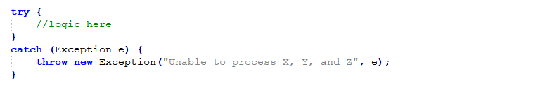

#  Catching Base Exception Class

In Java you can have a try statement with multiple catch clauses.  In a method that handles exceptions, by for example wrapping and rethrowing, it is important to catch the root-most “Exception” class and this post explains why even though some misguided recommendations suggest otherwise.

## TL;DR

There are situations where it is important to catch all exceptions:

*   When wrapping an exception and rethrowing to add context to an unexpected situation report
*   When implementing the root method on a thread you need to log all exceptions so that the failure information is not lost.
*   When implementing a web request handler, you need to return an error report to the original requester.

To catch all exceptions you make a catch block with the java “Exception” class in it.  Like this (for example the wrapping case above):

Some guidelines say that instead you should list all the exceptions classes that you specifically expect to receive, like this:

This is a bad idea because you can not know all of the possible exceptions classes that you will receive.  If an exception is thrown that is not in your list, it will fly out of the method without the necessary processing.

Most catch block don’t care at all about what kind of exception was thrown, because they are simply responding to the fact that the method did not complete.

Java method signatures list some exceptions that are thrown, but unchecked exceptions that extend RuntimeException do not appear in the signature.  Even if you analysize of all the code to determine what can be thrown, that might change in the future.  You will never know you failed to catch an exception until your system has crashed and you don’t have the information you need about why it did.

Listing the actual classes that you expect takes extra effort, provides no additional benefit, and exposes you to the risk that there might be an exception thrown that you did not include.  It is far easier to catch the base class, and then you are assured at run time that all catchable exceptions are caught.

## Why do otherwise?

Some expert recommend the opposite.  For example, MITRE [recommends the following](https://cwe.mitre.org/data/definitions/396.html):

> Multiple catch blocks can get ugly and repetitive, but “condensing” catch blocks by catching a high-level class like Exception can obscure exceptions that deserve special treatment or that should not be caught at this point in the program. Catching an overly broad exception essentially defeats the purpose of Java’s typed exceptions, and can become particularly dangerous if the program grows and begins to throw new types of exceptions. The new exception types will not receive any attention.

The new Java 7 syntax that allows multiple types to be declared resolves the ugly multiple repetitively defined blocks.  Indeed the suggestion was much more onerous in the past.  Now you simply have a number of class names and a single block.  That is clearly an improvements, but you still have the risk that you will miss a class.

Consider: “_Catching an overly broad exception essentially defeats the purpose of Java’s typed exceptions_”

First of all, Java had some goals that turn out to be unworkable.  Indeed, there was an idea that including a declaration of what a method will throw looked like a great idea for keeping track of every kind of exception that might come out of a routine.  Unfortunately, it does not work, and I have documented the reasons in a longer post on “[Method Exception Signatures](https://agiletribe.purplehillsbooks.com/2013/04/04/method-exception-signature/).”  It turns out to be impossible to track all the possible exceptions when one package calls another package that calls a third package.  Adding one line of code can cause the method to change exception signature, which changes the signature of all the methods that use it, and then all the methods that use that, and so on.   The cascade of signature changes is quickly unmanageable.  But wrapping and rethrowing with a package specific exception JUST to conform to a static signature also defeats the purpose of Java’s typed exceptions as well.  If you analyze this in depth, you find that exception signatures just can’t work in a real system.

Even if the signatures worked, there are exceptions that simply do not need to be included in the signature.  This is by design, because if all possible exceptions had to be reported from all methods, the list would include dozens or hundreds of exception types for every possible method.  Because of the signature problem, Java developers created the RuntimeException and all classes that extend it, and they do not need to be included in the signature.  An IllegalArgumentException can always be thrown, and it will unwind the stack, and there is no way to anticipate whether it will or not.

Consider: “_can become particularly dangerous if the program grows and begins to throw new types of exceptions._”

New exceptions certainly will be invented and thrown.  But the danger is when you don’t catch them!  The situations given above, where all exceptions must be caught, listing what you believe to be the list of all classes will fail to include the new exception type.  Failing to include this new type in the list will cause your thread to die when one is thrown, and you will have no logging that it occurred.  Or it will cause the exception to proceed without the additional context information added to it.

Consider: “_The new exception types will not receive any attention._”

This remark represents an odd mindset which I will discuss more fully below, but I should just point out that specifically listing the exception does not in any way assure that all the needed attention is received either.  Unchecked exceptions will have no effect.  Signature changes will then cause a mechanical inclusion of that new exception type into the catch statement, but understanding what the new exception really means is far from assured.

There is a paper by Tsipenyuk, Chess, and McGraw “[Seven Pernicious Kingdoms:](https://samate.nist.gov/SSATTM_Content/papers/Seven%20Pernicious%20Kingdoms%20-%20Taxonomy%20of%20Sw%20Security%20Errors%20-%20Tsipenyuk%20-%20Chess%20-%20McGraw.pdf) [A Taxonomy of Software Security Errors](https://samate.nist.gov/SSATTM_Content/papers/Seven%20Pernicious%20Kingdoms%20-%20Taxonomy%20of%20Sw%20Security%20Errors%20-%20Tsipenyuk%20-%20Chess%20-%20McGraw.pdf)” where there is a simple paragraph that says:

> Overly-Broad Catch Block. Catching overly broad exceptions promotes complex error handling code that is more likely to contain security vulnerabilities.

Catching all exception does not promote complex code, instead it is quite a bit simpler than listing all the classes you might need to catch.   None of the cases I have given are there security vulnerabilities because of including a new exception along with all the others being handled.  I beg to see an example of this security vulnerability.  Of course, once you claim something is a security vulnerability it becomes difficult to discuss.  This vague general statement has no supporting evidence provided in the paper itself.  (They have a identical vague unsupported statement about throws declarations, by the way.)

I would say that determining what to do with an exception is dependent more upon the logic of the current routine, than the type of exception.  If a routine much higher in the stack throws a new kind of exception, it is unlikely that the failure handling at the lower level will change.  For the case of thread-root methods, and wrapping, it most certainly must not change for the new exception type.

## Why would they think this?

This is pure speculation, but some things can be assumed from the way this is presented.  They seem to think that the only reason you would want to catch an exception is to respond with exception-specific logic.  In reality that is almost never the case.  In my experience 95% to 99% of the catch blocks do not care what kind of exception occurred. Those catch blocks are not concerned about the kind of exception but only **simply responding to the fact that the current routine did not complete**.

The MITRE document gives this explanation further down:

> However, if \[called method\] is modified to throw a new type of exception that should be handled in some different kind of way, the broad catch block will prevent the compiler from pointing out the situation. Further, the new catch block will now also handle exceptions derived from RuntimeException such as ClassCastException, and NullPointerException, which is not the programmer’s intent.

What is the likelihood that different processing is needed?  It is possible, but exceedingly unlikely that the calling method will want to do something different because of the new exception.   Also, how do they conclude that the programmer does not intend to catch RuntimeExceptions?  In all of the cases I give, it is absolutely critical that all failures are caught and logged, reported to user, and wrapped with context. They seem to be out of touch with actual programming experience.

Guidelines like these are based on a theory of how programming languages work.  These theories are worked out on small programs, but as explained above the method exception signature theory simply does not scale to the level of a real application.  I would guess that whoever said this does not really understand that method exception signatures do not work on any large scale.

If you think that method signatures work, then you think you can know about all the exceptions, and therefor list them all.  In a small program this is not a big deal, but in a large system you can be working with hundreds of different types of exceptions.  The bookkeeping is not a trivial amount of effort, when all the changes need to be cascaded through thousands of methods.  This effort expands exponentially, so what seems a reasonable amount of work for a small program become unsupportable at larger scale.

They seem to think that every time a new exception class is created, that programmers should manually check thousands of methods to see if special processing is needed.  In almost all cases no change will be needed, because the catch block is just compensating for the fact that the current method did not complete.

They seem to be oblivious of the cases were it is important that you catch all exceptions.  When handling a web request, you can only send an error back if you catch all exceptions.  If you miss one, then nothing is returned, and the caller has no idea why the call failed.  It seems that the small programs written by the language theorists don’t need to ever reliably deliver an error message.

Finally: they have no vision for how effective exception handling can improve error reporting.  It is a fact that error message deliver is rarely a computing example used in programming classes.

## Most exceptions are not specific

The fact is that any real production sized system will have thousands of different error messages to be delivered.  You will certainly not have a unique exception class for each error message.  If you did, the [expense would not be worthwhile](https://agiletribe.purplehillsbooks.com/2016/03/16/individual-exception-classes-are-monstrously-overweight/).   Normally what is done is that an exception is created with a unique exception message in it detailing the problem.  The net effect is that usually there is a single package-specific exception class which is used for all kinds of errors.  That means that the same kind of exception is thrown from all methods of a package no matter what the cause.  So the dream of specific Exception classes is not as real as you might think.

There are special situations where an exception is thrown and is of such a nature that is might be caught and compensated.  Thus, the designer of the function is expecting that exception might need to be specifically caught.  In this case a specific exception class might be created.  But this is a rare situation, and most packages have only a handful of these kinds of specific exception classes.

## What if you need exception specific processing?

While it is rare, there are times when the catch block will do something specific to the kind of exception received. If this is the case, then it is critical that the exact specific exception type is detected, before responding.

Example: If you are using the Java method to convert a string to a number, it will throw an exception if the format is not correct.  Quite often the method trying to do the convert doesn’t know whether it is a number either, so the only convenient way to know is to catch the exception if it is thrown.  For this, you absolutely must catch NumberFormatException so that your code is only responding to that specific situation.  Often the response is to return a default value instead of the converted string.

In the above example, if you catch all exceptions and return the default, you might be doing this on an OutOfMemory exception.  Returning a default value because of an OutOfMemory error is a very bad idea.

## Recommendation

If your catch block is performing an action that does not depend on the exception type, but is required when the method is interrupted, then you should catch all exception using an “**Exception**” root class.  This is the only way to assure that you will always catch every exception.   One should write code on the assumption that unexpected exceptions will need to be handled, because that is the nature of exceptions to represent unexpected situation.