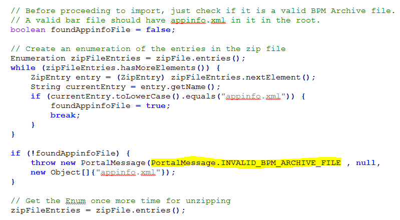

#  Constants and Errors

Still reviewing that code base and finding more bad patterns for use of constants, this time for error messages.   This is another “don’t do this” post.

## Error Reporting

The code in question is receiving a zip file containing an application and installing it.  In doing this, there are a number of things that might be wrong with the zip file contents, making the application install impossible.   Here is a piece of the code, looking for a file called “appinfo.xml” and throwing an exception if not found.  
  
The PortalMessage object is an exception object.  The constructor takes a string identifier for the message, then a possible nested exception, and then an array of values to include into the message.  The values in this case mention the actual file that is missing.  
Instead of putting a literal string in the first parameter a constant is used.  This constant file is defined in a completely different package, but if you navigate to that folder and find the source file there, you have this:

    
The symbol “INVALID\_BPM\_ARCHIVE\_FILE” makes a bit of sense when you read it.  The reviewer of the code can understand that this is about a poorly structured BPM archive.  However, this is mapped to “portal256”.  
Then, when you look int he properties file, you have this:  
  
Associated with “portal256” is the message that the user will ultimately see.

## Unnecessary Complication

The use of a string constant introduces an unnecessary complication.   If the system outputs the message, the debugger needs to search for “The file specified does not” in order to find that it is message “portal256” but this will not identify the place in the source, you have to find the constant that maps “portal256” to “INVALID\_BPM\_ARCHIVE\_FILE”.   Then, using that value, you can search for the lines of code that throw that string constant.  
Imagine how much easier this code would be to maintain if the string constant was defined like this:

```java
String INVALID_BPM_ARCHIVE_FILE = "INVALID_BPM_ARCHIVE_FILE"
```


And then, the properties file would have:

```
INVALID_BPM_ARCHIVE_FILE=The file specified does not contain a valid
Interstage BPM Application. Interstage BPM Applications can only be
created using the Interstage BPM Studio. Make sure that you specified
a file that was created using Interstage BPM Studio.
```


The properties file is to be used for translation, and clearly labeling this message this way will be easier for the translator, or anyone who has to work with messages.  
This point is that “portal256” is a meaningless value.  Why use an arbitrary value, when a clearly much better value is available.  **_If you are going to use a constant value, always make the name of the constant the same as the value of the constant!   Eliminate unnecessary arbitrary symbols in code to make it more maintainable._**

## Failure to Communicate

The next problem is more subtle.  The actual problem was that the “appinfo.xml” file was missing from the archive.  That is actually what the code was testing for, and that is actually what it should be reporting.  
The error message reports something else:  it _interprets_ the problem.  It takes the fact that the file is missing, and concludes that “the archive is invalid”.   This is poor error reporting.  The code should always report exactly the problem that was found, because code can evolve, and this may later be called by something else that is using it for a different reason, and this conclusion (which depends on the context it is being called in) may no longer be correct. 

I always have to remind programmers like the Detective Joe Friday on Dragnet:  “Just the facts.   Just report the facts that you found.”   Don’t jump to unfounded conclusions.

## Failure #2

The critical thing to know is that there was a problem with “appinfo.xml.”  If that is replaced in the archive, everything might be OK.  The throw actually includes this detail!  It includes as a value the name of the file that was missing.  But the message does not use it!   The message was written without a &lt;$1&gt; parameter in it, and so the file name is simply not displayed!  

This is a failure of the exception class and the message support.   If a value is supplied, then either it should be displayed automatically, OR there should be a meta-error telling the system developers that a the throw is inconsistent with the message  
**_Designing a good exception class can help assure that the message is delivered even if the programmer makes a mistake in creating the message._** 

## Resilience

When coding, there is another problem that can appear, and that is when the key value is supplied, and the message is missing from the properties file.  That did not happen in this case, but if it had, then the system would display:

```
portal256
```


The key is displayed when there is no message associated.  This key is meaningless.   If instead the key was as describe above, it would display:

```
INVALID_BPM_ARCHIVE_FILE
```


This is not the best message for a user, but it is far far better than “portal256”.   That is a second reason that you should use meaningful keys, because it allows for graceful degradation when the properties file is unreachable, unreadable, or otherwise unavailable.  
**_Always use descriptive message key values._**

## Locked in by Internationalization

There is one more moral hazard, and that is once you have a property file, and when coding a new exception, it is common for programmers to look to see if there is already an error message like what they want.  The programmer looks through the existing messages, finds one that expresses approximately the right sentiment, and then reuses that.  
Reuse is good in general.  Decreasing the number of error messages make a program more maintainable.  The problem is that programmers will pick a message that is not quite right.  That might be what happened in this case.  The correct message was “file missing from archive” but instead the programmer went with “archive is invalid”.  Not that much different.  
But as the development goes on, someone may discover that the original cause of the error message had not described it carefully enough, and change it.   Changing in for one place might not be appropriate for all the other places that use the same message. This gets in the way of incremental improvement of error messages, and defeats the Agile development approach.  
The other problem that can happen is when the message is translated, that translation might no longer apply to all the places it is used.  It is not that rare that a message works in two places in one language, but requires two separate messages in another.  
There are no easy answers here.  The only recommendation is to use a long, descriptive key value that matches the actual problem found.

## Summary

The use of a constant is not needed at all.  The string “INVALID\_BPM\_ARCHIVE\_FILE” becomes fixed once there is a properties file, and even more so when there are translations of that properties file.  Changing the key to a message essentially can never happen, so there is no real benefit to using the constants.  Just use the string literal “INVALID\_BPM\_ARCHIVE\_FILE” and it is as good as it can get.  
If you do insist on using a constants class, then at the very least, make the values exactly the same as the constant identifier, so that reading the code is less burdensome.