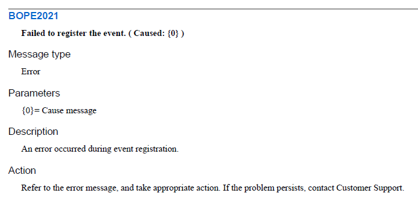

#  The Error Message IS Documentation for Code

Another example of content free documentation below: documentation that is a waste of screen space even to display it on the screen.  Here the issue is a development team so enamored with Documentation (with a capital D) that they really want to do a complete job to document everything, that they are blind to a better approach.  The real goal of any software development should be to _eliminate the need for documentation in the first place_

In this particular case, the development team wanted to “Document” every error message that might occur.  They set this task as a goal of some contractors, and those people dutifully made 10 lines of documentation for each error message.  Here is an example:

*   The second line shows the actual error message that will be displayed to the user in the product.  Everything else mentioned here is completely obvious once the error message is known.
*   Lines 3 & 4 say this is an error message, which we already know.
*   Lines 5 & 6 clarify that the parameter might be a cause, but that is clear from the error message itself, and this text adds nothing.
*   Lines 7 & 8 give a description that is essentially identical to the error message itself, and so these lines do not add anything.
*   Finally lines 9 & 10 propose an action, and this is a generic action that would apply to any error message, and offers no additional information.  When the manual says that the action is to “take appropriate action” you know you are seeing content-free documentation.

These 10 lines of documentation is a completely waste of space because it adds no value over the error message itself.  By including this in the documentation, you add clutter to the document.    If this was left out, the book would be smaller, easier to read, easier to maintain, and would still contain the same amount of information.  Everyone knows that good writing uses as few words as possible.  The same for documentation: include something only if it adds real value.

What if there was some additional information to provide?  If you have additional information, why not put it directly in the error message?   Let say you want to clarify the above with the following statement “_Failed to register the event.  This may be caused by invalid configuration, network failure, or during server shutdown._”  Then why include this all in the error message?  Why make the user go to a separate document to find this?  This of how much more convenient if the system puts this right on the screen.

Even if it takes a full paragraph to explain the problem?  Yes, the entire paragraph should be put in the error message.  I think a long time ago people used cryptic error codes because programs were very limited in size.  The code could only have a number, and you needed documentation to translate that number into a string of text.  But now translatable message files and common to do this for us.  Are we worried that the message file will take up too much space?  Never, the size of an error message file is an insignificant spec compared to all the other space that a system uses.  Assuming that the error happens only now and then, there should be no big deal to have quite a long error message that says exactly what the user needs.  Why force the user to go look up in the manual to find out what the error message means?  It makes so much more sense to display exactly what they manual would have right there on the screen.

This makes even more sense in the development process.  Why have one message in one place, and then a larger message in a different place (the manual)?  From a development perspective, it would be better to have a single description of the problem, in a single place.  If you have two descriptions, then you have to keep them in sync.  When they are out of sync this is a source of problems. Eliminate the source of problem by simply having the proper message in one place, and display the proper message to the user at the time that the error occurs.

It seems ridiculous to have two descriptions of the problem: one in the message file and one in the documentation.  If the writer can come up with a better description of the problem, then why leave the poor description in the error message file?  The writer should work simply to improve the error message, and then you kill two birds with one stone.  The users benefit because they see the better description right on the screen.  
This is about quality.  If you have high quality error messages, then there is no need to have documentation about those error messages.

**The error message IS the documentation, and there is no need to duplicate that.**

This entry was posted in [Design](https://agiletribe.purplehillsbooks.com/category/design/) and tagged [documentation](https://agiletribe.purplehillsbooks.com/tag/documentation/), [errors](https://agiletribe.purplehillsbooks.com/tag/errors/). Bookmark the [permalink](https://agiletribe.purplehillsbooks.com/2012/03/28/the-error-message-is-the-documentation/ "Permalink to The Error Message IS Documentation for Code").