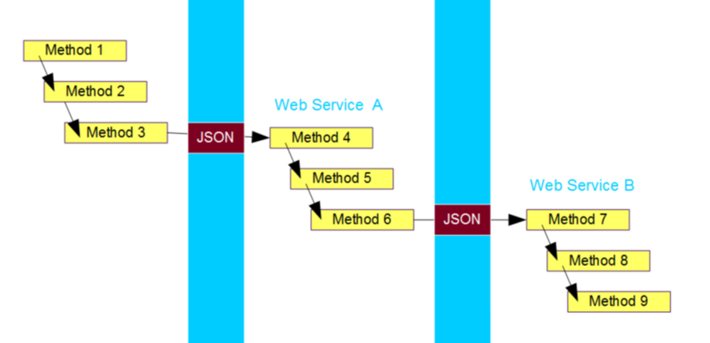
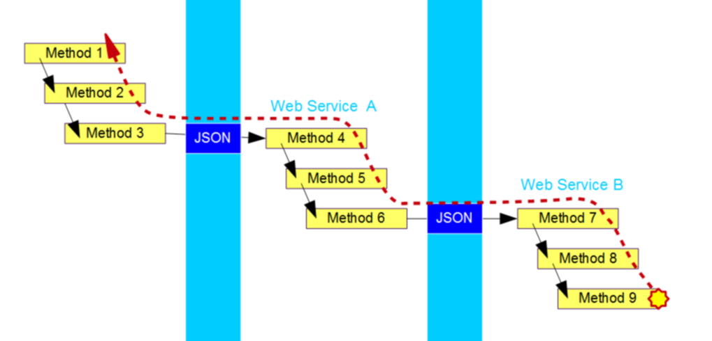

#  Exception Receiving

When you make a web service call, you want to report the problem to the user save as you do for any other part of the program, and that is through an exception object.  This post talks about converting the JSON received back into an exception object so that it can be reported properly.  This is the fourth post in a series about [translatable errors for REST web services](https://agiletribe.purplehillsbooks.com/2019/01/05/translatable-error-messages/).

## Integrating Across Web Service Calls

The scenario is a service that can be called, and part of that service is to call another service.  If something goes wrong you want to report back.  Logically:  
  

Method 1 calls 2 which calls 3.   Method 3 makes a JSON/REST web service call to method 4, which calls 5 and 6.   Method 6 makes another web service call over to method 7, and ultimately 8 and 9.  This is crossing from the client, to the first server that then calls the second server.  

Then imagine that method 9 has a problem and needs to report with an exception.  You want the exception message to make its way all the way to method 1 which presumably can display it to the user.   Far too often the exceptions are simply dumped to log files at the web service boundary. The user does not have access often to any access to the second server, so if method 7 logs the error it is useless.  Method 7 should package up the exception and send it back to 6.  It is not good enough for method 6 to log to a file either, it really should communicate back to the user, and the only way to do that is to throw an exception.  

  

For method 6 to communicate the problem, it needs to take the JSON representation of the error, and convert it back to an Exception object, and throw it.  That will ultimately get converted back to JSON, returned to method 3, that will in turn repackage it as an Exception.  The result is that the client will get a single exception chains showing all the exceptions generated along the way, with stack traces that look reasonably like a singe, integrated stack trace.  
Clearly, this can all be accomplished if you simply have the ability to convert back and forth, from Exception to JSON, and then from JSON back to Exception.

## Stack Traces

The stack trace is automatically set on an exception to the location that the Exception object is constructed.  That works fine when the exception is about the code that it is throwing from, but converting a JSON object is recovering an exception from the remote environment, and the stack trace for the current environment is not desired.  It is easy to take the template and the parameters from the JSON and construct a new Exception object, but to make it really reflect the original, it must also replicate the stack trace from the original location.

```java
JSONException je = new JSONException(msg.template, msg.params);
StackTraceElement[] newTrace = new StackTraceElement[msg.stack.length];
for( i=0; i<msg.stack.length; i++ ) {
    newTrace[i] = convertTrace(msg.stack[i]);
}
je.setStackTrace( newTrace );
throw je;
```


Conveniently there is an easy way to replace the stack trace on a Java Exception object.  It takes an array of StackTraceElement objects, each of which specifies a class, a method, a source file and a line number.  The stack trace on the originating side can be put into the JSON (See [JSON REST API – Exception Handling](https://agiletribe.purplehillsbooks.com/2015/09/16/json-rest-api-exception-handling/) for details on the syntax).  The receiving side converts the stack trace items back into [StackTraceElement](https://docs.oracle.com/javase/7/docs/api/java/lang/StackTraceElement.html) objects — using a simple ‘convertTrace’ method for the specific trace representation — and places them on the exception before throwing.

## Chained Exceptions

Remember that an Exception can have a cause, which in turn can have a cause, forming a chain of exceptions.  These are represented in the JSON as items in the details array.   Thus, when reconstructing the Exception objects, you will need to create an Exception object for each element in the details array, and link them together using the “cause” attribute.  Something like this:

```java
Exception cause = null;
for( i=0; i<msg.details.length; i++ ) {
    Exception newEx = MyException.newWrap(msg.details[i], cause);
    //other aspects of the conversion here
    cause = newEx;
}
throw cause;
```


The net result is that an exception in a web service is sent in JSON, received, converted back to Exception and re-thrown.  This can happen any number of times.  The end result is that the user gets a high quality report of what went wrong, and all the context around it.

## Translatable Messages

If the JSON you receive followed the recommendation in my post on [JSON Translatable Error Messages](https://agiletribe.purplehillsbooks.com/2019/01/06/json-translatable-error-messages/), then you have in the JSON the message template, and you have all the data values as well.  You can reverse this to construct an exception holding template and data to pass the internationalization on to further catch sites.

## Variety of Interface Styles

We have chosen to format the exception according to a proposed standard, that standard is far from universal.  It is likely that every different vendor will structure their errors differently.  So technically, you will need a conversion routine for every different flavor of error object.  This is manageable since you should be able to expect a particular type of error always associated with a particular interface being called.  

In fact, it would be reasonable for a REST interface to provide Java and other language converters for their own particular flavor of error report.   For the Purple Utilities, the converter is in the [JSONException class](https://github.com/agilepro/mendocino/blob/master/src/com/purplehillsbooks/json/JSONException.java) as the method [convertJSONToException](http://purplehillsbooks.com/purpleDoc/com/purplehillsbooks/json/JSONException.html#convertJSONToException-com.purplehillsbooks.json.JSONObject-).

## Result

The final result is that code can call a web service that calls code that calls a web service, and if an exception is thrown, it can be delivered all the way back to the source.  This means that the calling code knows that something went wrong (better than asynchronous calls) and the user has information to resolve the problem (better than a vague error number).
