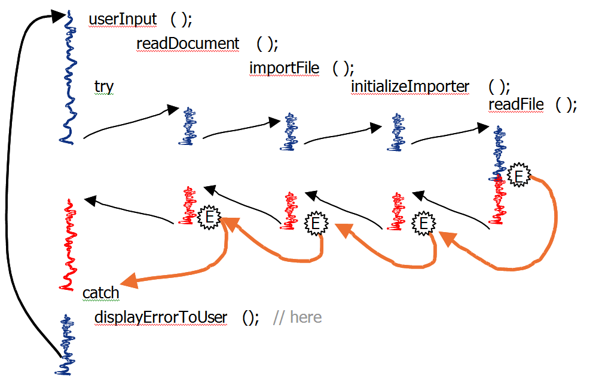

#  Gathering Error Report Information

In the last post, I clarified the [Purpose of Error Reporting](https://agiletribe.purplehillsbooks.com/2013/02/14/the-purpose-of-error-reporting/) is to give user/administrators information to solve the problem that they have encountered.  This post outlines a way to gather the best information together for that error message.

## The Challenge

What information will be needed to solve the problem?  Remember, real problems are situations that lie outside of the design parameters of the program. Trivial problems (e.g. Field XYZ must be filled in) are easy to program for, but those kinds of errors are actually the kind that are actually part of the program design.  Trivial problems take very little time from users.  The biggest challenge is to create an effective response when the user encounters a situation that the programmer would never have dreamed possible.  

In the [Purpose of Error Reporting](https://agiletribe.purplehillsbooks.com/2013/02/14/the-purpose-of-error-reporting/) post I explained that while you would like to have a message that tells the operator what to do, that is simply not possible because the program does not have enough information.  What you _can_ do is report on the _current status_ of the program.  However, that status is not a single value in a single location.  The program is in the middle of doing any number of things, any one of which may have been the source of the problem.  Even when you identify the operation that failed, explaining what and why it was doing this to the user can be a challenge.  Let me explain by way of an example.

## Example Problem Situation

An example is this: a program is being used to

```
(a)   import a file xxx.dox, in order to do this, the program needs to
(b)   invoke a import module for that file format, which is
(c)   initialized by
(d)   reading a configuration file doxfile.ini.  But
(e)   unfortunately the docfile.ini is missing from the disk or corrupted
```


There are a number of different options about what to report, and here are examples of how to do this incorrectly:

*   Imagine how inappropriate it is to simply report “Can’t read file” because from the user’s perspective it is the doc file that is being read.  The user might waste a lot of time trying to figure out why the program can not read the doc file.
*   It is a little better to report “Can’t read file docfile.ini” because while the file is specified, unless the user had a lot of experience with this error, there is no way to know why the system was trying to read this file.  Just knowing that the docfile.ini is associated with the doc-file import module, might allow the user to reinstall this module.  This example shows how reporting just the detailed information is insufficient to allow the user to solve the problem.
*   Notice how inappropriate it is to simply report “Can’t read file xxx.dox” because it leaves the user with no clue as to how to fix the problem.
*   An intermediate message by itself is also not sufficient, such as “Can not initialize import module”.

In the end, you find yourself choosing between two evils: either you lack detail, or you lack context.  The only appropriate error message is one that include **_all_** the detail and the context.  An pseudo-example of such an error message is:

```
Could not import file xxx.doc
    because
Could not invoke import module for doc-files
    because
Failure while initializing the doc-file import module
    because
Can not read file "docfile.ini"
```


Only this complete message, with the specific problem, and the nested context, has a chance of giving the user/administrator what they need to solve the problem. 

Unfortunately, it is very hard to know exactly what the user will need for any given situation.  The above problem might have been caused because the user mis-typed the original file name, and really meant to import the file “xxx.doe” which would use a very different import module.  There is no way to reliably guess what the user’s intent was.  It is better to display as much as possible so that the user can deduce the proper action to correct the problem — and I have never had an end user who had a real problem complain that there was too much information to sort through!   My guess is that the users complain about too much information when they are presented with information that is not relevant or useful to them, and that is a different problem. Proper use of exceptions provides us with a straightforward way to help overcome the problem of level.  

The figure below is a depiction of the call graph.  Each squiggley line indicates a routine of conceptual significance.  The routine handling the user input called a routine to read the document, which in turn call a routine to import the file, which in turn call a routine to initialize itself, which finally calls a routine to read a file.  There may be other routines in the call stack, but they are unimportant for this example.  You can think of the problem of selecting the right error message as being a problem of deciding which of these routines should report the error.  

Don’t make a choice between which of these routines should report an error; instead report use all of them to participate in constructing a error message.  Routine (d) has the goal of reading the file “doxfile.ini” and when it can not it throws an Exception that outlines the failure and the file it was trying to read.  This exception causes routine (c) to fail to initialize the module.  Instead of letting the exception pass on through, it catches the exception from (d) and creates a new Exception.  The Exception from (d) is not thrown away, but is used as a parameter to the new Exception.  This new Exception throw causes routine (b) to fail.  It should catch that and create another Exception that explains that the import module could not be invoked and uses the previous Exception as a parameter.  Finally, routine (a) fails because there is no valid import module, so it creates the top level Exception.  This is as far as it needs to go since we are now up to the same intention level as the user.  At this level, because all four exceptions are preserved, desired error message is produced.



The important thing to note about this approach is that each routine describes what it was doing, or that what it had been asked to do and failed to accomplish including the details of what parameter values it was passed.  This generally can be done with a single try/catch block that surrounds the entire body of the routine.  Any exception from within the body can be caught, and the exception created and thrown always describes what that routine was trying to do.  As long as each routine can describe its own failure in this way, then there is very little work that needs to be done with exceptions within the method block.  A little bit of work in every routine is all that is needed.

## Java Exception Support

Those familiar with the Java exception class know that there is a constructor to Exception that has a Throwable as a parameter.  That parameter sets the ’cause’ member.  Thus an exception can be caused by another exception, which can be caused by another exception and so on.  When I was working at Netscape I wrote a widely circulated document proposing this mechanism, and I was quite pleased when 4 years later this became a standard part of the Java standard classes — but whether my document was the origin of this idea I will never know.  

This allows the Exception object to be used to collect information from each of the different levels, and deliver the package to the root-most level of the program where it can be displayed in a consistent way.

## Is this Too Much Information?

Some programmers are put off because at first glance this is a lot of extra information that the user does not _need to know_.  I have even been told that the user should not be confronted with so many details about the system, and that instead they should be given just the right amount to solve the problem.  I have actually heard programmers say that the message needs to be “dumbed-down” to the level of the user.  I personally find this rather disturbing that some programmers have so little respect for the user, and apparently subscribe to the theory that the user’s difficulty with a program can be ascribed to their lack of intellectual ability.  Think _carefully_ about this.  Our users are intelligent and highly educated people, they simply don’t spend all their time hacking code and don’t have specific insight into the structure of our source code. A good user interface treats the user with respect.  

Some user interface testing results sometimes in the users complaining that the error message contains too much information.  There are two reasons.  The first is that you would like is a short, simple instruction telling you what to do.  Like “find the named ‘doxfile.ini’ from the install disk, and place it into directory xyz”.  As I have explained before, it is almost impossible for a program to have enough information to know why a particular operation failed.  Most users don’t know enough about this particular program to realize that this is impossible.  So … we agree it would be nice to offer a short message, but that is impossible. 

The second reason for complaining of too much information is when that information is useless. If offered a lot of gobbledigook in cryptic language that they can not use, and they fail to make use of it, then they complain that it is too much.  However, if the same amount of information is useful and relevant, and it allows them to find the problem, then they _never complain about the volume of information_.  The size of the message does not matter as long as it does the job!  Once you understand this, you realize that they are not complaining of too much information, but rather _too much noise without any good information_.  Instead of trimming down the poor information, you should focus on getting good complete information in the message.

## Summary

Exception object can be used to collect together the error and context necessary for a user/administrator to solve the problem they have run into.  

Each conceptually relevant method needs to catch all exceptions, and wrap that exception in another exception object that includes the information about that level of context.  

No method should swallow the exception by catching it, and not passing it on.  Generating a new exception without wrapping the old exception will result in a loss of information.  

Include specific data from the parameters of the method into the exception so that the user can understand the specifics of this situation. 

At the root-most level, include a mechanism to catch the exception, and display the entire chain to the user.