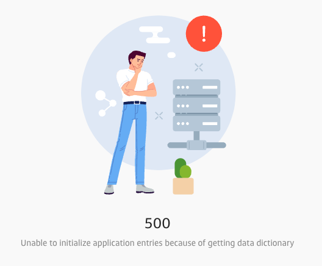

# Costs to Developers

This document is to give a concrete example of how a developer is harmed when error handling is done poorly.  While the total harm is modest -- amounting to a waste of a few hours of work -- it is important to note that doing it correctly would take much less than a few hours.  Generally, a few minutes of diligence can save hours of debugging later.

:::tip[Key Takeaway]

It takes only a few second to code a catch block correctly so that it does not drop the old exception on the floor, and instead wraps the old exception in the new one.  Taking a few seconds to do this will pay off many many times saving many hours of work in the future.

:::

## Setting

I am a new developer on a project, so I need to learn the code. Obviously there are experienced developers who know where everything is, and so any problem is easy for them to find.  But a new developer does not know how things are structured, where things are, and a straight linear reading of the entire source is time-prohibitive.  Instead, a programmer learns enough about the part of the code they are dealing with to become proficient in just that part.

One can review one method and determine what it does, but there are a lot of assumptions being made about the code that method calls.  By extension, you can review the methods called, but they call yet more methods.  While you might have certainty about one locality of the program, you will ultimately be relying on a lot of assumptions about the rest of the code.  Good coding conventions help a lot, such as proper naming of methods and variables.  Yet the name itself is often a specific term-of-art within the project and has subtle meaning that outsiders can not know until they gain experience on the project.

In this case my task is to change the program to read a file called a dictionary.  There are a number of groups in the system, and each group has a dictionary.  My job was to add a new group, and their associaded dictionary.  I created the new folder for the group, put the file in there, made sure the constants were updated in the code were correct, and tried running it.   I got this error:


This is a poor message for many reasons

* "there was a problem" tell you absolutely nothing about what went wrong.  It is very very vague.  With this you have absolutely nothing to go on.
* "Please try again" is a bad instruction because you could try an infinite number of times and you will get the same error.  This seems to imply that the code sometimes works and sometimes doesn't which would be very sloppy if true.
* This same message was produced for four different errors in the code.

Looking at the source, there was something like this:

```ts
try {
    if (config.dataDictionaryId) {
        dataDictionary = getDataDictionaryEntries(config.dataDictionaryId, environment);
    }
} catch (e) {
    dispatch({
        type: actionTypes.INIT_APP_FAILURE,
        error: {
            message: defaultErrorMessageforDataDictionaryErrors,
            type: 'DataDictionary',
        },
    });
}
```

This code catches the exception "e" and then creates an error message, but the message is defined in a constant at the top of the file, and is used for every error in the file.  That constant was defined as "There was a problem processing the request.  Please try again."  I didn't even know which of the four blocks of code was experiencing the error!

The first thing i did was get rid of the constant error message, and created unique error messages for each block. 


```ts
try {
    if (config.dataDictionaryId) {
        dataDictionary = getDataDictionaryEntries(config.dataDictionaryId, environment);
    }
} catch (e) {
    dispatch({
        type: actionTypes.INIT_APP_FAILURE,
        error: {
            message: `Unable to initialize application entries because of getting data dictionary`,
            type: 'DataDictionary',
        },
    });
}
```

This produced this error message:

```
Unable to initialize application entries because of getting data dictionary
```

By doing this, I was able to easily use the error message to itself to find the block of code that was experiencing the error.  But what was causing the problem?  That was explained by the exception "e" that was caught.  That exception object is being completely ignored by this catch handler!  Dropped on the ground and replaced with a generic message that does not tell you what went wrong.

So I altered message here, to append `e.message` to the end of the displayed message.  Sure enough, there was useful information there.   `e.message` was:

```
Unable to initialize application entries because of getting data dictionary
  because: Data dictionary 'Sample_Test_Group' not found
```

But I checked again.  The dictionary was there, in the right place, with the right name.   What was happening was that this method was being called:


```js
function getDataDictionaryEntries(dictionaryId, environment)  {
    try {
        const prodDataDictionaryValues = require(`../constants/data-dictionary/${dictionaryId}/dataDictionary`);
        const preProdDataDictionaryValues = require(`../constants/data-dictionary/${dictionaryId}/preProdDataDictionary`);

        let resultingDictionary = { ...prodDataDictionaryValues };

        if (environment !== PROD) {
            resultingDictionary = { ...resultingDictionary, ...preProdDataDictionaryValues };
        }

        return resultingDictionary;
    } catch (err) {
        throw new ClientError(`Data dictionary ${dictionaryId} not found`);
    }
}
```

Notice once again that the catch block catches an exception `err` but does absolutely nothign with it!  It simply constructs a new exception and throws it.  Why?   So once again I appended the value of `err.message` onto the error message, and sure enough, I got a useful error message.

```
Unable to initialize application entries because of getting data dictionary
  because: Data dictionary 'Sample_Test_Group' not found
    because: Unable to read file data-dictionary/Sample_Test_Group/preProdDataDictionary
```

Aha!  There had to be _two_ files there.  There is another file called the `preProdDataDictionary` and while the group I was working with didn't need one of those, the code was written to fail if it was not there.  Only, when it failed, it didn't report what exactly went wrong.  Instead it covered that information up with generic (and useless) error messages.

This cost me about 1 hour of work to dig into the code and find the problem.   If the final error message had been there from the start, I would have known immediately what the problem was, and would have saved an hour of work.

The most import note is the it does not take any extra effort to do it right.  Don't drop the exception on the florr, but add it to the new one you are creating.  The right way to do this is something like this:

```js
    } catch (err) {
        let clientError = new ClientError(`Data dictionary ${dictionaryId} not found`);
        clientError.cause = err;
        throw clientError;
    }
```

Just set the cause member of the new error, to the error that was caught.  Then at the end, you display the message member of all of the objects.

I ran into the problem a second time.   I needed to add a call for loading of a second dictionary, the output dictionary.   I added the new method and called it just below the first, and the final code looked like this -- note the setting of the `cause` member of the new exception.  There is a bug in this code, can you see it?

```ts
try {
    if (config.dataDictionaryId) {
        dataDictionary = getDataDictionaryEntries(config.dataDictionaryId, environment);
        outputDictionary = getOutputDictionary(dataDictionaryId, environment);
    }
} catch (e) {
    dispatch({
        type: actionTypes.INIT_APP_FAILURE,
        error: {
            message: `Unable to initialize application entries because of getting data dictionary`,
            type: 'DataDictionary',
            cause: e,
        },
    });
}
```

The display I got on the screen was this:



That is not useful because I know that, but what caused it?  The problem was that the screen was not displaying the causes of the exception.  I modified that, and then I got a display like this:


Aha!  Look at the first parameter of `getOutputDictionary` and you will see that it should be `config.dataDictionaryId` and not just `dataDictionaryId` by itself.  If I had had this extra detail on the displayed error message, I would have saved at least half an hour searching for it.

Good error messages make debugging the code much much easier, quicker, and make the development of the application more effective.


