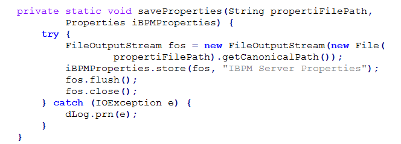

#  Simple Rule for Exception

If you want a program that runs reliably, then there is a simple rule to follow about exception handling.   It is so simple, it can be stated in a single sentence:   _**if a method does not accomplish what it is supposed to do, it must throw an exception.**_    
It really is that simple.  Here is why.

## Methods and Promises

A method is a block of code that does something for the programmer.  In a sense, the interface makes a promise to do something, and the method body fulfills it.   Here are some things that a method might promise and fulfill:

*   convert a string to an integer
*   write a data to disk
*   add two numbers together
*   calculate a checksum for a block of data

It is obvious that the interface makes a promise,a and the implementation should do exactly that.  But, if it is unable to do what it promises what should happen?  That is equally obvious: it should throw an exception.

*   if it can’t convert the string to an integer, it should throw an exception.
*   if it can’t write a data to disk, it should throw an exception.
*   if it can’t add two numbers together, it should throw an exception.
*   if it can’t calculate a checksum for a block of data, it should throw an exception

## Programming Assumes that Each Step Works

The reason for this is simple.   If a programmer writes the following code:

```
1. calculate the checksum of data
2. write that checksum to disk
3. delete the data
```


The programmer is expecting line 1 to work, and only if it works, the it should be written to disk.   If line 1 fails to calculate the checksum, then you don’t want line 2 to execute. You either want a checksum to be written to disk, or you want nothing written to disk.  What you don’t want, is for line 1 to fail, and for line 2 to go ahead and write the inaccurate number to disk.  

Similarly, if line 2 fails to write the value to disk, you don’t want line 3 to execute and delete the data. Or if line 1 fails, you don’t want line 3 to execute. 

Not all code is this direct, but in general each line is written on the _assumption_ that the line before it did its job.

## Exceptions Stop the Program

If a method can not perform what it promises to do, it must somehow tell the calling code that it failed.  Exceptions were designed to work exactly this way.  An exception says: “this method could not accomplish its goal, so it can not provide you a correct result.”  The exception causes the normal flow of execution to stop. 

This is obvious, but since is it so obvious, we have to ask the question: _why it is that programmers often code exactly contrary to this?_ 

## Poor Coding Example

In the previous post, I pointed out some very poor exception handling examples I found in sites designed to offer guidance on how to use exceptions.  About half of the example provided would actually catch the exception, and then continue as if nothing bad happened.  Here is another actual example I found in a product:  

  

This method promises to “save the properties to a file path.”   The implementation does that except if an exception is thrown.  If an exception is thrown, then some part of saving the properties did not work.  Maybe the exception happened before anything was written (e.g. a necessary class was missing) and the old properties file is still there.  Maybe it happened after the properties were written. Maybe if failed half way through, and half the file is there, and possible the file has a corrupted format.   We can’t know this at the time of writing the code what will cause the exception.  

But this code catches the exception, writes it to a log file (which probably the user is unaware of) and then returns normally.  Let me say it again to impact:  the method fails to save the properties, but it returns completely normally as if nothing went wrong!  

Is this important? Does it matter if the properties were not written? We can’t tell that either from the method, that depends on the code that was calling it.   It might be that writing these properties was missing critical.  We don’t know.  

What we do know is that the method failed to guarantee that the file was written, and so it MUST throw an exception.

## Catching and Swallowing Exception

It should be obvious, that catching an exception and “swallowing” it is a bad programming pattern.  Swallowing is the term used when an exception is caught, but execution continues as if nothing happened.  Writing to a log file that the exception occurred is NOT an acceptable response because the following code will execute on the assumption that everything before it worked.  

The try-block that throw the exception can not be assumed to have run correctly.  Something went wrong.  Even if we know the exact exception type, we can’t know how badly the block failed to achieve its mission.  What you do know is that it can not guarantee that it accomplished the mission.  So a good program assumes the worst and starts over again.

## The Rule in Summary

:::tip[Key Takeaway]

If a method can not accomplish its mission, it must throw an exception.  

If a method accomplishes its mission, it must not throw an exception.

:::

Conversely

:::tip[Key Takeaway]

If a method throws an exception, you can not trust that it accomplished its mission.  

If a method does not throw an exception, you can assume it accomplished its mission.

:::

Of course the last one of these is contingent on the code being written correctly, but barring bugs in the code, it will always accomplish its mission if it returns normally.