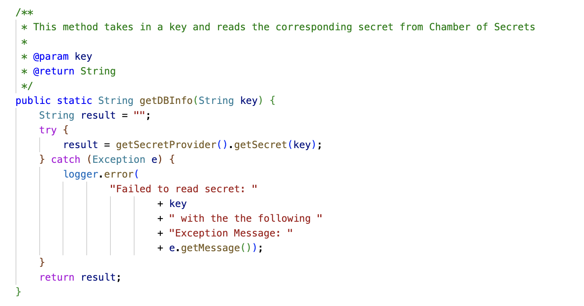
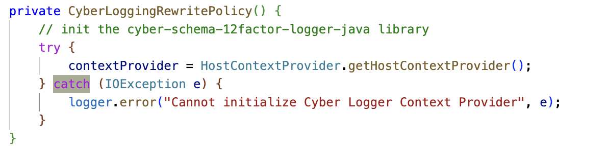
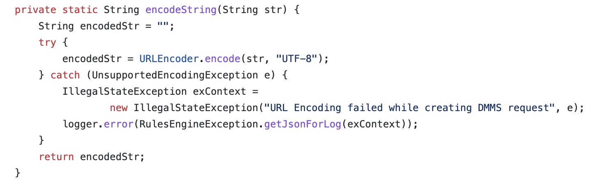

#  Time Bombs

A time bomb is an error in the code that does not show up immediately, but sits in wait, and will show up at some point in the future.  When it does, the information about the original problem is lost, and a helpful error message can not be produced.  Time bombs prevent the proper reporting of the real cause of a problem.

## TL;DR

When a critical problem occurs, it is critical that (1) it is reported to the user, and (2) further processing is stopped.  The most common cause of time bombs is when an exception is caught, maybe reported to the log, and then processing is allowed to continue.  This is the primary problem.

However, the exception caused code to be skipped, and when that code was supposed to set something up, those remaining object that have not been set up will eventually cause a problem.  This is the secondary problem.  The secondary problem was caused by the primary problem, but the information about the primary problem has been lost.

It is critical that if an exception is caught, that all processing is stopped down to the root level.  Processing should not continue on a collection of objects that were possibly half formed, or for which you can not be sure that the functions called were completed.

## Example

This is a real example I found that be illustrates the problem.  the method is named “getDBInfo” and so one concludes that this is to get information from the database, in this case a password from the secret provider.  Something might go wrong reading from the DB, and an exception will be thrown explaining why the DB can not be read.  The code you see here catches the exception, logs to the log, and then continues by returning an empty string.

The empty string is not the value from the DB, but the calling code does not know any difference.  Later that value, a password, will be used, and the authentication will fail.  It will report something like 'incorrect password' and the application will then fail at that point.

Returning the empty string is an example of a time bomb.  The method was supposed to return the password value, but in fact returned an empty string, which will later cause the application to fail.  There will of course be an entry in the log file, but how is one suppose to know that from all the entries that appear in a log file, that this DB failure was the failure that caused the problem?

If the user is to fix the problem, the problem that needs to be fixed is the access to the DB.  That will be hard to know because that failure is not associated with the final inability to log in.

This method should have thrown an exception and stopped the execution of the thread.  The method failed to accomplish it's task, and so should not return a value.  Whatever line called this method, is expecting to be holding the proper value after the call, but in this case it might not be.  By returning an empty string, the code continued on the assumption that the value is valid, and the time bomb went off later, and reported the wrong problem.

## Example 2

Here is an example of a constructor that initialized a data member.  That member is null before the constructor is called.  This code catches the exception, logs it, but then continues as if nothing happened.  But the data member is still null.  The object has not been properly initialized.

Later, then object is called, there will be a null pointer exception.  The real cause of that exception is the exception here, but at that time it can not report it.  Sure, there is a log trace in the log, but how is one to know that from all the traces in the log, this is the one that caused the null pointer exception?

It makes no sense to catch this exception and then continue as if nothing happened.  Since the object is not properly initialized, it must re-throw the exception.  Failing to do so allows the program to continue with a time bomb.

## Example 3

Another real example I ran into: here is a method which has the duty to convert a string into a properly encoded string.  The encoder is declared to throw an `Unsupported Encoding Exception` which will never happen because `UTF-8` is always supported.  But note that if an exception does occur, the method will return an empty string!  This is a time bomb because this data was being prepped for sending to another service, and instead of the data you will be sending an empty string.  The calling code is not made aware of the fact that the data was not encoded, and so it has no choice but to continue.

We know that the exception will never happen, but if it did, the right response is to thrown an exception and stop all execution involving this data.  The wrong response is to return an empty string, and pretend like nothing happened.

## Summary

A method is called to do a job.  It should either do that job, or it should throw an exception explaining why it can not do the job.  If you follow this rule, then all the failures of the system will have accurate descriptions of why they failed.  With an accurate description of the failure, the user has a chance to fix the problem and get it running.

Reporting the failure to the log, and then continuing is a bad idea, because it often leaves a time bomb ready to blow up later.  That later exception will not have the real reason for the problem, and will waste user and programmer time.

Letting the program continue to run with corrupted internals is a time bomb waiting to blow.   If a method returns a value, it should be precisely the value that it is supposed to return.  If it can not return the right value, it should not return anything at all.  Returning the wrong value is just a time bomb waiting to go off, and waste time.

## References

*   [Return Null or Exception?](https://agiletribe.purplehillsbooks.com/2019/05/11/return-null-or-exception/) – discussion of when a null should be the result, and when you should instead throw an exception.
*   [Simple Rule for Exception](https://agiletribe.purplehillsbooks.com/2019/01/11/simple-rule-for-exception/) – A method should return the value it is expected to return, or it should throw an exception
*   [Poor Exception Handling Examples](https://agiletribe.purplehillsbooks.com/2019/01/10/poor-exception-handling-examples/)
*   [Exception Receiving](https://agiletribe.purplehillsbooks.com/2019/01/08/exception-receiving/) – how web services might best use exceptions
*   [Pragmatic Exception Handling](https://agiletribe.purplehillsbooks.com/2018/05/01/pragmatic-exception-handling/) – the theory of exception handling
*   [Two Kinds of Exceptions](https://agiletribe.purplehillsbooks.com/2016/03/14/two-kinds-of-exceptions/)
*   [JSON REST API – Exception Handling](https://agiletribe.purplehillsbooks.com/2015/09/16/json-rest-api-exception-handling/) – how a REST API might use exceptions
*   [Exceptions Speak about the Context they are Thrown From](https://agiletribe.purplehillsbooks.com/2013/02/21/exceptions-speak-about-the-context-they-are-thrown-from/)
*   [Never Convert Exception to String before Display Time](https://agiletribe.purplehillsbooks.com/2011/12/20/never-convert-exception-to-string-before-display-time/)