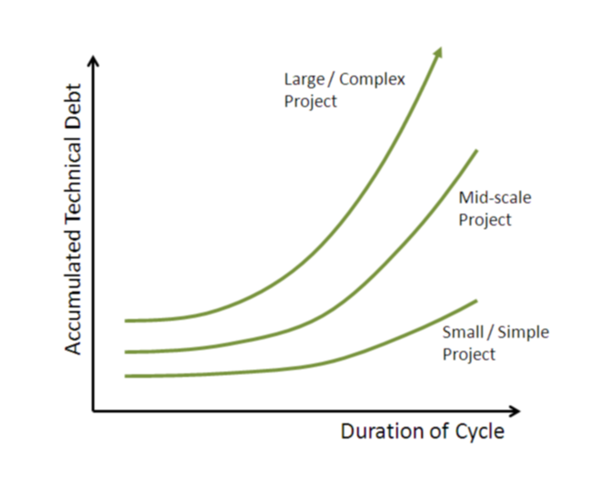
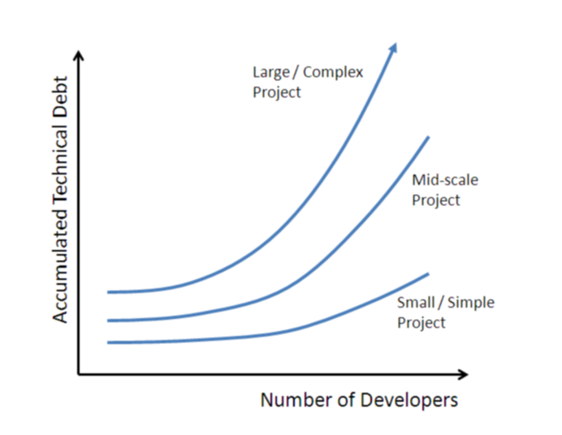

#  Complex Projects need Agile MORE than Smaller Projects

I met another Japanese executive last week who said “An Agile approach may be fine for other projects, but our software is big and complex, and because of that we have to use Waterfall approach.”  This is the exact opposite from the truth:  the larger and more complex the code, the _greater_ the need for an agile, iterative approach.

I always need to remind myself, that the entire software division in Japan has been developing software for 30 years with all the same people, and in all that time they have never seen a successful Agile project.  Without anyone in the division having been successful with an iterative approach, it is not surprising that they fear and distrust anything but the orthodox methodology. It is not their fault that they can not see.  I grew up (career-wise) in California, using a type of Agile method like most successful software companies in Silicon Valley.  I have seen it work hundreds of time.  However, if you have never seen it work, it must be hard to believe.  So I always have to tell myself to be very very patient.

## Understand the Cost of Software

The “cost” aspct of a development project is called “technical debt”.  This is not the number of lines produced, but rather the number of unfinished lines multiplied by the likelihood that these lines will effect other unfinished lines.  Unfinished lines includes lines that do not exist, but must be written before the task can be complete.  

Technical debt explains why a small, simple program can be worked on by a single programmer, and there are very few problems.  But, when the number of programmers increases, the cost greatly increases, and so does the schedule uncertainty.   If you have a team of people working, while they work individually, there is a chance what what one person does will conflict with what another person does.  These conflicts produce the expensive problems.  Debugging the problems introduced by new code across a large project can be a majority of the development time.  Large software project are often late, and this is why.

## In Complex Projects, Technical Debt Grows Faster

The more technical debt you carry, the harder it is to get anything done. Large projects have lots of people working on it, and the technical debt grows **exponentially** with the number of people working.  Technical debt also grows **exponentially** as the longer they work before merging changes.  Finally, tecnical debt is proportional to the size and complexity of the code base you are working on.  

In a large complex project you have everything against you: technical debt should be your number one concern.  You are starting with something large and complex, but when you throw a lot of people at it, and let them work for long periods of time before merging, you end up tremendous, unmanageable amounts of technical debt.

## Waterfall Approach Ignores Technical Debt

The problem with waterfall approach is that you start designing and making changes at the beginning of a long project, and it can be many months before the final code is integrated.  Over the entire course of the project, technical debt piles up at a tremendous rate, and to truly immense levels.  

Waterfall approach works OK for very small project, where there are only a couple people, and where the amount of change is small.  It works for projects that run a number of weeks.  You can continue to use waterfall for bigger and bigger projects, but it gets less and less appropriate.  This is the exact opposite of thinking it gets more appropriate for larger projects.

## Large Complex Projects benefit the Most from an Agile Approach

I am amazed at exactly how wrongheaded it is to think that since you have a large complex project, you are going to develop in a way that magnifies the technical debt, and therefor magnifies the cost and the risk. 

Because large projects cause technical debt to grow quickly, it should be obvious that you need to control this from the start, but doing work a small bite at a time.

## How can you do Large Changes with Agile?

One question I got was, if you are making architectural level changes, how can that be done in little steps.  
This question is mostly a “red herring.”  That is, you very rarely make major architectural changes to any software code base, so you shouldn't use this to drive your method.  But lets consider some examples:

*   Changing a program from C++ to Ruby language.  This is a change that effects every line of the code base.  Would you do this in a waterfall way?  No, this is essentially a re-write, and just like any software project, you set up iterations.  You get the core pieces to work, you get some of the functionality working, and at each step you do a complete build and run all the tests.  To think that a team is going to go and re-write the entire program and then in a single release it will all work, is just foolishness.
*   Changing from Relational DB to NoSQL alternative.  This is a pretty big change for any program, and definitely qualified as an architectural change.  But it still can best be done incrementally.  You start by isolating the operational code from the code responsible for storage, while it is on the relational DB. This can be done by any number of small short iterations, depending upon the size of the code.  Then, provide a NoSQL storage alternative, but don't change everything at once.  People working on the operational part continue to use the old storage system, while people working on the storage system use the new one.  Eventually, the new storage system passes all the tests, with all the latest changes from the oprational part.  The old storage is removed.  Everything is done incrementally.
*   Changing the UI framework.  I have experience with this: we wanted to completely rewrite the UI of a particular project, and leverage the Spring framework.  Exactly like above, we isolated the model part of the program, implemented parts of the new UI incrementally, without removing the old UI.  The new UI was very limited in functionality at first, but gradually it took on more and more of the functionality.  Finally, it did everything, and there was not need to go to the old UI.

What I am trying to persuade you, is that once you know how to do an Agile approach, you will see it is suitable for all job, particularly for large architectural changes.  
There is no evidence that waterfall is a good way to make large changes.  Certainly the experience within this team is that “adding support for Mozilla” has proven to be such a big job under waterfall that for three years in a row it has consistently been delayed.  Because the waterfall approach has to do everything in a single big bang, all costs have to be accounted in a single release.  With a large step, there is a lot of uncertainty, and so estimates tend to be high.  The waterfall approach typically fails on large projects, and it is a mystery to me why people still seem to think it is the way to do large projects.

## Preaching to the Choir

If you have gotten all the way down to this point in the post, then _thank you_ for reading.  Most people who make it this far already know that Agile is a surprior approach, and I don't need to work to convince you.  If, however, you are one who still believes that waterfall approach works better for some situation, then PLEASE make a comment on this blog post, and share what you think works better with waterfall, and why.  We don't bite, I promise!