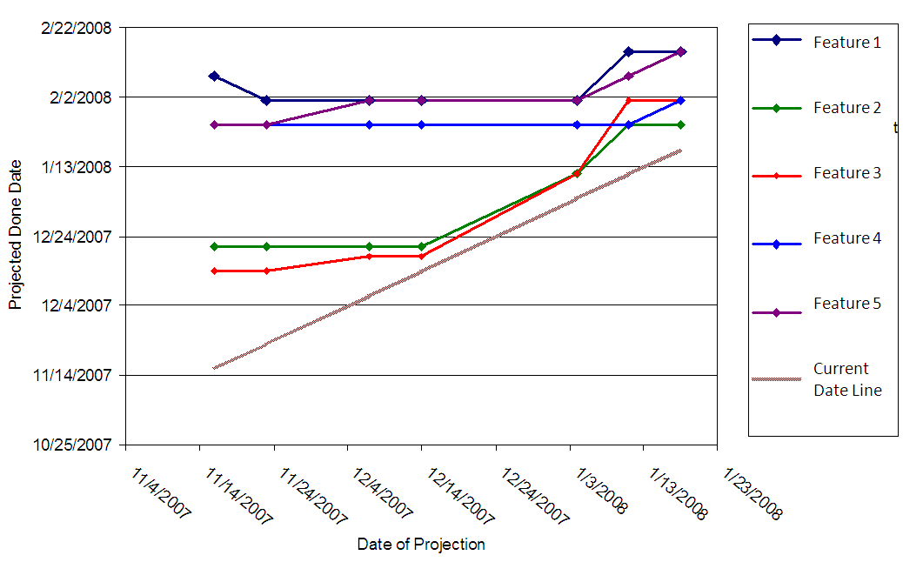

#  Classic Date Drift Case Study

A waterfall project is required to predict dates that certain things will happen in the future.  There are usually many pieces of the project, each with their own date, and each dependent upon others.  No one can change a date without effecting others, and so a game of “chicken” ensues where people report dates they plan to complete and never hint there is a problem.  At the last possible minute they declare a change in date, and when you look at the history, you can easily conclude that they should have known ahead of time that the deadline was to be missed.  But everyone waits for someone else to change first.

Below is a sample of real data from a project which started well before Nov 2007, and extended well past February 2008.  The feature complete projection dates for that time period are plotted.  At every weekly status report, each of 5 features were required to report the date that they expected to be completely finished.  The graph shows how these dates changed over time. 

The graph is time against time, that is the expected completion date is plotted against the date that that completion date was reported.  The horizontal axis is the date of the status report.  The vertical axis is the date of the projected completion date for a particular feature. 

For example, the first status report was distributed on about Nov 15th.  At that time Feature 3 was expected about Dec 15th, and feature 2 was expected around Dec 20th.  You see in the next status report, probably Nov 22, that these two features are still expected to ship on the same dates.  

There is a gray diagonal line, and that is the “current date line”.  Dates above that line are in the future of the current date, while dates below that line are in the past of the current date.  It would be silly to propose a completion date in the past if the feature is not completed.  The only way a feature line can cross the today line is when it is completed.  

  

We should not be surprised that completion dates are delayed — that happens all the time with waterfall projects.  What is worth noting is how the dates are communicated, and when it is that people recognize the problem.  

Consider feature 2.  The programmer in charge had estimated a completion date of around Dec 20 and held steady on that date.  IF there was a problem with the development of the feature, you would expect that the development team would have noticed something.  In fact they hold onto the Dec 20 completion date right up to the last few days — less than a week to completion.  You would expect that when you get a few days from the target release date, that the development team would have a pretty good idea that they are not going to make it, but this was not communicated.  The first indication of a slip comes in early January when the original deadline is missed.  On Jan 3, a new target date is announced, but still only a few days in the future.  The dev team still thinks they are almost ready to release.  But history shows that to be a misunderstanding, because again, having missed that date, they announce another date, a little more than a week in the future.  So the pattern is: commit to a date early, stay on that date until the date comes, and then slip week-for-week as long as necessary.  

Consider feature 4.  Here you have a development manager who put a stake in the ground a long way off, around the end of January.  As December goes, January comes, and other features are starting to slip, there is no indication that anything is wrong with this feature. Right up to two weeks from the due date, then the team wakes up, knowing they are in bad shape, and starts slipping the dates.  

The _shocking revelation_ is that even though features 2 & 3 reported substantial delays in the first week of January, there was NO effect on features 4 & 5.  Clearly, a delay of one feature, is going to cause additional resources to be consumed, and delay any dependencies.  Theoretically features can be independent, but in practice, given that this is one team, features are never completely independent.  When one feature schedule slips, the others should not naively keep on sailing as if everything is OK.  

I compiled these dates from status report obviously right in the middle of February when this pattern was becoming apparent.  I don't have the rest of the dates indicating how this was all ultimately resolved — that is a research project for someone else.  The pattern of slip by a week every week is a very disturbing pattern to be in.  Needless to say, this project overall was very late in shipping, and there was a lot of finger pointing at other features “causing” the problem.

## Considerations

Those who hold true to the waterfall model will say that obviously the development managers are incompetent, would fire all of them.  The developers involved were fairly senior and fairly disciplined in their work.  The real message is:

*   Release dates for a software are simply not predictable.  The dates that are chosen are usually dates that are arrived at by political means: as late a possible to give the team the most risk coverage, without being so far out as to be politically untenable.  In other words, the dates are picked out of a hat.
*   Once chosen, there is a lot of pressure to keep the same date.  It is the management feeling to “just pick a date and make it.”  To some extent if you have ability to manage the amount of feature details, one can manage to the date, but in waterfall there is also no flexiblity on the amount of a feature to implement.
*   There is no ability to maintain a realistic date.  Since there was no solid evidence for the date in the first place, there is even less evidence for changing the date.
*   Features can impact features, and since accurate dates are not communicated, there can be a domino effect, which all happens at the last possible moment in the development cycle.

Asking developers to pick and commit to long terms dates, on complex interrelated features, is simply asking for trouble.  Such dates are bogus if given, and yet at the same time necessary to run a complex project.

The real solution is to eliminate the estimating of dates in the first place.  Instead, break features into bite sized chunks that can each be implemented quickly, prioritize the chunks in order to assure that the most important get worked on first, keep the software at release quality at all times, make fast, regular releases.  When the date comes to ship, ship as much as you have implemented.  Never compromise on quality, but instead be flexible about how much of a feature gets into the product. 

If you prioritize the chunks correctly, you will assure that the development resource will be working on the most important things first.  Second, since you don't need to commit to a date, no time is wasted trying to estimate how long it will take.  Third, each part implemented is immediately useful to other parts of the project, so if there are complex interactions, they are able to make use of those part when available, and will not become dependent upon them if they are not implemented yet.  You eliminate the waste of estimation, and you eliminate the waste of building up technical debt.  Ultimately, you are able to ship at a predictable time, and if the features were not all you wanted, you at least know that the development team was focused on the right things, and did more than they could have done any other way.

:::tip[Key Takeaway]

Asking for firm commitment dates on parts of a complex project, and holding developers to those dates, is simply asking for trouble.

:::