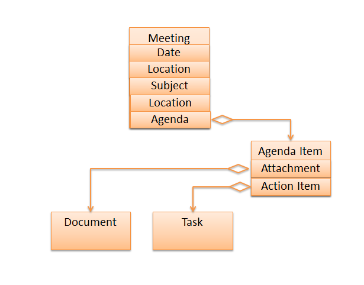

#  Create-On-Update Pattern for AngularJS Applications

This is a suggestion for how to design the JSON/REST protocol between the Angular application and the server, to handle creation of items easily and conveniently.  Use a special ID value to indicate that the object does not exist on the server, and update like normal.  The server detects this and creates it on demand.

## Setting

You have an angular application that deals with an object that contains collections of other objects.  You have retrieved those from the server using a JSON call.  Angular gives you powerful capabilities to iterate JS array objects, and to make repeating structures on the page.  

The example is a “Meeting” object, which has a collection of “Agenda Item” objects within it. The Agenda Items in turn have collections of Attachment objects and Action Item objects.  The structure might be visualized like this:  

[  

I am assuming that each of the agenda items in the list has some form of “id” which is used to identify which object back on the server gets updated with any changes you might have.  The AngularJS code can edit the values in the JS array as much as desired, and whenever appropriately send an update request back to the server.  

Because this page is being viewed and updated by many people at the same time, you want to update back to the server only the parts that you changed, and not the entire meeting.  The structure comes in, the id values of the sub objects are matched up, and the server returns the latest copy of the entire meeting.

## Creating Parts

When you want to create an object within the meeting you have a couple of choices.  The pattern that I found that works best is to create the object on the client, and put it into the collection.  Thus a new Agenda Item is placed directly into the meeting structure in the browser.  

This is quite convenient because all the nice AngularJS constructs for dealing with collections continue to work while you are setting the initial values.  The user wants to set up a few values on the new Agenda Item (like entering the subject and description) before sharing it with everyone else. That user wants to see it in the list of existing items, and wants to use the same UI that is used for committed items.  

So what I do is create the new object, and set the id to the special value “**~new~**“.  This special value is not confused with a real id value.  I can’t invent the id value on the client, because it might clash on the server with an id value someone else used, so you have to let the server assign the id value.  But this special value then is a signal to the server to create a new object with a new id value.  The client will find out the new id value when the entire meeting structure is returned as the result of the update call.  

Eventually, the user hits the “save” button, and the update is sent to the server, and a new copy of the entire meeting (including the old and the new agenda items) is returned.  If, however, the user want to “Cancel” and not save this new item, you can simply re-fetch the existing full meeting record from the server without doing an update.  Since you get the entire meeting back, the new object disappears.

## Conclusions

There are a couple of nice things about this

*   The new object is in the list with the old objects, so iteration includes the new object
*   The same UI that edits the old objects can edit the new object, because that object is not in any special place.
*   No special create operation is needed to tell the server.  The same update operation is used for updating existing objects, as creating new ones.  The id value simply makes it clear.

I have found this pattern to simplify the coding of user interfaces for objects that contain collections of other objects.  
 

This entry was posted in [Coding](https://agiletribe.purplehillsbooks.com/category/coding/), [Design](https://agiletribe.purplehillsbooks.com/category/design/) and tagged [AngularJS](https://agiletribe.purplehillsbooks.com/tag/angularjs/), [API](https://agiletribe.purplehillsbooks.com/tag/api/), [JSON](https://agiletribe.purplehillsbooks.com/tag/json/), [REST](https://agiletribe.purplehillsbooks.com/tag/rest/). Bookmark the [permalink](https://agiletribe.purplehillsbooks.com/2015/06/11/create-on-update-pattern-for-angularjs-applications/ "Permalink to Create-On-Update Pattern for AngularJS Applications").