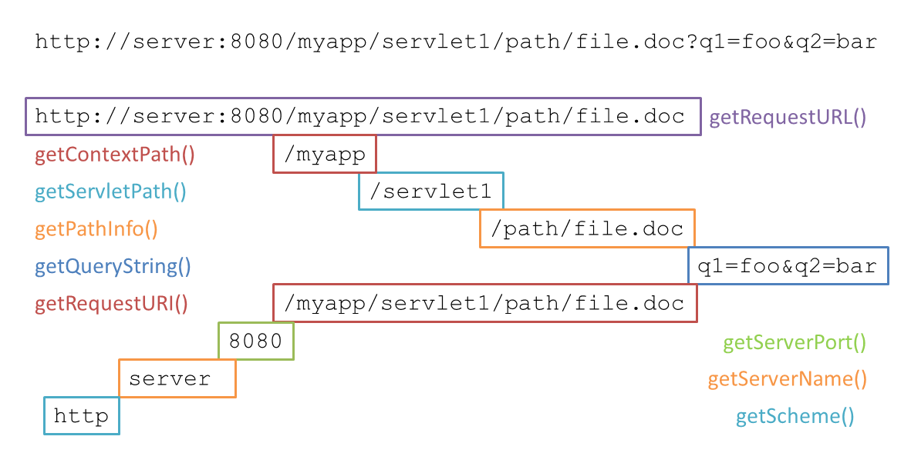

#  HttpServletRequest Path Decoding

The documentation on HttpServletRequest is very poor, and this fills in a critical set of facts that you need to know to write a TomCat application.  
The HttpServletRequest object will return the path to the current request with the following methods:

*   `getContextPath()`
*   `getPathInfo()`
*   `getPathTranslated()`
*   `getQueryString()`
*   `getRequestURI()`
*   `getRequestURL()`
*   `getServletPath()`

Imagine you have a tomcat server installed at **http://server:8080/**  
Imagine you install an application in this server at “**myapp**”  
That application has a servlet mounted at “**servlet1**”  
The user then makes a request:

```
http://server:port/myapp/servlet1/path/file.doc?q1=foo&q2=bar
```


Here is the map of how the various functions decode this:  

  

I won’t repeat what the documentation says — things like “use getContextPath to get the context path” without any explanation of what “context” we are talking about or how much of that context is included.  A simple map like this helps show all the relationships.  
 

This entry was posted in [Coding](https://agiletribe.purplehillsbooks.com/category/coding/) and tagged [Java](https://agiletribe.purplehillsbooks.com/tag/java/). Bookmark the [permalink](https://agiletribe.purplehillsbooks.com/2016/02/23/httpservletrequest-path-decoding/ "Permalink to HttpServletRequest Path Decoding").