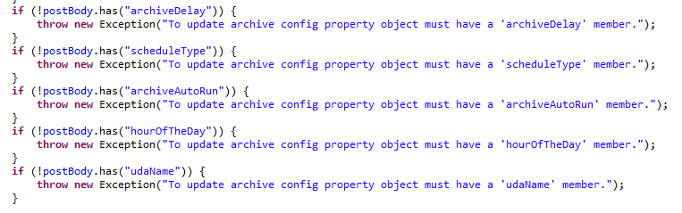

#  Safe API Upgrade

First consideration for any Application Programming Interface (API) is how it will evolve in the future.  This critical interface must stand the test of time, and should whenever possible be both upgrade and downgrade compatible. 

## First, A Specific Example

Today I ran into a problem with an old test failing on a new version of the product. This API method updates some settings in the product related to how an archive is performed.  There was code in the API for verifying that the request is proper, which looked like this:  

  

In the last release there were three parameters to post in: archiveDelay, scheduleType, and archiveAutoRun.   The new release adds some more functionality and there are two new parameters to control that:  hourOfTheDay and udaName. 
 
On the surface, this implementation seems quite good because if the caller forgets a particular parameter, then a very clear error is sent back.  The problem is that a client written to call the old version of the API sending in the three values, will now fail with the new version.   This makes upgrade a critical problem: you have to change both the client and the server at the same time.  When you have a large network of clients and servers (e.g. maybe a dozen) it is impossible to require completely API consistency on both sides of the API.  
The Rule then is:

:::tip[Key Takeaway]

When an API is extended, it must be done in a way that does not break previous clients that call it.

:::

## Proper Use of Default Values

This case can easily be solved by substituting default values for the parameters that are missing.  In this case, if the caller does not specify the time of the day to run the archive, then any hour will do, so pick 3am US Eastern time will be sufficient.  In fact it is a good idea to design the API with default values for all the values and that allows the client to only set the specific values they are interested in .  If the client prefers a different time, it can be sent in, but if not specified they get whatever they get.  

There are some cases where defaults can not be used.   For example, an API setup a new user, there are some values like user id and password that really simply can not be defaulted.  As it turns out, those critical values are not likely to change from version to version of the API.  It would be quite unusual for a critical parameter to be added to an API in a new version.  

Downgrade compatibility is a matter of ignoring extra values that are submitted by the client.  Thus an older server can communicate with a newer client.  I don't want to say this is a trivial answer to a complicated problem;  it is harder to guarantee that any given value can be ignored, and still make sense.  Still, you can consider when adding parameters to a call whether the old clients could still call it.  

Besides adding parameters, another change is changing the values that a parameter can take.  For example a parameter used to take 3 values, and now it can take 6 values.  For upgrade compatible (old client – new server) this is not a problem, however downgrade (new client-old server) you need to handle unexpected values appropriately.  Often a new client can be designed to stick to old parameters and old values when making requests in order to remain viable with old servers.

## Patch Semantics

Another approach is to implement in a form that only the parameters that you pass are updated in the underlying file, but any other values remain unchanged.  The new values are merged into the old values.   This allows a client to only send in the values that it wants to change.   Of course, if two parameters need to be coordinated, then perhaps some extra conditions might be in play.  
This approach is also friendly for version upgrade.  A client will only update the parameters it knows about, and if new parameters are added, there is no problem.  Like the default method above, it is friendly for downgrade compatibility as long as extra parameters are ignored.

## Versioned Calls

If there really is no way to make the parameters optional, then the fallback is to simply create a new API method with the new meanings, and leave the old method unmodified.  
If you want to go overboard with the client, you can make an elaborate versioning mechanism that detects which version, and possibly changes behavior appropriately.  This is necessary on the most common, widely adopted public APIs and protocols, however in most applications this is overkill.  Small, incremental changes to the API can be made by just allowing the flexibility above.

## Conclusion

The example given here is a REST API with a JSON object posted in, and the response is a JSON objects as well, but the logic behind how to upgrade an API should be the same for any language.  The only thing to avoid is strict, exact coherence between client and server.  It is worth noting that some automated generation of remote APIs does not allow for this.  Instead, they seem to have the build in assumption that all servers and all clients will be at exactly the same version of the protocol.  Check up-grade and down-grade compatibility carefully.  
In a network, it simply is impossible to upgrade all the parts at the same moment.  In general, things should be coded so that _each server can be upgraded separately_, and all the existing clients run without modification. The different approaches outlined above help achieve this goal.  
 

This entry was posted in [Coding](https://agiletribe.purplehillsbooks.com/category/coding/), [Design](https://agiletribe.purplehillsbooks.com/category/design/), [practice](https://agiletribe.purplehillsbooks.com/category/practice/) and tagged [API](https://agiletribe.purplehillsbooks.com/tag/api/), [client](https://agiletribe.purplehillsbooks.com/tag/client/), [network](https://agiletribe.purplehillsbooks.com/tag/network/), [server](https://agiletribe.purplehillsbooks.com/tag/server/), [versioning](https://agiletribe.purplehillsbooks.com/tag/versioning/). Bookmark the [permalink](https://agiletribe.purplehillsbooks.com/2020/02/27/safe-api-upgrade/ "Permalink to Safe API Upgrade").