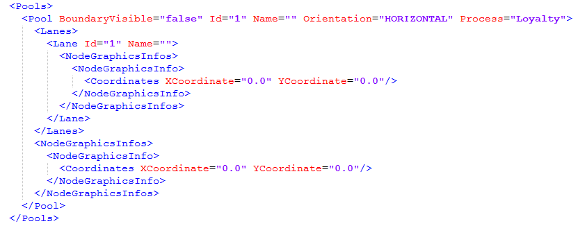
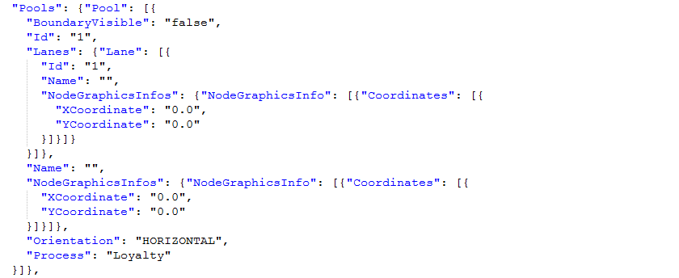

#  XML vs. JSON vs. YML

Here is a side by side comparison of the same data presented in three common formats.  How do they compare?  What are they good for?
Keep in mind, of the three examples below are holding the exact same data, only the format (syntax) is changed.

## XML

XML is the oldest format, invented in 1995.  XML can be parsed into a tree without knowing the meaning of the individual tags.  This was an improvement over SGML needed additional schema input to say how to parse the different elements.  Here is a sample of a set of data presented in XML:

This data was originally designed as XML because you can see that there is a “Pools” tag, and then inside that a set of “Pool” tags.  XML is weak on the concept of arrays.  You represent a set of values, you need a tag for each value, and then a tag containing them.  You will see that both JSON and YML don’t needs these, but this example has them because the data originally was designed to be expressed in XML

## JSON

JSON uses braces and start and end the value, so the tag name does not need to be repeated at the end.  JSON has support for arrays, and it is pretty succinct:

There is certainly a lot of space saving, and it is quite easy to read.  JSON is also simple to parse, so it is fast and effective for a wire protocol.  The indenting is optional in JSON, and when sent over the wire, the indenting is often eliminated, making the file smaller still.

## YML

YML is put forward as a format for human to use.  It require far less syntactic consistency.  Specifically, there are no braces, no need to match end braces with start braces.  Things are grouped simply by indenting related things the same level.   Indent more means nested inside.  No quotes and no need to match opening quotes with end quotes.

Indenting is not optional, instead it is absolutely necessary for determining what is grouped with what.  Arrays are denoted with a simple hyphen for each element of the array.

## Discussion

There are different places where the different formats are better

*   JSON is fast to parse and represents everything exactly in a single universal style.  This is the best format for client/server and server/server communications that is ephemeral.
*   JSON can be sent without indent which saves a lot of space.
*   JSON is a bit tedious because you need a comma between each element of a list or map, and forgetting one causes the entire file to be unparseable.
*   JSON requires that quotes be used both in keys and values, and special characters need to be escaped with a backslash.
*   YML does not have the syntax overhead and is far more forgiving.  Just about anything you type is a valid YML file, which means it almost never fails to be parsed.  That can be a problem as well since mistakes are less likely to be caught.
*   YML is harder to parse.  For example neither numbers nor strings have quotes, and the parse has to identify things that look like numbers.
*   XML is heavy and bloated.  Representing unusual characters uses something XML calls ‘entities’ which also have a significant overhead.
*   XML does not have good support for arrays, specifically no way to denote an empty array, instead you just omit all the data.
*   JSON accurately preserves string values exactly, every space, ever tab, everything.  YML and XML both treat white space as flexible and approximate, assuming implicitly that a bunch of spaces is equal to one space.  YML has an extra feature to quote strings and gain exact representation, but that means that YML has two ways to do the same thing.  XML has no way to represent white space reliably.
*   YML allows comments to be included, which is useful for human use.  XML has comments which are klunky.  JSON has no way to do comments.
*   XML has a strong namespace feature to allow identically named tags from different sources to be handled without confusion, however this creates a tremendous overhead that is almost never needed.
*   XML has both attribute and tag content values, and it is ambiguous as to which to use in each case.  This arbitrary choice means different people will do the same thing differently, causing additional work.
*   XML came from SGML which was designed as ‘markup’ for text, the way that HTML allows lots of text with tags sprinkled in.  XML really never was a data format, while both JSON and YML are designed as data format and can never be used as markup.

## Conclusion

For all data on the wire, use JSON.  It is fast and accurate and nearly universal.

For all configuration files which need to be edited by humans, and also parsed by software, use YML.  It is easier for people, and generally the performance of JSON is not needed for files the size like configuration files.

XML should for the most part be avoided for data. (Obviously for text markup, like XHTML, a dialect of XML, it is quite necessary.)  There is one place were XML may have an advantage for data, and this is in long term archive of data.   If data is at rest for 10 to 15 years, XML namespace features may allow it to be a longer lasting format able to survive schema changes over time, and still be readable.

This entry was posted in [Coding](https://agiletribe.purplehillsbooks.com/category/coding/), [Design](https://agiletribe.purplehillsbooks.com/category/design/) and tagged [data format](https://agiletribe.purplehillsbooks.com/tag/data-format/), [Data Interchange](https://agiletribe.purplehillsbooks.com/tag/data-interchange/), [JSON](https://agiletribe.purplehillsbooks.com/tag/json/), [XML](https://agiletribe.purplehillsbooks.com/tag/xml/), [yml](https://agiletribe.purplehillsbooks.com/tag/yml/). Bookmark the [permalink](https://agiletribe.purplehillsbooks.com/2021/04/08/xml-vs-json-vs-yml/ "Permalink to XML vs. JSON vs. YML").