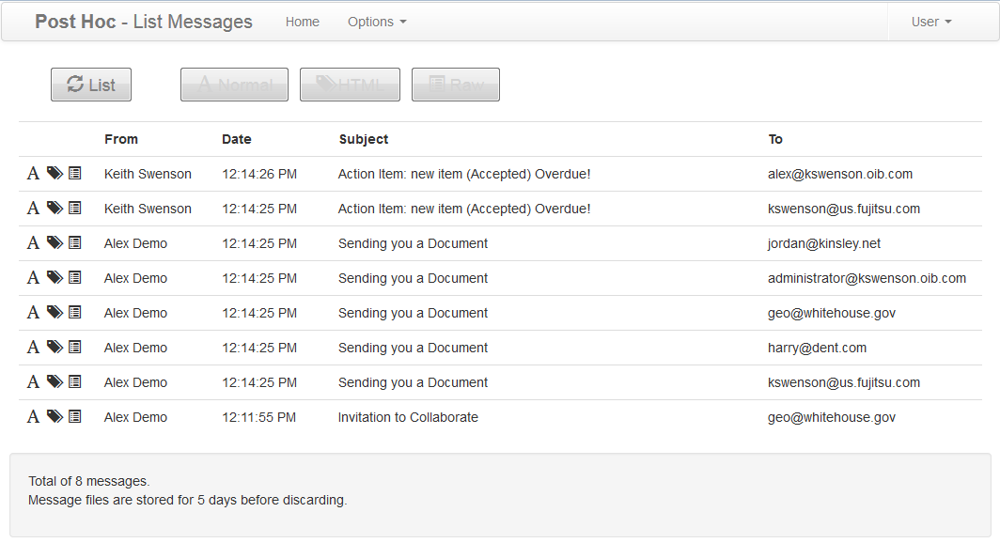

#  PostHoc: Testing Apps that Send Email

I have developed a utility program that is extremely useful for testing and demonstrating applications that send email.  It is called **Post Hoc**.   As far as your application is concerned, it is an SMTP server, but it comes with a built in user interface to let you see and inspect the email that was sent.  Without any fuss.

## Motivation

Developing an application that send email is challenging because when testing the application you need a set of test users with email addresses that are realistic. But, you don’t _ever_ want to actually deliver the email to the address.  You want the application to send it, but you don’t want the person with that email address to receive it, because this is test information.  It is clear that accidentally sending test information to real people can be a problem because they see the email like any other, and might assume it is a real email message and act on it.  At best it is a nuisance because during testing you are going to need to send a lot of the same email messages.  

**Fake Addresses**: One solution is to carefully use only fake addresses, like “johndoe@example.com” which is a well known domain that nobody uses.  Sometimes, however the test data set is taken from production, and may contain some real email addresses in it.  Also, when testing with live users, some might accidentally enter a real email address.  This is hard to manage.  

**Overriding the Address**: Another approach is to put a feature in the application to ignore the address, and always test to a test address. This adds an extra complication to the program, and it also means that it is not running the same way it will be in production where you will turn off this override.  There will always be that nagging concern that it might work in testing, but then finally fail in production.  It is better to have the application run _exactly_ as it would in production.  

**Capturing the Email in SMTP server**: It is better to set up your own SMTP server, and isolate that from the real world, so that no matter what email address is sent to, it is never delivered.  Fine.  Servers can take up a lot of space and resources.  Configuring a real SMTP server often requires effort.  Sometimes you have to set up a database and other dependent technologies.  Some server complain if you don’t configure them to forward to a real server — because in production use that would be a notable problem.  Usually, all of the users have to be set up in advance, and each use needs a password, etc.  A real SMTP server is optimized for scale, and often they are continually running things in the background.  It is a lot of overhead if all you want to do is see if your application is sending appropriately structured email. 

**Viewing the Email**: Most SMTP servers offer no way to view the email, so you then have to set up some sort of mail client, either locally or a web-mail client on the server.   The mail client will access the server using a username and password.  Those need to be set up in advance for each user you are testing with.  If your application is sending to multiple email addresses, you must continually log out and log back in as a different user, to check whether the email was sent to everyone.  This can be tedious.  

**Email Correctness**: most email clients or web-mail servers do not give you an easy way to see what was actually sent.  They are designed to allow the user to see the final presentation, but if the email is poorly formatted (something you might need to do while debugging an application) they often simply fail to show the message.  What you need is something that will show you the guts — exactly what was sent  — so you can easily find the source of any problem in formatting the email.  

**Cleaning up**: Testing email is usually needed only for a moment. There is no need or desire to store the email messages for a long time.  SMTP servers and email clients are designed to do keep mail for long periods.  Deleting all the old email requires that you log in as each user, and delete each inbox manually.  Again, a lot of bother when the email messages are just testing artifacts that can be readily discarded.

## Requirements

So this is what I need to test multi-user email-enabled applications:

*   **Looks like SMTP:**  the application sends email exactly as it would to an SMTP server with exactly the same kind of settings.  The application _does not know it is different_.
*   **Captures All Email**: the server must never allow an email message to escape out into the real email system.  It must be fool proof: impossible to accidentally configure it to actually forward email.
*   **No database**: No need for separate DB server, and not need to configure all the complicated aspects of a real scalable server.  While testing, I will probably have dozens to hundreds of email messages.  These can be stored in a simple file system as files.  There is no need to scale to thousands or millions of messages, because my testing will never go there.
*   **No mailbox setup**:  Any email message to any mailbox will be accepted without having to tell the server ahead of time to allow email for that email address.
*   **No restriction on addresses**: Allow testing of email to any email address without regard to domain or anything.
*   **No user setup**: No need to set up passwords for the different recipients of the email.  Just save every message that is sent.
*   **No need to log in**:  It is all just test data, so just display without the need for any password entry.
*   **No change user**: just display all the messages to all the users in a single list.  Having to logout/login to change the user is unnecessary overhead.
*   **Render HTML**: most email is rich text so display the individual email message  HTML as it would be formatted in an email client.
*   **Show HTML source**: show the source HTML for messages so it is easy to see what the cause of formatting problems is.
*   **Show RAW message**: show the SMTP message as raw text without interpreting any of the MIME boundaries.  Some email libraries do unpredictable things when constructing the actual SMTP message, and there needs to be a mode to show the lowest level format when it is not working right.
*   **Automatic Cleanup**: discard messages after 5 days because either you saw it the first day or so, or you don’t care to see it.  Keeping these test messages for more than 5 days is a waste.
*   **Manually Clean all Users**: For a demo, you want to be able to start with an empty inbox to avoid distracting prior messages.  A button to clear the inbox for all users will do.
*   **Trivial Install**: as simple as a WAR file that you drop in TomCat and it is instantly ready to go.  The only thing you need to configure is the host name and the port number.
*   **Resilient and Stable**: Avoid having lots of interdependent running things.  Either it is up, or it is not.  If not, it should have a clear error message stating what the problem is.  When starting, it should test every thing, and if anything is not shown to be working, it should fail and report a clear error.

## The Answer: “Post Hoc”

Post Hoc does all this.  The only requirement is a TomCat server (or other servlet engine).  Drop the WAR file in there, and usually that is all you need to be up and running immediately.  You might have to set host name and port number, but that is all.  

The messages are stored in a simple data folder.  No database, no confliguration, no connection problems, no data user to set up or maintain, no conflicts with other databases you application might be using.  Just a simple file system folder.  It automatically cleans up that data folder by deleting an email message when it gets 5 days old.  It does this without any background processing!  Every time the user lists all the existing email, it looks for and deletes any out-of-date messages.  This simplicity assures that the server runs without fail, and cleans up after itself.  

The application can send any number of messages, to any address, and with any format.  There is no need to log in.  Just point your browser at the application, and it shows all the email messages that your application sent, with the most recent at the top.  Click on the message and it is displayed as rich text. Links are active.  Attachments can be accessed and viewed.  

If the message looks wrong for any reason, it is easy to get to the underlying source.  Click a button and display the HTML code for the message.  It is easy to click back and forth to find the cause of a formatting problem.  If the attachments are not working, maybe it is a problem in the MIME encoding.  The RAW display shows the actual bytes exactly as they are sent to the server so that MIME encoding errors can be identified.  The bytes of attachments are shown as well in case that is the problem.  Generally, if there is a problem in the construction of the email message, you can identify it in a few seconds and get back to making a fix.  

Using this saves so much time when working with applications that send email.  I have absolutely no worry that the email might accidentally get delivered.  No matter what email address is entered.  It is a simple list of all email sent.   When the application send to 10 people, it is easy to count the 10 emails received and see they all were correctly sent.  The UI looks a bit like a real web-mail UI:  

  

It looks quite a bit like a regular web-mail client, however notice that along with the date and subject, it is showing both the “from” and the “to” addresses.  You can easily see in the above list that at 12:14:25 it sent the same message to five users, and you can easily inspect any one of the five recipients by clicking on the line:  

  

Above is the formatted display of the message, but just click on the HTML button to see the HTML source of the message:  

 

Or indeed, drill all the way to the RAW MIME formatting for the email message if you are having problems there:  

  

Hopefully, it would be extremely rare that you need to look at this, but it is always there a click away.  

_That is pretty much all there is_.  There is no clutter.  There is no way to forward a message.  No way to compose a message (Post Hoc receives and displays messages only).  No options for saving the message in folders, or preserving them in any way.  (If you need more than five days it is easy to find and save the .msg file some place else — the name of the file is displayed — but I have never needed that capability.)   It does that one thing:  _it looks exactly like an SMTP server, and it displays the messages received._

## Excellent for Demos

Though this was not originally intended for use in demonstrations, we found it was extremely useful for a number of reasons:

*   Runs locally, is there is no need to have an internet connection to show email capability.  This is huge.  At trade shows internet connectivity is sketchy.  At customer site, it is not always possible to get a network connection.  Nothing is worse than having to wait and wait and wait on an network to show an email message.  Post Hoc is fast and responsive making the demo look good.
*   No need to log in and out during the demo.  No matter what email address you use for the demo, the email message appears instantly and can be selected.
*   Looks enough like web-mail that most people don’t notice the different.  Everyone has seen an email client, so they really don’t care or notice this particular one.  For a demo, you generally see the message in the list, click on it, and the message is displayed, and then on the hyperlinks.  That is all you need for the typical demo.
*   No junk hanging around.  If you did some testing just before the demo, no problem.  A single button clears out all the prior email, and you have nothing but the new demo email in there at showtime.
*   UI is a clean Bootstrap-based UI without a lot of clutter.  Nothing to write home about, but not ugly either. It blends into the background, which is perfect for a demo that is highlighting you product.

If you are already using Java, this lightweight server requires almost no overhead.  It can be installed into the smallest of systems, because all it does it

## Best of All: it is Free

Licensed under the Apache license, the source is freely available at: [https://github.com/agilepro/posthoc](https://github.com/agilepro/posthoc).   Built versions are available occasionally so check at the GitHub site for information on where the latest build might be. 

I did an extensive search, and I could not find anything that worked like this to allow me to test applications that send email without a lot of trouble, or without requiring the application to be specially configured.  For years I moaned about the problem, until finally I spent a weekend and wrote this.  This looks exactly like an SMTP server, but it allows one to easily inspect the email that was sent.  Perfect. 

**If this works for you, LET ME KNOW!**   

I would welcome any contributions.  There are a few capabilities which I would like to expand: I would like a simple “reply” capability that would allow the user to do minimal composing of the reply message (just typing text, no need for fancy formatting) and then a POP or IMAP interface to pick up messages targeted at a particular email address from the pool.  Probably not that difficult but I have not had time to put that in.  I would also like to test failures: for example set a particular address that when asked to send to that address, it would fail and return a message in the SMTP standard way.  This would allow testing of bad address scenarios.  Or maybe a “server down” mode that would refuse connections and allow testing of the SMTP server being down to assure that the application handled that correctly.  However, without these expansions, **I think you would find the current capability to be immensely useful just as it is.**