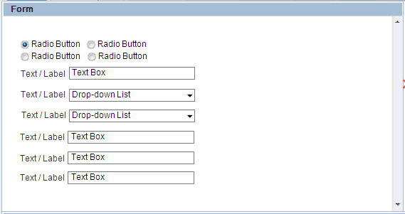

#  Use Realistic User Scenarios

So many times I see programmers create user scenario stories that are entire abstract. If you want to know if the software will work for a real use, you need to consider real scenarios.

## The Abstract Scenario

An abstract scenario uses very artificial values for all the elements of the scenario.  

In the case of a business process product, an abstract scenario will involve a user named “user1” who performed an activity called “Activity1”.  User1 is a member of a group called group1.  The variables in the process engironment are named “variable1” and “variable2” etc.  Sometimes they are named “IntegerVariable” and “BooleanVariable”.  The process application is called “Application 1” and . . . you get the idea.  

 

If you were testing a word processor, you would have a user named “user1” who would create a document called “Title” and it would have the text like “Heading, Word word word word. Word word word.”  It might have a picture called “picture” which would be a snapshot of the programmer’s child . . . or dog.

## The Problem

The assumption is that it really does not matter what these values are, so just use anything, and while at it use a value that is easy to remember.  This means you are not really testing what users do, but rather an artifical pattern which might, or might not, be relevant.  

The screen shot above is an actual example I snapped from a proposed design for a form tool.  Can the form actually be used for anything useful?  We don’t know from this example.  If I was actually presented with this screen in a real business process I would be shocked.  Intellectually, you can imagine that this type of form might be changed into something suitable, but we don’t even know.  What kind of text values might a person want to enter?  Would values be big?  Small?  Can you enter names?  

What you really want to know is whether the user can really use the product for a real task.  A generic task “activity 1” will mean different things to different people.  For one person a “activity 1” might be looking a phrase up in google and finding the answer.  For someone else, “activity 1” might be making a telephone call.  Different people will imagine what the tool has to do differently, and because it is not spelled out you have not really proven that the development environment is good for anything.  

In the case of a word processor, what one person things a typical document is, might be 140 pages long.  Another person might think it is a single page three-fold brochure.  Without being specific, and only using abstract concepts, you are not necessarily testing what users need.  

In real scenarios, there _are_ requirements on real value.  For example a real user might have a multi-part name with a space in it, or a hyphen, that you forgot to test.  A real “activity 1” might be a 3 hour task that requires that the work be saved multiple times so a crash will not result in lost data.  For word processing, the actual text of a real document might trigger some error conditions that the simple text does not.  Or there might be a requirement for labeling the graphic a particular way, or a table of contents, etc.

## A Realistic Scenario

To make a real test scenario (or design scenario) you need to think about real people.  Not hypothecial people with the name “user1” but real people you know.  Imagine your classmates actually participating in using the product.  Consider their occupations if appropriate for the product, if not, consider a real occupation that would be a user of the product.  Imagine a task they are likely to do, and then see if you can actually do that real task.  If the task is to retrieve a form for paying for a parking ticket, go take a look at what the form looks like.  Then imagine, what kinds of values a parking ticker fine form might need.  You need a car license plate field . . . can you do this?  You might need an automobile VIN number, can you create this?  You need real address, city, state, postal code.  Then, how many people would be involved  What are their names?  What would the groups look like and what would they be named.  

Some developer worry that they don’t have enough domain experience to make a good application.  They feel unqualified. However, the exact scenario you think up matters less than that it is NOT an abstract one.  You can choose any application, and it will be better than an “abstract application”.  

Choose any application. For example, something we all understand: bug tracking. You need a step for entering a bug report. The next person needs to find that bug report. how do you want to find them? What do you want to see? What choices does that person have. The important thing is to think about it from the point of view of the USER.

Imagine that you have to check your bug list on the phone. Or a bug is just filed, you received a notification, and you want to know whether it is important or not. imagine you want to forward the bug to someone else. What occupations might want to check a bug report on their phone or tablet? That is not hard to answer. 

Precise application definition is not that important, what IS important is that you imagine a real application, with real roles, real activity names, real forms, real variable names. Etc.  Only by imagining real people using the product, and imagine what their needs will be in a specific situation, only then will you be sure that the product is really appropriately designed or working.

This entry was posted in [Design](https://agiletribe.purplehillsbooks.com/category/design/) and tagged [design](https://agiletribe.purplehillsbooks.com/tag/design/), [scenarios](https://agiletribe.purplehillsbooks.com/tag/scenarios/), [testing](https://agiletribe.purplehillsbooks.com/tag/testing/), [user stories](https://agiletribe.purplehillsbooks.com/tag/user-stories/). Bookmark the [permalink](https://agiletribe.purplehillsbooks.com/2012/10/14/use-realistic-user-scenarios/ "Permalink to Use Realistic User Scenarios").