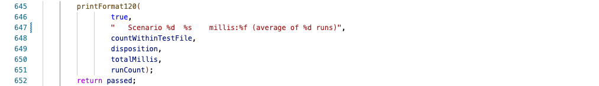
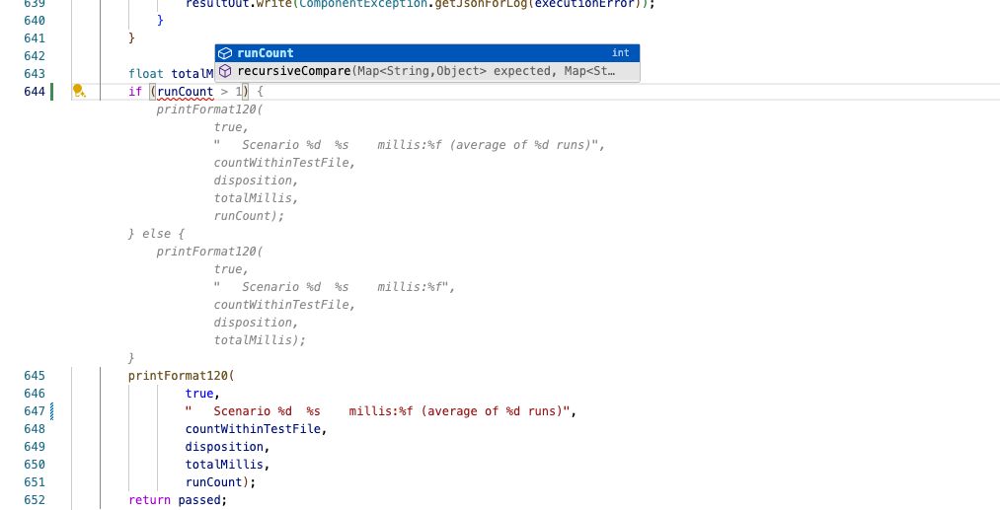

# Impressive Example of Copilot

I just enables copilot for working on software in my regular work in August 2024.  I mention the date because this field is moving so quickly that I am sure in a few years this will seem very quaint.  I hit this particular example that really shows the amazing achievement today.

The code is simply printing out results of some testing.  This is printing whether the test was successful, how long it took, and then notice the part in parentheses: it says the time is the average of a number of runs. 

 Often this test is made just as a single run, and I think it looks silly to say `(average of 1 runs)` because first of all the plural grammar does not match, but also because the entire statement is unnecessary when the test is only performing single runs.  Would be best to omit the parentheses altogether.

 That was the logic I was thinking in my head, but somehow Copilot knew exactly what I wanted.  I merely went to the line before the block in question, and typed in the condition `if (runCount > 1)` on line 644 and copilot immediately jumped in to finish the block without my telling it anything else about what I wanted the condition to do.  All of the text in grey italic was generated automatically from the if condition, and simply appeared suddenly.   I grabbed a screen shot:
 

Just by typing `runCount > 1` it somehow figured out that I would like to special case the message that gets printed.   It copies the print statement as-is into the then block including the count, but then in the else block it copies the print statement, but it removes the entire parenthetical statement, and it leaves runCount out of the list of parameters.

The original print statement still appears below that, obviously allowing me to delete it later.  Copilot in this mode is only suggesting new code and not automaticaly removing redundant code, but there is a probably a mode to do that.

The fact that it figured out that I wanted to print a different message, and that it figured out that the entire statement in parentheses could be eliminated is far more than I would have expected it to deduce just from my typing a condition.  It also figured out that nothing else should change.

I am sure far more impressive cases will be uncovered soon, and in short time this example will appear quaint and naive.  Yet here it is, today, and I am impressed.

